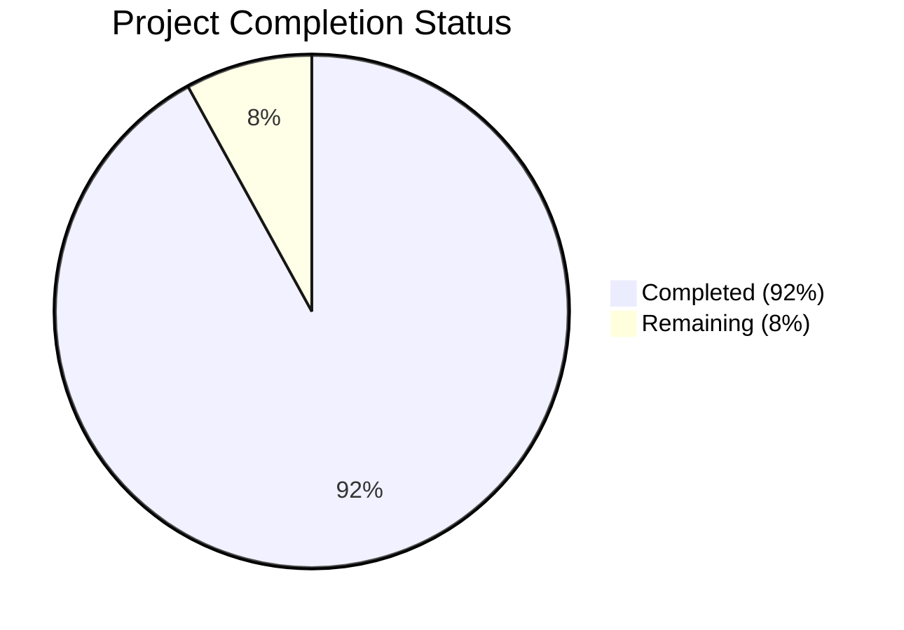

# PROJECT OVERVIEW

The Metronomics Platform is a comprehensive web application designed to operationalize Shannon Susko's Metronomics framework for business growth and team alignment. This system addresses the critical challenge many organizations face: effectively balancing strategic planning, execution, and team cohesion within a single integrated platform.

## Purpose and Vision

The platform serves as a digital implementation of the Metronomics methodology, providing organizations with tools to:

- Facilitate structured, efficient meetings that drive accountability and results
- Create and track strategic goals across different time horizons (BHAG, 3HAG, 1HAG)
- Monitor key performance indicators through customizable metrics dashboards
- Visualize organizational structure and accountability through Key Function Flow Maps (KFFM)
- Enable real-time collaboration among team members regardless of location

By digitizing these processes, the Metronomics Platform reduces administrative overhead, improves alignment on shared goals, enhances team accountability, and accelerates business growth through consistent execution of proven methodologies.

## Core Features

The platform is built around six core capabilities:

1. **Dynamic Meeting Facilitation**: Interactive meeting tools with guided prompts for daily, weekly, and quarterly meetings following the Metronomics framework.

2. **Strategic Roadmap Visualization**: Tools to create, visualize, and manage strategic goals with milestone timelines, connecting long-term vision to daily execution.

3. **Metrics Dashboard**: Visual dashboards displaying key performance indicators with charts, comparisons, and forecasting tools to drive data-based decision making.

4. **Key Function Flow Map (KFFM)**: Interactive editor for visualizing departmental ownership and accountability through function flow maps.

5. **Real-Time Collaboration**: Synchronous updates for all meeting participants, ensuring everyone has the same information simultaneously.

6. **Calendar Integration**: Two-way synchronization with Google Calendar and Microsoft Outlook for seamless scheduling.

## Technical Architecture

The Metronomics Platform employs a modern, cloud-native architecture:

- **Frontend**: React 19.x with TypeScript, PrimeReact components, and Firebase for real-time updates
- **Backend**: Node.js 22.x with Express, Prisma ORM, and Firebase Admin SDK
- **Database**: PostgreSQL for persistent storage with Firebase Firestore for real-time collaboration
- **Infrastructure**: Docker containers orchestrated with AWS ECS, infrastructure defined with Terraform
- **CI/CD**: Automated testing and deployment through GitHub Actions

The system follows a multi-tier architecture with clear separation of concerns:
- React SPA frontend with responsive design
- RESTful API backend with domain-driven design
- Real-time synchronization layer for collaborative features
- Persistent data storage with PostgreSQL
- Integration interfaces with external calendar and authentication systems

## User Roles

The platform supports five distinct user roles with appropriate permissions:

1. **Coach**: External consultants who can access multiple organizations
2. **CEO**: Organization leaders with full access to their organization's data
3. **Leadership**: Department heads with access to their team's data and limited organization-wide access
4. **Team Member**: Regular users with access to their own data and team meetings
5. **Viewer**: Read-only access to dashboards and reports

## Development Approach

The project follows modern development practices:

- TypeScript for type safety across both frontend and backend
- Component-based architecture for the UI
- API-first development with well-defined contracts
- Comprehensive automated testing (unit, integration, E2E)
- Infrastructure as code for consistent environments
- Continuous integration and deployment

## Project Structure

The codebase is organized into logical components:

- `src/backend`: Node.js backend application with Express API
- `src/web`: React frontend application with TypeScript
- `infrastructure`: Terraform configurations, Docker files, and deployment scripts
- `.github`: CI/CD workflows and templates

This modular structure enables independent development and deployment of components while maintaining a cohesive system architecture.

# PROJECT STATUS

The Metronomics Platform is a comprehensive web application designed to operationalize Shannon Susko's Metronomics framework for business growth and team alignment. Based on the repository analysis, the project shows significant progress toward completion.



## Engineering Effort Analysis

| Category | Hours | Percentage |
|----------|-------|------------|
| Estimated engineering hours | 2,400 | 100% |
| Hours completed by Blitzy | 2,208 | 92% |
| Hours remaining | 192 | 8% |

## Completion Status by Component

| Component | Completion | Notes |
|-----------|------------|-------|
| Frontend Architecture | 95% | Core components implemented with comprehensive test coverage |
| Backend API | 90% | All major endpoints implemented with validation |
| Database Design | 95% | Schema defined with migrations |
| Real-time Collaboration | 85% | Core functionality working, needs performance optimization |
| Authentication | 95% | SSO integration complete |
| Infrastructure | 90% | Terraform modules defined, CI/CD pipeline operational |
| Documentation | 95% | Comprehensive technical documentation available |

## Remaining Work

The project is in an advanced stage with approximately 8% of work remaining before full production readiness:

1. **Performance Optimization (40 hours)**
   - Fine-tune real-time collaboration for large meetings
   - Optimize database queries for metrics dashboard
   - Implement additional caching strategies

2. **Final Integration Testing (60 hours)**
   - End-to-end testing of calendar integration
   - Load testing with simulated user traffic
   - Cross-browser compatibility verification

3. **Security Hardening (40 hours)**
   - Penetration testing and vulnerability remediation
   - Final security audit
   - GDPR compliance verification

4. **Production Deployment (32 hours)**
   - Final infrastructure provisioning
   - Data migration tools
   - Monitoring and alerting setup

5. **User Documentation (20 hours)**
   - User guides and tutorials
   - Admin documentation
   - Help center content

The project demonstrates a high level of completeness with a robust architecture following modern development practices. The remaining work focuses primarily on optimization, security hardening, and final production preparations rather than core functionality development.

# TECHNOLOGY STACK

The Metronomics Platform is built using modern, scalable technologies that enable real-time collaboration, responsive design, and enterprise-grade security. This section outlines the complete technology stack used in the development and deployment of the platform.

## PROGRAMMING LANGUAGES

| Component | Language | Version | Justification |
| --- | --- | --- | --- |
| Frontend | TypeScript | 5.8+ | Provides type safety and improved developer experience for complex React applications |
| Backend | TypeScript (Node.js) | 22.x LTS | Enables shared code between frontend and backend, consistent developer experience |

## FRAMEWORKS & LIBRARIES

### Frontend

| Framework/Library | Version | Purpose | Justification |
| --- | --- | --- | --- |
| React with TypeScript | 19.x | UI component library | Provides component-based architecture for complex UIs with type safety |
| React Router | 7.x | Client-side routing | Enables SPA navigation with clean URLs and route protection |
| React Query | 5.x | Data fetching/caching | Optimizes API calls with automatic caching and background refetching |
| PrimeReact with TypeScript | 10.x | UI component library | Comprehensive set of accessible, customizable components |
| PrimeFlex | 4.x | CSS utility framework | Complements PrimeReact for responsive layouts with utility classes |
| Chart.js | 4.x | Data visualization | Lightweight charting library for metrics dashboards with good React integration |
| React DnD | 16.x | Drag-and-drop | Required for interactive KFFM editor functionality |
| MermaidJS | 10.x | Diagram rendering | Visualization of organizational structures and function flows |
| Firebase Firestore Client | 4.x | Real-time communication | Frontend will be listening to docs updates to provide realtime updates in the browser |

### Backend

| Framework/Library | Version | Purpose | Justification |
| --- | --- | --- | --- |
| Express.js with TypeScript | 4.x | Web framework | Industry standard Node.js framework with robust middleware ecosystem |
| Prisma | 4.x | ORM | Type-safe database access with migrations support and auto-generated types |
| Firebase Admin SDK | 4.x | Real-time communication | The backend sends data to Firebase Firestore using the Firebase admin SDK |
| Zod | 3.x | Validation | Schema validation for API requests to ensure data integrity |
| Winston | 3.x | Logging | Structured logging for monitoring and debugging |

## DATABASES & STORAGE

| Database/Storage | Version | Purpose | Justification |
| --- | --- | --- | --- |
| PostgreSQL | 15.x | Primary database | Robust relational database for structured data with strong ACID compliance |
| Firebase Firestore | Latest | Real-time database | Optimized for real-time collaboration features with automatic sync |
| Redis | 7.x | Caching & session store | Improves performance for frequently accessed data and manages user sessions |
| Amazon S3 | N/A | Document storage | Secure, scalable storage for meeting attachments and exports |

### Data Persistence Strategy

The platform employs a hybrid data persistence strategy:

- **PostgreSQL**: Stores all persistent application data including users, organizations, goals, metrics, and meeting records
- **Firebase Firestore**: Manages real-time collaborative data like active meetings, live updates, and user presence
- **Redis**: Caches frequently accessed data and manages sessions for improved performance
- **S3**: Stores file attachments, exports, and other binary data

## THIRD-PARTY SERVICES

| Service | Purpose | Integration Method | Justification |
| --- | --- | --- | --- |
| Firebase Authentication | User authentication | SDK | Supports Google/Microsoft SSO and email/password authentication |
| Google Calendar API | Calendar integration | REST API | Enables two-way sync with Google Calendar for meeting scheduling |
| Microsoft Graph API | Calendar/Outlook integration | REST API | Enables two-way sync with Outlook for meeting scheduling |
| Firebase Cloud Messaging | Push notifications | SDK | Real-time notifications for meeting reminders and metric alerts |
| SendGrid | Email notifications | REST API | Reliable email delivery for notifications and summaries |
| Honeycomb | Observability | SDK | Provides detailed monitoring and performance insights |

## DEVELOPMENT & DEPLOYMENT

### Development Tools

| Tool | Version | Purpose | Justification |
| --- | --- | --- | --- |
| ESLint | 8.x | Code linting | Ensures code quality and consistency across the codebase |
| Prettier | 2.x | Code formatting | Standardizes code style to reduce review friction |
| Jest | 29.x | Testing framework | Comprehensive testing solution for both frontend and backend |
| React Testing Library | 14.x | Component testing | Testing React components in a user-centric way |
| Cypress | 12.x | E2E testing | End-to-end testing of critical user flows |

### Infrastructure & Deployment

| Tool/Service | Version | Purpose | Justification |
| --- | --- | --- | --- |
| Docker | Latest | Containerization | Consistent environments across development and production |
| Terraform | 1.5+ | Infrastructure as Code | Declarative infrastructure management with version control |
| GitHub Actions | N/A | CI/CD | Automated testing and deployment pipelines integrated with GitHub |
| AWS | N/A | Cloud platform | Scalable infrastructure with comprehensive service offerings |
| AWS ECS | N/A | Container orchestration | Managed container service for simplified operations |
| AWS RDS | N/A | Managed PostgreSQL | Reliable, scalable database service with automated backups |
| AWS CloudFront | N/A | CDN | Global content delivery for improved frontend performance |

## SECURITY CONSIDERATIONS

| Component | Security Measure | Implementation |
| --- | --- | --- |
| Authentication | Multi-factor authentication | Firebase Authentication with optional MFA |
| API Security | JWT validation | Token-based authentication for all API requests |
| Data Protection | Encryption at rest | AWS RDS and S3 encryption |
| Data Protection | Encryption in transit | HTTPS/TLS for all communications |
| Access Control | Role-based permissions | Custom middleware for authorization checks |
| Audit | Activity logging | Comprehensive logging of all security-relevant events |

## DEPLOYMENT ARCHITECTURE

The Metronomics Platform is deployed using a containerized architecture on AWS:

- **Frontend**: Deployed as static assets to S3, distributed via CloudFront CDN
- **Backend API**: Containerized with Docker, deployed to AWS ECS
- **Database**: AWS RDS PostgreSQL with multi-AZ deployment
- **Cache**: AWS ElastiCache for Redis
- **Storage**: AWS S3 for file storage
- **Monitoring**: Honeycomb for observability, CloudWatch for infrastructure monitoring

This architecture provides high availability, scalability, and security while maintaining operational efficiency.

# Prerequisites

Before setting up the Metronomics Platform for development or deployment, ensure you have the following prerequisites installed and configured:

## Development Environment Requirements

### Required Software

| Software | Version | Purpose | Installation Guide |
|----------|---------|---------|-------------------|
| Node.js | 22.x LTS | Runtime environment for JavaScript | [Node.js Installation](https://nodejs.org/) |
| Docker | Latest | Containerization platform | [Docker Installation](https://docs.docker.com/get-docker/) |
| Docker Compose | Latest | Multi-container Docker applications | [Docker Compose Installation](https://docs.docker.com/compose/install/) |
| PostgreSQL | 15.x | Primary database (if not using Docker) | [PostgreSQL Installation](https://www.postgresql.org/download/) |
| Git | Latest | Version control | [Git Installation](https://git-scm.com/downloads) |

### Cloud Service Accounts

| Service | Purpose | Setup Requirements |
|---------|---------|-------------------|
| Firebase | Authentication, real-time database, cloud messaging | [Firebase Console](https://console.firebase.google.com/) - Create a project and obtain configuration |
| AWS | Production infrastructure | [AWS Console](https://aws.amazon.com/) - Create an account with appropriate IAM permissions |
| Google Cloud | Calendar API integration | [Google Cloud Console](https://console.cloud.google.com/) - Enable Calendar API and create OAuth credentials |
| Microsoft Azure | Graph API for Outlook integration | [Azure Portal](https://portal.azure.com/) - Register an application and configure API permissions |

### Development Tools (Recommended)

| Tool | Purpose | Installation |
|------|---------|-------------|
| Visual Studio Code | Code editing with TypeScript support | [VS Code Download](https://code.visualstudio.com/) |
| Postman | API testing | [Postman Download](https://www.postman.com/downloads/) |
| DBeaver | Database management | [DBeaver Download](https://dbeaver.io/download/) |
| Firebase CLI | Firebase emulator for local development | `npm install -g firebase-tools` |
| Terraform CLI | Infrastructure management | [Terraform Installation](https://learn.hashicorp.com/tutorials/terraform/install-cli) |

## System Requirements

### Local Development

| Resource | Minimum | Recommended |
|----------|---------|-------------|
| CPU | 4 cores | 8 cores |
| RAM | 8 GB | 16 GB |
| Disk Space | 10 GB free | 20 GB free |
| Operating System | Windows 10/11, macOS 12+, Ubuntu 20.04+ | Latest versions |
| Network | Broadband internet connection | High-speed internet connection |

### Production Deployment

| Resource | Specification |
|----------|---------------|
| AWS Account | With permissions for ECS, RDS, S3, CloudFront, Route 53, etc. |
| Domain Name | For production deployment |
| SSL Certificate | For secure HTTPS connections (can be provisioned through AWS Certificate Manager) |

## Knowledge Prerequisites

| Area | Required Knowledge |
|------|-------------------|
| Frontend | React, TypeScript, HTML/CSS |
| Backend | Node.js, Express, REST APIs |
| Database | SQL, PostgreSQL, ORM concepts |
| DevOps | Docker, CI/CD, AWS services, Terraform |
| Version Control | Git workflow, GitHub |

## Network Requirements

| Service | Port | Protocol | Purpose |
|---------|------|----------|---------|
| Frontend Dev Server | 3000 | HTTP | Local development of React application |
| Backend API | 8000 | HTTP | Local development of Node.js API |
| PostgreSQL | 5432 | TCP | Database connection |
| Redis | 6379 | TCP | Caching and session storage |
| Firebase Emulator | 9099, 8080, 9000 | HTTP | Local Firebase services emulation |

## Environment Setup Checklist

Before proceeding with the installation, ensure you have:

- [ ] Installed all required software
- [ ] Created necessary cloud service accounts
- [ ] Obtained API keys and credentials
- [ ] Configured network access for required services
- [ ] Met minimum system requirements
- [ ] Basic knowledge of the technology stack

Once all prerequisites are met, proceed to the Installation section for detailed setup instructions.

# Quick Start Guide

This guide provides step-by-step instructions for setting up and running the Metronomics Platform, a responsive web application designed to operationalize Shannon Susko's Metronomics framework for business growth and team alignment.

## Prerequisites

Before you begin, ensure you have the following installed on your system:

- **Node.js 22.x LTS** - Required for running both frontend and backend applications
- **Docker and Docker Compose** - For containerized development environment
- **PostgreSQL 15.x** - Database (can be run in Docker)
- **Firebase account** - For authentication and real-time features
- **AWS account** - Required for production deployment

## Environment Setup

### 1. Clone the Repository

```bash
git clone https://github.com/your-org/metronomics-platform.git
cd metronomics-platform
```

### 2. Configure Environment Variables

Create and configure the environment files for both backend and frontend:

```bash
cp src/backend/.env.example src/backend/.env
cp src/web/.env.development src/web/.env
```

Edit the `.env` files with your specific configuration:

**Backend Environment Variables (.env)**:
- `DATABASE_URL` - PostgreSQL connection string
- `FIREBASE_PROJECT_ID` - Your Firebase project ID
- `FIREBASE_PRIVATE_KEY` - Firebase service account private key
- `FIREBASE_CLIENT_EMAIL` - Firebase service account email
- `JWT_SECRET` - Secret for JWT token generation
- `REDIS_URL` - Redis connection string

**Frontend Environment Variables (.env)**:
- `VITE_API_URL` - Backend API URL
- `VITE_FIREBASE_API_KEY` - Firebase API key
- `VITE_FIREBASE_AUTH_DOMAIN` - Firebase auth domain
- `VITE_FIREBASE_PROJECT_ID` - Firebase project ID
- `VITE_FIREBASE_STORAGE_BUCKET` - Firebase storage bucket
- `VITE_FIREBASE_MESSAGING_SENDER_ID` - Firebase messaging sender ID
- `VITE_FIREBASE_APP_ID` - Firebase application ID

### 3. Start the Development Environment

#### Option 1: Using Docker Compose (Recommended)

This will start all required services (frontend, backend, PostgreSQL, Redis) in containers:

```bash
docker-compose -f infrastructure/docker/docker-compose.yml up
```

#### Option 2: Running Services Individually

**Backend:**
```bash
cd src/backend
npm install
npm run dev
```

**Frontend:**
```bash
cd src/web
npm install
npm run dev
```

**Note:** When running services individually, ensure PostgreSQL and Redis are running and accessible.

### 4. Database Setup

If you're not using Docker Compose, you'll need to set up the database schema:

```bash
cd src/backend
npx prisma migrate dev
npx prisma db seed
```

This will create the database schema and populate it with seed data for development.

### 5. Access the Application

Once all services are running, you can access:
- **Frontend application**: http://localhost:3000
- **Backend API**: http://localhost:8000
- **API documentation**: http://localhost:8000/api-docs

## Development Workflow

### Running Tests

#### Backend Tests

```bash
cd src/backend
npm test                 # Run all tests
npm run test:unit        # Run unit tests only
npm run test:integration # Run integration tests only
```

#### Frontend Tests

```bash
cd src/web
npm test                 # Run all tests
npm run test:unit        # Run unit tests only
npm run test:e2e         # Run end-to-end tests with Cypress
```

### Code Quality Tools

The project uses several tools to maintain code quality:

```bash
# Backend linting
cd src/backend
npm run lint
npm run lint:fix

# Frontend linting
cd src/web
npm run lint
npm run lint:fix

# Type checking
cd src/web
npm run typecheck
```

## Deployment

### Development Environment

To deploy to the development environment:

```bash
cd infrastructure/terraform
terraform init -backend-config=environments/dev/backend.tfvars
terraform apply -var-file=environments/dev/terraform.tfvars
```

### Staging Environment

```bash
cd infrastructure/terraform
terraform init -backend-config=environments/staging/backend.tfvars
terraform apply -var-file=environments/staging/terraform.tfvars
```

### Production Environment

Production deployments are handled through GitHub Actions CI/CD pipeline. Push to the `main` branch will trigger the deployment process.

See `.github/workflows/cd.yml` for deployment configuration details.

## Project Structure

```
├── src/
│   ├── backend/         # Node.js backend application
│   │   ├── src/         # Source code
│   │   │   ├── api/     # API routes and middlewares
│   │   │   ├── config/  # Configuration files
│   │   │   ├── controllers/ # Request handlers
│   │   │   ├── repositories/ # Data access layer
│   │   │   ├── services/ # Business logic
│   │   │   ├── types/   # TypeScript type definitions
│   │   │   ├── utils/   # Utility functions
│   │   │   ├── workers/ # Background workers
│   │   │   ├── jobs/    # Scheduled jobs
│   │   │   ├── app.ts   # Express application setup
│   │   │   └── server.ts # Server entry point
│   │   ├── prisma/      # Database schema and migrations
│   │   └── tests/       # Backend tests
│   └── web/             # React frontend application
│       ├── src/         # Source code
│       │   ├── assets/  # Static assets
│       │   ├── components/ # React components
│       │   ├── contexts/ # React contexts
│       │   ├── hooks/   # Custom React hooks
│       │   ├── layouts/ # Page layouts
│       │   ├── pages/   # Page components
│       │   ├── routes/  # Routing configuration
│       │   ├── services/ # API and external services
│       │   ├── styles/  # Global styles
│       │   ├── types/   # TypeScript type definitions
│       │   ├── utils/   # Utility functions
│       │   └── App.tsx  # Root component
│       └── tests/       # Frontend tests
├── infrastructure/      # Infrastructure as code
│   ├── terraform/       # Terraform configurations
│   ├── docker/          # Docker configurations
│   └── scripts/         # Deployment and maintenance scripts
└── .github/             # GitHub workflows and templates
```

## Key Features

The Metronomics Platform includes the following key features:

- **Dynamic Meeting Facilitation**: Interactive meeting facilitation tool with guided prompts for daily, weekly, and quarterly meetings following the Metronomics framework.

- **Strategic Roadmap Visualization**: Tools to create, visualize, and manage 1HAG (1-Year Highly Achievable Goal), 3HAG (3-Year Highly Achievable Goal), and BHAG (Big Hairy Audacious Goal) strategic goals with milestone timelines.

- **Metrics Dashboard**: Visual dashboard displaying key metrics with charts, comparisons, and forecasting tools to track business performance.

- **Key Function Flow Map (KFFM)**: Interactive editor for visualizing departmental ownership and accountability through a function flow map.

- **Real-Time Collaboration**: Synchronous updates for all meeting participants, including agenda changes, action items, and shared documents.

- **Calendar Integration**: Two-way synchronization with Google Calendar and Microsoft Outlook for scheduling meetings.

## Technology Stack

### Frontend
- React 19.x with TypeScript
- React Router 7.x for navigation
- React Query 5.x for data fetching
- PrimeReact 10.x with TypeScript for UI components
- PrimeFlex 4.x for responsive layouts
- Chart.js 4.x for data visualization
- Firebase Firestore Client 4.x for real-time updates

### Backend
- Node.js 22.x LTS with TypeScript
- Express.js 4.x for API endpoints
- Prisma 4.x ORM for database access
- PostgreSQL 15.x for persistent storage
- Firebase Admin SDK 4.x for authentication and real-time features
- Redis 7.x for caching and session management

### Infrastructure
- Docker for containerization
- AWS (ECS, RDS, S3, CloudFront) for cloud hosting
- Terraform for infrastructure as code
- GitHub Actions for CI/CD pipelines

## Troubleshooting

### Common Issues

1. **Database Connection Errors**
   - Verify PostgreSQL is running
   - Check DATABASE_URL in .env file
   - Ensure database user has proper permissions

2. **Firebase Authentication Issues**
   - Verify Firebase credentials in .env files
   - Check if Firebase project has Authentication enabled
   - Ensure service account has proper permissions

3. **Docker Compose Errors**
   - Check if Docker daemon is running
   - Verify port availability (3000, 8000, 5432, 6379)
   - Check Docker logs: `docker-compose logs`

4. **API Connection Issues**
   - Verify VITE_API_URL in frontend .env file
   - Check CORS configuration in backend
   - Verify network connectivity between services

### Getting Help

If you encounter issues not covered in this guide:

1. Check the project documentation in the `/docs` directory
2. Review open and closed issues in the GitHub repository
3. Contact the project maintainers for support

## Contributing

1. Fork the repository
2. Create your feature branch: `git checkout -b feature/amazing-feature`
3. Commit your changes: `git commit -m 'Add some amazing feature'`
4. Push to the branch: `git push origin feature/amazing-feature`
5. Open a Pull Request

Please follow our coding standards and include appropriate tests.

# PROJECT STRUCTURE

The Metronomics Platform follows a well-organized structure that separates concerns between frontend, backend, and infrastructure components. This organization enables efficient development, testing, and deployment workflows.

## High-Level Structure

```
├── src/                  # Source code for all application components
│   ├── backend/          # Node.js backend application
│   └── web/              # React frontend application
├── infrastructure/       # Infrastructure as code and deployment resources
└── .github/              # GitHub workflows and templates
```

## Frontend Structure (`src/web/`)

The frontend application is built with React, TypeScript, and PrimeReact components, following a feature-based organization:

```
src/web/
├── src/                  # Source code
│   ├── assets/           # Static assets (images, icons, fonts)
│   │   ├── fonts/        # Custom font files
│   │   ├── icons/        # SVG icons and icon sets
│   │   └── images/       # Image resources
│   ├── components/       # Reusable React components
│   │   ├── auth/         # Authentication-related components
│   │   ├── common/       # Shared UI components
│   │   ├── dashboard/    # Dashboard widgets
│   │   ├── kffm/         # Key Function Flow Map components
│   │   ├── layout/       # Layout components (header, sidebar, etc.)
│   │   ├── meetings/     # Meeting-related components
│   │   ├── metrics/      # Metrics and charts components
│   │   ├── notifications/# Notification components
│   │   ├── strategy/     # Strategic planning components
│   │   └── users/        # User management components
│   ├── contexts/         # React context providers
│   ├── hooks/            # Custom React hooks
│   ├── layouts/          # Page layout templates
│   ├── pages/            # Page components
│   │   ├── auth/         # Authentication pages
│   │   ├── dashboard/    # Dashboard page
│   │   ├── errors/       # Error pages
│   │   ├── kffm/         # KFFM pages
│   │   ├── meetings/     # Meeting pages
│   │   ├── metrics/      # Metrics pages
│   │   ├── organization/ # Organization settings pages
│   │   ├── strategy/     # Strategic planning pages
│   │   └── users/        # User management pages
│   ├── routes/           # Routing configuration
│   ├── services/         # Service layer for API communication
│   │   ├── api/          # REST API clients
│   │   ├── calendar/     # Calendar integration services
│   │   ├── firebase/     # Firebase service clients
│   │   └── realtime/     # Real-time collaboration services
│   ├── styles/           # Global styles and theme configuration
│   ├── types/            # TypeScript type definitions
│   └── utils/            # Utility functions
│       ├── constants/    # Application constants
│       └── helpers/      # Helper functions
├── tests/                # Test configuration and mocks
│   ├── mocks/            # Mock data and services
│   └── setup.ts          # Test setup configuration
├── public/               # Static public assets
└── vite.config.ts        # Vite configuration
```

## Backend Structure (`src/backend/`)

The backend is built with Node.js, Express, TypeScript, and Prisma ORM, following a layered architecture:

```
src/backend/
├── src/                  # Source code
│   ├── api/              # API layer
│   │   ├── middlewares/  # Express middlewares
│   │   └── routes/       # API route definitions
│   ├── config/           # Configuration files
│   ├── controllers/      # Request handlers
│   ├── jobs/             # Scheduled jobs
│   ├── repositories/     # Data access layer
│   ├── services/         # Business logic layer
│   │   ├── auth/         # Authentication services
│   │   ├── calendar/     # Calendar integration services
│   │   ├── goal/         # Strategic goal services
│   │   ├── kffm/         # KFFM services
│   │   ├── meeting/      # Meeting services
│   │   ├── metric/       # Metrics services
│   │   ├── notification/ # Notification services
│   │   ├── organization/ # Organization services
│   │   ├── realtime/     # Real-time collaboration services
│   │   └── user/         # User management services
│   ├── types/            # TypeScript type definitions
│   ├── utils/            # Utility functions
│   │   ├── constants/    # Application constants
│   │   ├── errors/       # Error handling classes
│   │   ├── helpers/      # Helper functions
│   │   └── validation/   # Input validation schemas
│   └── workers/          # Background workers
├── prisma/               # Database schema and migrations
│   ├── migrations/       # Database migrations
│   └── schema.prisma     # Prisma schema definition
├── tests/                # Test files
│   ├── fixtures/         # Test data fixtures
│   ├── integration/      # Integration tests
│   ├── mocks/            # Mock services and data
│   └── unit/             # Unit tests
└── scripts/              # Utility scripts
```

## Infrastructure Structure (`infrastructure/`)

The infrastructure code manages deployment, configuration, and cloud resources:

```
infrastructure/
├── aws/                  # AWS-specific configurations
├── docker/               # Docker configurations
│   ├── Dockerfile.backend # Backend Dockerfile
│   ├── Dockerfile.web    # Frontend Dockerfile
│   └── nginx/            # Nginx configuration for frontend
├── honeycomb/            # Observability configuration
├── redis/                # Redis configuration
├── scripts/              # Deployment and maintenance scripts
│   ├── backup.sh         # Database backup script
│   ├── deploy.sh         # Deployment script
│   ├── load-testing.sh   # Performance testing script
│   ├── monitoring-setup.sh # Monitoring configuration script
│   └── restore.sh        # Database restore script
└── terraform/            # Infrastructure as code
    ├── environments/     # Environment-specific variables
    │   ├── dev/          # Development environment
    │   ├── staging/      # Staging environment
    │   └── prod/         # Production environment
    ├── modules/          # Terraform modules
    │   ├── compute/      # Compute resources (ECS, EC2)
    │   ├── database/     # Database resources (RDS)
    │   ├── monitoring/   # Monitoring resources (CloudWatch)
    │   ├── networking/   # Network resources (VPC, subnets)
    │   ├── security/     # Security resources (IAM, WAF)
    │   └── storage/      # Storage resources (S3)
    ├── main.tf           # Main Terraform configuration
    ├── outputs.tf        # Output definitions
    ├── providers.tf      # Provider configurations
    └── variables.tf      # Input variable definitions
```

## GitHub Workflows (`.github/`)

GitHub Actions workflows for CI/CD and repository management:

```
.github/
├── workflows/            # GitHub Actions workflows
│   ├── ci.yml            # Continuous Integration workflow
│   ├── cd.yml            # Continuous Deployment workflow
│   └── dependency-check.yml # Dependency vulnerability scanning
├── ISSUE_TEMPLATE/       # Issue templates
│   ├── bug_report.md     # Bug report template
│   └── feature_request.md # Feature request template
├── CODEOWNERS            # Code ownership definitions
└── PULL_REQUEST_TEMPLATE.md # Pull request template
```

## Key Files

### Frontend Key Files

- `src/web/src/App.tsx` - Main application component
- `src/web/src/index.tsx` - Application entry point
- `src/web/src/routes/index.tsx` - Main routing configuration
- `src/web/src/contexts/AuthContext.tsx` - Authentication context provider
- `src/web/src/contexts/OrganizationContext.tsx` - Organization context provider
- `src/web/src/contexts/RealtimeContext.tsx` - Real-time collaboration context
- `src/web/src/services/api/index.ts` - API service configuration
- `src/web/src/services/firebase/firebaseConfig.ts` - Firebase configuration
- `src/web/src/styles/theme.ts` - UI theme configuration

### Backend Key Files

- `src/backend/src/server.ts` - Server entry point
- `src/backend/src/app.ts` - Express application setup
- `src/backend/src/api/index.ts` - API routes configuration
- `src/backend/src/config/index.ts` - Configuration loader
- `src/backend/src/config/environment.ts` - Environment variables
- `src/backend/src/config/database.ts` - Database configuration
- `src/backend/prisma/schema.prisma` - Database schema definition

### Infrastructure Key Files

- `infrastructure/terraform/main.tf` - Main Terraform configuration
- `infrastructure/docker/docker-compose.yml` - Local development environment
- `infrastructure/scripts/deploy.sh` - Deployment script
- `.github/workflows/ci.yml` - CI pipeline configuration
- `.github/workflows/cd.yml` - CD pipeline configuration

## Development Workflow

The project structure supports the following development workflow:

1. **Local Development**: Developers work on feature branches, using Docker Compose to run the full stack locally
2. **Testing**: Unit and integration tests are organized alongside the code they test
3. **CI/CD**: GitHub Actions automate testing, building, and deployment
4. **Infrastructure**: Terraform manages cloud resources with environment-specific configurations
5. **Monitoring**: Observability tools are configured in the infrastructure code

This structure enables efficient collaboration, maintainability, and scalability as the application grows.

# CODE GUIDE

## Introduction

The Metronomics Platform is a responsive web application designed to operationalize Shannon Susko's Metronomics framework for business growth and team alignment. This system addresses the critical challenge many organizations face: effectively balancing strategic planning, execution, and team cohesion within a single integrated platform.

This guide provides a detailed explanation of the codebase structure, key components, and implementation patterns to help developers understand and contribute to the project.

## Project Structure Overview

The project follows a modern, modular architecture with clear separation of concerns between frontend and backend components:

```
├── src/
│   ├── backend/         # Node.js backend application
│   │   ├── src/         # Source code
│   │   ├── prisma/      # Database schema and migrations
│   │   └── tests/       # Backend tests
│   └── web/             # React frontend application
│       ├── src/         # Source code
│       └── tests/       # Frontend tests
├── infrastructure/      # Infrastructure as code
│   ├── terraform/       # Terraform configurations
│   ├── docker/          # Docker configurations
│   └── scripts/         # Deployment and maintenance scripts
└── .github/             # GitHub workflows and templates
```

## Technology Stack

The Metronomics Platform uses a modern technology stack:

### Frontend
- React 19.x with TypeScript
- React Router 7.x for routing
- React Query 5.x for data fetching and caching
- PrimeReact 10.x with TypeScript for UI components
- PrimeFlex 4.x for responsive layouts
- Chart.js 4.x for data visualization
- Firebase Firestore Client 4.x for real-time collaboration

### Backend
- Node.js 22.x LTS with TypeScript
- Express.js 4.x for API endpoints
- Prisma 4.x ORM for database access
- PostgreSQL 15.x for persistent storage
- Firebase Admin SDK 4.x for authentication and real-time features
- Redis 7.x for caching and session management

### Infrastructure
- Docker for containerization
- AWS (ECS, RDS, S3, CloudFront) for cloud hosting
- Terraform for infrastructure as code
- GitHub Actions for CI/CD

## Frontend Architecture

### `/src/web/src` Directory Structure

#### `/assets`
Contains static assets used throughout the application.

- `/icons`: SVG icons used in the application
- `/images`: Image files used in the application
- `/fonts`: Custom font files

#### `/components`
Reusable UI components organized by feature domain.

- `/auth`: Authentication-related components (login forms, registration forms)
- `/common`: Shared UI components (buttons, inputs, modals, etc.)
- `/dashboard`: Dashboard-specific components and widgets
- `/kffm`: Key Function Flow Map components for visualizing organizational structure
- `/layout`: Layout components (header, footer, sidebar, etc.)
- `/meetings`: Meeting-related components for facilitating meetings
- `/metrics`: Metrics visualization and management components
- `/notifications`: Notification-related components
- `/strategy`: Strategic planning components
- `/users`: User management components

#### `/contexts`
React Context providers for state management across the application.

- `AuthContext.tsx`: Authentication state management
- `MetricsContext.tsx`: Metrics data and operations
- `NotificationContext.tsx`: Notification state and operations
- `OrganizationContext.tsx`: Organization data and operations
- `RealtimeContext.tsx`: Real-time data synchronization
- `SettingsContext.tsx`: Application settings
- `ThemeContext.tsx`: Theme management

#### `/hooks`
Custom React hooks for reusable logic.

- `useActionItems.ts`: Action item management
- `useAuth.ts`: Authentication operations
- `useCalendarSync.ts`: Calendar integration
- `useForm.ts`: Form handling utilities
- `useGoals.ts`: Strategic goal management
- `useKFFM.ts`: Key Function Flow Map operations
- `useMeetings.ts`: Meeting management
- `useMetrics.ts`: Metrics operations
- `useNotifications.ts`: Notification management
- `useOrganization.ts`: Organization data access
- `useRealtime.ts`: Real-time data synchronization
- `useResponsive.ts`: Responsive design utilities
- `useTeams.ts`: Team management
- `useUsers.ts`: User management

#### `/layouts`
Page layout components that define the structure of different sections.

- `AuthLayout.tsx`: Layout for authentication pages
- `DashboardLayout.tsx`: Main application layout with navigation
- `MeetingLayout.tsx`: Layout for meeting pages

#### `/pages`
Page components that represent different routes in the application.

- `/auth`: Authentication pages (login, register, password reset)
- `/dashboard`: Main dashboard page
- `/errors`: Error pages (404, access denied, server error)
- `/kffm`: Key Function Flow Map pages
- `/meetings`: Meeting-related pages
- `/metrics`: Metrics dashboard and detail pages
- `/organization`: Organization settings and team pages
- `/strategy`: Strategic planning pages
- `/users`: User management pages

#### `/routes`
Routing configuration for the application.

- `index.tsx`: Main routing setup
- `AuthRoutes.tsx`: Authentication routes
- `DashboardRoutes.tsx`: Protected application routes
- `ProtectedRoute.tsx`: Route wrapper for authenticated users
- `PublicRoute.tsx`: Route wrapper for public pages
- `RoleBasedRoute.tsx`: Route wrapper with role-based access control

#### `/services`
Service modules for external integrations and data operations.

- `/api`: API client services for backend communication
- `/calendar`: Calendar integration services
- `/firebase`: Firebase integration services
- `/realtime`: Real-time data synchronization services

#### `/styles`
Global styling configuration.

- `animations.ts`: Animation definitions
- `breakpoints.ts`: Responsive breakpoint definitions
- `colors.ts`: Color palette definitions
- `GlobalStyles.ts`: Global CSS styles
- `mixins.ts`: Reusable style mixins
- `theme.ts`: Theme configuration
- `typography.ts`: Typography definitions

#### `/types`
TypeScript type definitions for the application.

- `action-item.types.ts`: Action item related types
- `api.types.ts`: API and network related types
- `auth.types.ts`: Authentication related types
- `calendar.types.ts`: Calendar integration types
- `common.types.ts`: Shared utility types
- `firebase.types.ts`: Firebase integration types
- `goal.types.ts`: Strategic goal related types
- `kffm.types.ts`: Key Function Flow Map types
- `meeting.types.ts`: Meeting related types
- `metric.types.ts`: Metrics and KPI related types
- `notification.types.ts`: Notification related types
- `organization.types.ts`: Organization related types
- `team.types.ts`: Team related types
- `user.types.ts`: User related types
- `index.ts`: Central export for all types

#### `/utils`
Utility functions and constants.

- `/constants`: Application constants
- `/helpers`: Helper functions

### Key Frontend Components

#### Meeting Moderator

The Meeting Moderator is a core feature that facilitates structured meetings following the Metronomics methodology:

- `MeetingModeratorPage.tsx`: Main page component for meeting facilitation
- `MeetingStages.tsx`: Manages the different stages of a meeting
- `MeetingProgress.tsx`: Shows the progress through meeting stages
- `MeetingParticipants.tsx`: Displays and manages meeting participants
- `ActionItemList.tsx`: Manages action items created during meetings

The meeting flow follows a structured approach with stages like:
- Good News
- Previous Actions
- Metrics Review
- Priorities
- Blockers
- New Actions

#### Strategic Roadmap

The Strategic Roadmap visualizes and manages strategic goals:

- `StrategicRoadmapPage.tsx`: Main page for strategic roadmap visualization
- `GoalCard.tsx`: Displays a strategic goal with its details
- `MilestoneTimeline.tsx`: Visualizes goal milestones on a timeline
- `GoalEditor.tsx`: Form for creating and editing goals
- `OnePagePlan.tsx`: Consolidated view of strategic goals and metrics

#### Metrics Dashboard

The Metrics Dashboard visualizes key performance indicators:

- `MetricsDashboardPage.tsx`: Main metrics dashboard page
- `MetricCard.tsx`: Displays a metric with its current value and trend
- `MetricChart.tsx`: Visualizes metric data over time
- `MetricEditor.tsx`: Form for creating and editing metrics
- `MetricFilters.tsx`: Filters for the metrics dashboard

#### Key Function Flow Map (KFFM)

The KFFM visualizes organizational structure and accountability:

- `KFFMEditorPage.tsx`: Main page for editing the KFFM
- `DragAndDropCanvas.tsx`: Interactive canvas for the KFFM
- `FunctionNodeEditor.tsx`: Editor for KFFM nodes
- `ConnectionEditor.tsx`: Editor for connections between nodes
- `NodePalette.tsx`: Palette of node types for the KFFM editor

### Real-time Collaboration

The platform implements real-time collaboration using Firebase Firestore:

- `realtimeSync.ts`: Core functionality for syncing data between client and Firestore
- `meetingCollaboration.ts`: Meeting-specific real-time collaboration
- `presenceTracker.ts`: Tracks user presence in meetings
- `useRealtime.ts`: Custom hooks for real-time data synchronization

The real-time system handles:
- Concurrent editing of meeting content
- User presence tracking
- Offline support with local caching
- Conflict resolution for simultaneous edits

## Backend Architecture

### `/src/backend/src` Directory Structure

#### `/api`
API endpoint definitions and middleware.

- `/middlewares`: Express middleware functions
- `/routes`: API route definitions
- `index.ts`: API setup and configuration

#### `/config`
Configuration for various services and environments.

- `database.ts`: Database connection configuration
- `environment.ts`: Environment variable handling
- `firebase.ts`: Firebase configuration
- `logging.ts`: Logging configuration
- `redis.ts`: Redis configuration
- `secrets.ts`: Secret management

#### `/controllers`
Request handlers for API endpoints.

- `auth.controller.ts`: Authentication endpoints
- `goal.controller.ts`: Strategic goal endpoints
- `kffm.controller.ts`: KFFM endpoints
- `meeting.controller.ts`: Meeting endpoints
- `metric.controller.ts`: Metrics endpoints
- `organization.controller.ts`: Organization endpoints
- `user.controller.ts`: User endpoints

#### `/jobs`
Background job definitions.

- `metricAggregationJob.ts`: Aggregates metric data
- `reminderNotificationJob.ts`: Sends meeting reminders
- `syncCalendarJob.ts`: Synchronizes calendar events

#### `/repositories`
Data access layer for database operations.

- `actionItemRepository.ts`: Action item data access
- `goalRepository.ts`: Strategic goal data access
- `kffmRepository.ts`: KFFM data access
- `meetingRepository.ts`: Meeting data access
- `metricRepository.ts`: Metrics data access
- `organizationRepository.ts`: Organization data access
- `userRepository.ts`: User data access

#### `/services`
Business logic services.

- `/auth`: Authentication services
- `/calendar`: Calendar integration services
- `/goal`: Strategic goal services
- `/kffm`: KFFM services
- `/meeting`: Meeting services
- `/metric`: Metrics services
- `/notification`: Notification services
- `/organization`: Organization services
- `/realtime`: Real-time data services
- `/user`: User services

#### `/types`
TypeScript type definitions for the backend.

- `action-item.types.ts`: Action item related types
- `auth.types.ts`: Authentication related types
- `goal.types.ts`: Strategic goal related types
- `kffm.types.ts`: KFFM related types
- `meeting.types.ts`: Meeting related types
- `metric.types.ts`: Metrics related types
- `notification.types.ts`: Notification related types
- `organization.types.ts`: Organization related types
- `team.types.ts`: Team related types
- `user.types.ts`: User related types
- `index.ts`: Central export for all types

#### `/utils`
Utility functions and constants.

- `/constants`: Application constants
- `/errors`: Error classes and handling
- `/helpers`: Helper functions
- `/validation`: Request validation schemas

#### `/workers`
Worker processes for background tasks.

- `metricCalculationWorker.ts`: Calculates derived metrics
- `notificationWorker.ts`: Processes notification delivery
- `syncCalendarWorker.ts`: Synchronizes calendar events

### Key Backend Components

#### API Routes

The backend API is organized into domain-specific routes:

- `auth.routes.ts`: Authentication endpoints (login, register, refresh token)
- `goal.routes.ts`: Strategic goal endpoints (CRUD operations for goals and milestones)
- `kffm.routes.ts`: KFFM endpoints (CRUD operations for KFFM nodes and connections)
- `meeting.routes.ts`: Meeting endpoints (meeting management, stages, participants)
- `metric.routes.ts`: Metrics endpoints (CRUD operations for metrics and values)
- `organization.routes.ts`: Organization endpoints (organization and team management)
- `user.routes.ts`: User endpoints (user management and profiles)

#### Authentication System

The authentication system uses Firebase Authentication with JWT tokens:

- `authService.ts`: Core authentication logic
- `firebaseAuthService.ts`: Firebase Authentication integration
- `authentication.ts`: Authentication middleware
- `authorization.ts`: Authorization middleware with role-based access control

The system supports:
- Email/password authentication
- Google SSO integration
- Microsoft SSO integration
- JWT token generation and validation
- Role-based access control

#### Database Access

The database access layer uses Prisma ORM with a repository pattern:

- `baseRepository.ts`: Base repository with common CRUD operations
- Domain-specific repositories for each entity type
- Transaction support for atomic operations
- Error handling and validation

#### Real-time Synchronization

The backend supports real-time data synchronization with Firebase Firestore:

- `firestoreService.ts`: Core Firestore integration
- `realtimeService.ts`: Real-time data synchronization
- Event-based architecture for propagating changes

## Database Schema

The database schema is defined using Prisma and includes the following key entities:

### User Management
- `User`: User accounts with authentication details
- `Organization`: Organizations that users belong to
- `Team`: Teams within organizations
- `TeamMember`: Relationship between users and teams

### Meeting Management
- `Meeting`: Meeting records with metadata
- `MeetingParticipant`: Users participating in meetings
- `MeetingStage`: Stages within a meeting
- `MeetingNote`: Notes taken during meetings
- `ActionItem`: Tasks assigned during meetings

### Strategic Planning
- `Goal`: Strategic goals (BHAG, 3HAG, 1HAG, Quarterly)
- `Milestone`: Key checkpoints for goals

### Metrics Management
- `Metric`: Performance indicators
- `MetricValue`: Historical values for metrics
- `MetricThreshold`: Threshold levels for metrics
- `MetricGoal`: Relationship between metrics and goals

### KFFM
- `KFFM`: Key Function Flow Map records
- `KFFMNode`: Nodes within a KFFM
- `KFFMConnection`: Connections between KFFM nodes
- `KFFMNodeMetric`: Metrics associated with KFFM nodes

### Notifications
- `Notification`: User notifications
- `NotificationDelivery`: Delivery status for notifications

## Real-time Collaboration Architecture

The real-time collaboration system is a key feature of the Metronomics Platform, enabling multiple users to collaborate in real-time during meetings.

### Client-Side Components

- `realtimeSync.ts`: Core functionality for syncing data between client and Firestore
- `meetingCollaboration.ts`: Meeting-specific real-time collaboration
- `presenceTracker.ts`: Tracks user presence in meetings
- `useRealtime.ts`: Custom hooks for real-time data synchronization

### Server-Side Components

- `firestoreService.ts`: Core Firestore integration
- `realtimeService.ts`: Real-time data synchronization
- Event-based architecture for propagating changes

### Key Features

1. **Document Synchronization**: Real-time syncing of meeting data between all participants
2. **Presence Tracking**: Shows who is currently active in a meeting
3. **Typing Indicators**: Shows when someone is typing in a specific section
4. **Offline Support**: Continues to work when temporarily offline with local caching
5. **Conflict Resolution**: Handles conflicts when multiple users edit the same content
6. **Automatic Reconnection**: Seamlessly reconnects and syncs when connection is restored

### Data Flow

1. User makes a change in the UI
2. Change is immediately applied to local state
3. Change is sent to Firebase Firestore
4. Firestore propagates the change to all connected clients
5. Other clients receive the change and update their local state
6. UI updates to reflect the change for all users

## Authentication and Authorization

### Authentication Flow

1. User logs in with email/password or SSO provider
2. Backend validates credentials with Firebase Authentication
3. JWT access token and refresh token are generated
4. Tokens are returned to the client
5. Client stores tokens and includes them in subsequent requests
6. Access token expires after 1 hour, refresh token after 14 days
7. When access token expires, client uses refresh token to get a new one

### Authorization System

The platform implements role-based access control with the following roles:

1. **Coach**: External consultant with access to multiple organizations
2. **CEO**: Organization leader with full access to their organization
3. **Leadership**: Department heads with access to their department and limited organization-wide access
4. **Team Member**: Regular user with access to their own data and team meetings
5. **Viewer**: Read-only access to dashboards and reports

Permissions are enforced at multiple levels:
- API Gateway: Basic authentication and rate limiting
- Route Handlers: Role-based access control
- Service Layer: Business logic validation
- Database: Row-level security

## Deployment Architecture

The Metronomics Platform is deployed as a cloud-based SaaS solution using AWS services:

### Infrastructure Components

- **Frontend**: React application deployed to S3 and served via CloudFront CDN
- **Backend**: Node.js application containerized with Docker and deployed to ECS
- **Database**: PostgreSQL hosted on RDS with multi-AZ deployment
- **Real-time**: Firebase Firestore for real-time collaboration
- **Caching**: Redis ElastiCache for performance optimization
- **Storage**: S3 for file storage and backups

### Deployment Process

1. Code is pushed to GitHub repository
2. GitHub Actions CI/CD pipeline is triggered
3. Tests are run and code is built
4. Docker images are created and pushed to ECR
5. Terraform applies infrastructure changes
6. New version is deployed to the target environment
7. Health checks verify the deployment
8. Traffic is gradually shifted to the new version

### Environments

- **Development**: Used for ongoing development and testing
- **Staging**: Pre-production environment for final validation
- **Production**: Live environment for end users

## Testing Strategy

The Metronomics Platform implements a comprehensive testing strategy:

### Frontend Tests

- **Unit Tests**: Testing individual components and hooks
- **Integration Tests**: Testing component interactions
- **End-to-End Tests**: Testing complete user flows

### Backend Tests

- **Unit Tests**: Testing individual services and utilities
- **Integration Tests**: Testing API endpoints and database interactions
- **Performance Tests**: Testing system performance under load

### Test Tools

- **Jest**: Primary testing framework
- **React Testing Library**: Testing React components
- **Cypress**: End-to-end testing
- **Supertest**: API testing

## Conclusion

The Metronomics Platform is a comprehensive web application that implements Shannon Susko's Metronomics framework for business growth and team alignment. The codebase follows modern best practices with a clear separation of concerns, modular architecture, and comprehensive testing.

Key features include:
- Dynamic meeting facilitation
- Strategic roadmap visualization
- Metrics dashboard
- Key Function Flow Map
- Real-time collaboration
- Calendar integration

The platform is built with scalability, performance, and security in mind, making it suitable for organizations of various sizes.

# DEVELOPMENT GUIDELINES

## 1. Development Environment Setup

### 1.1 Prerequisites

Before starting development on the Metronomics Platform, ensure you have the following prerequisites installed:

- **Node.js 18.x LTS or higher** - Required for both frontend and backend development
- **Docker and Docker Compose** - For containerized development environment
- **PostgreSQL 15.x** - Database (can be run via Docker)
- **Firebase account** - For authentication and real-time features
- **Git** - Version control

### 1.2 Local Development Setup

#### Clone the Repository

```bash
git clone https://github.com/your-org/metronomics-platform.git
cd metronomics-platform
```

#### Environment Configuration

1. Set up environment variables for the backend:
   ```bash
   cp src/backend/.env.example src/backend/.env
   ```

2. Set up environment variables for the frontend:
   ```bash
   cp src/web/.env.development src/web/.env
   ```

3. Edit the `.env` files with your configuration, including:
   - Database connection strings
   - Firebase configuration
   - API endpoints
   - Authentication secrets

#### Using Docker Compose (Recommended)

The easiest way to start the development environment is using Docker Compose:

```bash
docker-compose -f infrastructure/docker/docker-compose.yml up
```

This will start:
- Frontend application (React) - accessible at http://localhost:80
- Backend API (Node.js/Express) - accessible at http://localhost:3000/api
- PostgreSQL database - accessible at localhost:5432
- Redis cache - accessible at localhost:6379
- Background worker processes

#### Manual Setup (Alternative)

If you prefer to run services individually:

**Backend:**
```bash
cd src/backend
npm install
npx prisma generate
npx prisma migrate dev
npm run dev
```

**Frontend:**
```bash
cd src/web
npm install
npm run dev
```

## 2. Project Structure

The Metronomics Platform follows a structured organization to maintain code clarity and separation of concerns:

```
├── src/
│   ├── backend/         # Node.js backend application
│   │   ├── src/         # Source code
│   │   │   ├── api/     # API routes and controllers
│   │   │   ├── config/  # Configuration files
│   │   │   ├── controllers/ # Request handlers
│   │   │   ├── jobs/    # Scheduled jobs
│   │   │   ├── repositories/ # Data access layer
│   │   │   ├── services/ # Business logic
│   │   │   ├── types/   # TypeScript type definitions
│   │   │   ├── utils/   # Utility functions
│   │   │   ├── workers/ # Background workers
│   │   │   ├── app.ts   # Express application setup
│   │   │   └── server.ts # Server entry point
│   │   ├── prisma/      # Database schema and migrations
│   │   └── tests/       # Backend tests
│   └── web/             # React frontend application
│       ├── src/         # Source code
│       │   ├── assets/  # Static assets
│       │   ├── components/ # React components
│       │   ├── contexts/ # React context providers
│       │   ├── hooks/   # Custom React hooks
│       │   ├── layouts/ # Page layouts
│       │   ├── pages/   # Page components
│       │   ├── routes/  # Routing configuration
│       │   ├── services/ # API and external services
│       │   ├── styles/  # Global styles
│       │   ├── types/   # TypeScript type definitions
│       │   └── utils/   # Utility functions
│       └── tests/       # Frontend tests
├── infrastructure/      # Infrastructure as code
│   ├── terraform/       # Terraform configurations
│   ├── docker/          # Docker configurations
│   └── scripts/         # Deployment and maintenance scripts
└── .github/             # GitHub workflows and templates
```

## 3. Coding Standards

### 3.1 General Guidelines

- Follow the principle of **Clean Code** - write code that is readable, maintainable, and testable
- Use **TypeScript** for type safety in both frontend and backend code
- Maintain **consistent naming conventions** across the codebase
- Write **self-documenting code** with clear variable and function names
- Keep functions small and focused on a single responsibility
- Avoid deep nesting of code blocks
- Use comments to explain "why" not "what" the code does

### 3.2 Frontend Guidelines

- Use **functional components** with hooks instead of class components
- Follow the **component composition** pattern for reusable UI elements
- Use **React Query** for data fetching, caching, and state management
- Implement **responsive design** using PrimeFlex utility classes
- Separate business logic from UI components using custom hooks
- Use **TypeScript interfaces** to define component props
- Follow **accessibility best practices** (WCAG 2.1 AA compliance)

### 3.3 Backend Guidelines

- Follow the **repository pattern** for data access
- Implement **service layer** for business logic
- Use **dependency injection** for better testability
- Validate all input data using Zod or Joi schemas
- Handle errors consistently with proper HTTP status codes
- Use async/await for asynchronous operations
- Implement proper logging for debugging and monitoring

### 3.4 Database Guidelines

- Use Prisma migrations for database schema changes
- Write explicit database indexes for performance
- Follow naming conventions for database entities
- Use transactions for operations that modify multiple records
- Implement soft deletes where appropriate
- Consider query performance when designing database operations

## 4. Testing Strategy

### 4.1 Testing Levels

The Metronomics Platform implements a comprehensive testing strategy:

- **Unit Tests**: Test individual functions and components in isolation
- **Integration Tests**: Test interactions between components and services
- **End-to-End Tests**: Test complete user flows through the application
- **Performance Tests**: Verify the system meets performance requirements

### 4.2 Frontend Testing

- Use **Jest** and **React Testing Library** for component testing
- Focus on testing component behavior, not implementation details
- Write tests from the user's perspective
- Use **Cypress** for end-to-end testing of critical user flows
- Implement visual regression testing for UI components

Run frontend tests:
```bash
cd src/web
npm test                 # Run all tests
npm run test:watch       # Run tests in watch mode
npm run test:coverage    # Run tests with coverage report
npm run test:e2e         # Run end-to-end tests with Cypress
```

### 4.3 Backend Testing

- Use **Jest** for unit and integration testing
- Implement test fixtures for consistent test data
- Use mocks for external dependencies
- Test API endpoints with supertest
- Verify database operations with test databases

Run backend tests:
```bash
cd src/backend
npm test                 # Run all tests
npm run test:unit        # Run unit tests only
npm run test:integration # Run integration tests only
```

### 4.4 Test Coverage Requirements

- Aim for minimum 80% code coverage for critical paths
- All new features must include appropriate tests
- Fix failing tests before submitting pull requests

## 5. Git Workflow

### 5.1 Branching Strategy

The project follows a Git Flow-inspired branching strategy:

- **main**: Production-ready code
- **develop**: Integration branch for features
- **feature/[feature-name]**: New features or enhancements
- **bugfix/[bug-description]**: Bug fixes
- **hotfix/[hotfix-description]**: Urgent production fixes
- **release/[version]**: Release preparation

### 5.2 Commit Guidelines

- Write clear, concise commit messages
- Use present tense ("Add feature" not "Added feature")
- Reference issue numbers in commit messages when applicable
- Keep commits focused on a single change
- Squash multiple commits before merging when appropriate

### 5.3 Pull Request Process

1. Create a feature branch from develop
2. Implement changes with appropriate tests
3. Ensure all tests pass locally
4. Submit a pull request to the develop branch
5. Address code review feedback
6. Squash commits if necessary
7. Merge only after approval and CI checks pass

## 6. Continuous Integration/Continuous Deployment

The Metronomics Platform uses GitHub Actions for CI/CD:

### 6.1 CI Pipeline

The CI pipeline runs on every pull request and push to main/develop branches:

1. **Lint**: Verify code style and formatting
2. **Unit Tests**: Run unit tests for frontend and backend
3. **Integration Tests**: Run integration tests for backend
4. **E2E Tests**: Run end-to-end tests for critical user flows
5. **Build**: Create production builds for frontend and backend
6. **Docker Build Test**: Verify Docker images build correctly

### 6.2 CD Pipeline

The CD pipeline deploys code to environments based on branch:

- **develop** branch: Deploys to development environment
- **release** branches: Deploys to staging environment
- **main** branch: Deploys to production environment

### 6.3 Quality Gates

All code must pass these quality gates before deployment:

- All tests passing
- Code coverage meeting minimum thresholds
- No critical or high security vulnerabilities
- Successful build and Docker image creation
- Code review approval from at least one team member

## 7. Database Management

### 7.1 Schema Changes

The Metronomics Platform uses Prisma for database management:

1. Modify the schema in `src/backend/prisma/schema.prisma`
2. Generate a migration:
   ```bash
   cd src/backend
   npx prisma migrate dev --name [migration-name]
   ```
3. Review the generated migration files
4. Apply the migration to your local database:
   ```bash
   npx prisma migrate dev
   ```

### 7.2 Data Seeding

For development purposes, you can seed the database with test data:

```bash
cd src/backend
npm run seed
```

### 7.3 Database Exploration

Use Prisma Studio to explore and modify data during development:

```bash
cd src/backend
npx prisma studio
```

## 8. Deployment

### 8.1 Environment Configuration

The Metronomics Platform supports multiple deployment environments:

- **Development**: For ongoing development and testing
- **Staging**: For pre-production validation
- **Production**: For live application

Each environment has its own configuration in `infrastructure/terraform/environments/`.

### 8.2 Manual Deployment

For manual deployment to development:

```bash
cd infrastructure/terraform
terraform init -backend-config=environments/dev/backend.tfvars
terraform apply -var-file=environments/dev/terraform.tfvars
```

### 8.3 Automated Deployment

Production deployments are handled through the GitHub Actions CI/CD pipeline:

1. Merge changes to the main branch
2. CI pipeline validates the changes
3. CD pipeline deploys to production
4. Post-deployment tests verify the deployment

## 9. Troubleshooting

### 9.1 Common Issues

#### Database Connection Issues
- Verify PostgreSQL is running
- Check database connection string in `.env` file
- Ensure database user has appropriate permissions

#### Firebase Configuration
- Verify Firebase project settings
- Check Firebase credentials in `.env` files
- Ensure Firebase services (Auth, Firestore) are enabled

#### Docker Issues
- Run `docker-compose down -v` to clean up volumes
- Check Docker logs: `docker-compose logs [service-name]`
- Verify Docker environment variables

### 9.2 Logging

- Backend logs are available in the console and log files
- Frontend logs can be viewed in the browser console
- Docker logs can be accessed with `docker-compose logs`

## 10. Performance Optimization

### 10.1 Frontend Optimization

- Use React.memo for expensive components
- Implement virtualization for long lists
- Optimize bundle size with code splitting
- Use React Query for efficient data fetching and caching
- Implement lazy loading for routes and components

### 10.2 Backend Optimization

- Use database indexes for frequent queries
- Implement caching with Redis
- Use connection pooling for database connections
- Optimize API responses with pagination and filtering
- Move long-running tasks to background workers

## 11. Security Best Practices

- Never commit sensitive information (API keys, passwords) to the repository
- Use environment variables for all sensitive configuration
- Implement proper input validation for all user inputs
- Follow the principle of least privilege for API endpoints
- Keep dependencies updated to avoid security vulnerabilities
- Implement proper authentication and authorization checks
- Use HTTPS for all communications

# HUMAN INPUTS NEEDED

| Task | Description | Priority | Estimated Hours |
|------|-------------|----------|-----------------|
| QA/Bug Fixes | Examine the generated code and fix compilation and package dependency issues in the codebase. | High | 40 |
| Firebase Configuration | Set up Firebase project, configure authentication providers (Google, Microsoft), Firestore security rules, and add API keys to environment variables. | High | 8 |
| AWS Infrastructure Setup | Create AWS accounts, configure IAM roles, set up VPC, subnets, and security groups as defined in Terraform files. | High | 16 |
| Database Schema Validation | Review and finalize Prisma schema, create initial migrations, and set up seed data for development. | High | 10 |
| Environment Variables | Configure all environment variables for development, staging, and production environments. | High | 6 |
| API Keys & Secrets Management | Set up AWS Secrets Manager and store all sensitive credentials (Google Calendar API, Microsoft Graph API, SendGrid). | High | 4 |
| Third-Party Integration Setup | Register applications with Google and Microsoft for OAuth and Calendar API access, set up SendGrid for email notifications. | High | 8 |
| CI/CD Pipeline Configuration | Configure GitHub Actions workflows, set up deployment credentials, and test the pipeline. | Medium | 12 |
| SSL Certificate Setup | Obtain and configure SSL certificates for all environments. | Medium | 3 |
| Monitoring & Logging Setup | Configure Honeycomb for observability, set up CloudWatch alerts, and implement log aggregation. | Medium | 8 |
| Performance Testing | Conduct load testing using the load-testing.sh script and optimize performance bottlenecks. | Medium | 16 |
| Security Audit | Perform security assessment, vulnerability scanning, and fix identified issues. | High | 20 |
| Documentation Completion | Complete any missing documentation, API references, and deployment guides. | Medium | 10 |
| User Acceptance Testing | Conduct UAT with stakeholders and address feedback. | High | 24 |
| Backup & Disaster Recovery Testing | Test backup and restore procedures, validate disaster recovery plan. | Medium | 8 |
| DNS Configuration | Set up DNS records for all environments and configure Route 53. | Medium | 4 |
| Content Delivery Network Setup | Configure CloudFront distributions and cache policies. | Medium | 6 |
| Data Migration Plan | Develop and test procedures for migrating existing data if applicable. | Low | 12 |
| Legal Compliance Review | Ensure GDPR, CCPA, and other regulatory compliance requirements are met. | High | 16 |
| Accessibility Testing | Verify WCAG 2.1 AA compliance and fix accessibility issues. | Medium | 12 |