# Technical Specifications

## 1. INTRODUCTION

### 1.1 EXECUTIVE SUMMARY

The Metronomics Platform is a responsive web application designed to operationalize Shannon Susko's Metronomics framework for business growth and team alignment. This system addresses the critical challenge many organizations face: effectively balancing strategic planning, execution, and team cohesion within a single integrated platform.

The platform serves CEOs, leadership teams, team members, and business coaches who need to manage strategic roadmaps, track daily/weekly progress, and monitor team health metrics. By automating Metronomics best practices, the system delivers real-time meeting facilitation, strategic roadmap visualization, shared accountability dashboards, and data-driven metrics tracking.

The expected business impact includes reduced administrative overhead, improved alignment on shared goals, enhanced team accountability, and accelerated business growth through consistent execution of the Metronomics methodology.

### 1.2 SYSTEM OVERVIEW

#### 1.2.1 Project Context

| Context Element | Description |
| --- | --- |
| Business Context | The Metronomics framework has proven effective for business growth, but lacks a dedicated software solution to implement its methodologies efficiently. This platform fills that gap in the market. |
| Current Limitations | Existing solutions require cobbling together multiple tools (spreadsheets, project management software, meeting tools) that don't integrate effectively or support the specific Metronomics workflow. |
| Enterprise Integration | The system will integrate with existing calendar systems (Google, Outlook) and potentially with whiteboarding tools (Mural/Miro) to enhance the collaborative experience. |

#### 1.2.2 High-Level Description

The Metronomics Platform is a comprehensive web application that facilitates strategic planning, execution tracking, and team alignment through:

- Dynamic meeting facilitation tools that guide daily, weekly, and quarterly meetings
- Strategic roadmap visualization for 1HAG, 3HAG, and BHAG planning
- Real-time metrics dashboards tied to strategic objectives
- Function flow mapping to clarify organizational accountability
- Collaborative tools for team alignment and communication

The system architecture employs React for the frontend, Node.js for the backend, PostgreSQL for persistent storage, and Firebase for real-time data synchronization and authentication.

#### 1.2.3 Success Criteria

| Success Factor | Measurement Approach |
| --- | --- |
| User Adoption | 80%+ of target organization members actively using the platform within 3 months of implementation |
| Meeting Efficiency | 30% reduction in meeting time while maintaining or improving outcome quality |
| Strategic Alignment | Improved alignment scores in team surveys; reduced time to communicate and implement strategic changes |
| Business Performance | Measurable improvement in key business metrics tracked through the platform |

### 1.3 SCOPE

#### 1.3.1 In-Scope

**Core Features and Functionalities:**

- Meeting management with dynamic moderator tools
- Strategic roadmap visualization and management (1HAG, 3HAG, BHAG)
- Metrics and business intelligence dashboards
- Real-time collaboration and notifications
- One-Page Plan and Key Function Flow Map (KFFM)
- User and organization management with role-based permissions

**Implementation Boundaries:**

| Boundary Type | Coverage |
| --- | --- |
| User Groups | Coaches, CEOs, Leadership Teams, Team Members, Viewers |
| System Access | Web-based responsive application accessible on desktop and mobile devices |
| Data Domains | Strategic goals, metrics, meeting notes, action items, organizational structure |
| Deployment | Cloud-based SaaS model with multi-tenant architecture |

#### 1.3.2 Out-of-Scope

- Native mobile applications (though responsive web design will support mobile browsers)
- Offline-first functionality (though limited offline capabilities may be supported)
- Deep integrations with ERP, CRM, or financial systems beyond basic API connections
- Custom reporting engine (beyond the built-in dashboards and export capabilities)
- Advanced project management features (Gantt charts, resource allocation, etc.)
- Video conferencing capabilities (will integrate with existing solutions rather than build)
- Historical data migration services (though import tools will be provided)
- White-labeling or extensive customization of the interface for specific clients

## 2. PRODUCT REQUIREMENTS

### 2.1 FEATURE CATALOG

#### 2.1.1 Meeting Management & Collaboration

| Feature Metadata | Details |
| --- | --- |
| ID | F-001 |
| Feature Name | Dynamic Meeting Moderator |
| Feature Category | Collaboration |
| Priority Level | Critical |
| Status | Proposed |

**Description:**

- **Overview:** Interactive meeting facilitation tool with guided prompts for daily, weekly, and quarterly meetings following the Metronomics framework.
- **Business Value:** Reduces meeting time by 30% while improving outcome quality and consistency.
- **User Benefits:** Structured approach to meetings ensures all critical topics are covered and action items are captured.
- **Technical Context:** Requires real-time synchronization to ensure all participants see the same content simultaneously.

**Dependencies:**

- **Prerequisite Features:** User authentication and organization setup
- **System Dependencies:** Real-time database (Firebase Firestore)
- **External Dependencies:** None
- **Integration Requirements:** Google Calendar and Outlook for scheduling

| Feature Metadata | Details |
| --- | --- |
| ID | F-002 |
| Feature Name | Real-Time Collaboration |
| Feature Category | Collaboration |
| Priority Level | Critical |
| Status | Proposed |

**Description:**

- **Overview:** Synchronous updates for all meeting participants, including agenda changes, action items, and shared documents.
- **Business Value:** Eliminates miscommunication and ensures everyone leaves with the same understanding.
- **User Benefits:** Immediate visibility of changes without manual refresh; confidence that everyone sees the same information.
- **Technical Context:** Requires WebSocket or similar technology for instant data propagation.

**Dependencies:**

- **Prerequisite Features:** User authentication (F-013)
- **System Dependencies:** Firebase Firestore or equivalent real-time database
- **External Dependencies:** None
- **Integration Requirements:** None

| Feature Metadata | Details |
| --- | --- |
| ID | F-003 |
| Feature Name | Calendar Integration |
| Feature Category | Collaboration |
| Priority Level | High |
| Status | Proposed |

**Description:**

- **Overview:** Two-way synchronization with Google Calendar and Microsoft Outlook for scheduling meetings.
- **Business Value:** Reduces administrative overhead and ensures meetings are properly scheduled.
- **User Benefits:** Eliminates double-entry of meeting information across systems.
- **Technical Context:** Requires OAuth integration with calendar APIs.

**Dependencies:**

- **Prerequisite Features:** User authentication (F-013)
- **System Dependencies:** None
- **External Dependencies:** Google Calendar API, Microsoft Graph API
- **Integration Requirements:** OAuth 2.0 authentication

#### 2.1.2 Strategic Roadmaps

| Feature Metadata | Details |
| --- | --- |
| ID | F-004 |
| Feature Name | Strategic Goal Management |
| Feature Category | Strategy |
| Priority Level | Critical |
| Status | Proposed |

**Description:**

- **Overview:** Tools to create, visualize, and manage 1HAG, 3HAG, and BHAG strategic goals with milestone timelines.
- **Business Value:** Provides clear direction and alignment for the entire organization.
- **User Benefits:** Visual representation of goals helps teams understand priorities and timelines.
- **Technical Context:** Requires flexible data model to accommodate different goal structures.

**Dependencies:**

- **Prerequisite Features:** User authentication (F-013), Organization setup (F-014)
- **System Dependencies:** None
- **External Dependencies:** None
- **Integration Requirements:** None

| Feature Metadata | Details |
| --- | --- |
| ID | F-005 |
| Feature Name | One-Page Plan |
| Feature Category | Strategy |
| Priority Level | High |
| Status | Proposed |

**Description:**

- **Overview:** Configurable unified view that combines corporate priorities, strategic goals, and scoreboard metrics.
- **Business Value:** Creates alignment by connecting daily activities to long-term vision.
- **User Benefits:** Single source of truth for organizational direction and priorities.
- **Technical Context:** Requires flexible layout engine to accommodate different organizational structures.

**Dependencies:**

- **Prerequisite Features:** Strategic Goal Management (F-004), Metrics Dashboard (F-007)
- **System Dependencies:** None
- **External Dependencies:** None
- **Integration Requirements:** None

#### 2.1.3 Metrics & Business Intelligence

| Feature Metadata | Details |
| --- | --- |
| ID | F-006 |
| Feature Name | Custom Metrics Creation |
| Feature Category | Analytics |
| Priority Level | Critical |
| Status | Proposed |

**Description:**

- **Overview:** Interface for defining, updating, and tracking custom business metrics with various comparison types (YTD, M/M, Y/Y).
- **Business Value:** Enables data-driven decision making aligned with strategic goals.
- **User Benefits:** Flexibility to track the specific metrics that matter to their business.
- **Technical Context:** Requires robust data storage and calculation engine.

**Dependencies:**

- **Prerequisite Features:** User authentication (F-013), Organization setup (F-014)
- **System Dependencies:** PostgreSQL database
- **External Dependencies:** None
- **Integration Requirements:** None

| Feature Metadata | Details |
| --- | --- |
| ID | F-007 |
| Feature Name | Metrics Dashboard |
| Feature Category | Analytics |
| Priority Level | Critical |
| Status | Proposed |

**Description:**

- **Overview:** Visual dashboard displaying key metrics with charts, comparisons, and forecasting tools.
- **Business Value:** Provides at-a-glance understanding of business performance.
- **User Benefits:** Quick identification of trends, issues, and opportunities.
- **Technical Context:** Requires charting library and data visualization components.

**Dependencies:**

- **Prerequisite Features:** Custom Metrics Creation (F-006)
- **System Dependencies:** None
- **External Dependencies:** None
- **Integration Requirements:** None

#### 2.1.4 Organizational Structure

| Feature Metadata | Details |
| --- | --- |
| ID | F-008 |
| Feature Name | Key Function Flow Map (KFFM) |
| Feature Category | Organization |
| Priority Level | High |
| Status | Proposed |

**Description:**

- **Overview:** Interactive editor for visualizing departmental ownership and accountability through a function flow map.
- **Business Value:** Clarifies roles and responsibilities across the organization.
- **User Benefits:** Visual representation of how different functions support strategic outcomes.
- **Technical Context:** Requires interactive diagram editor with drag-and-drop functionality.

**Dependencies:**

- **Prerequisite Features:** User authentication (F-013), Organization setup (F-014)
- **System Dependencies:** None
- **External Dependencies:** None
- **Integration Requirements:** None

#### 2.1.5 Notifications & Alerts

| Feature Metadata | Details |
| --- | --- |
| ID | F-009 |
| Feature Name | Real-Time Notifications |
| Feature Category | Communication |
| Priority Level | High |
| Status | Proposed |

**Description:**

- **Overview:** System for delivering instant notifications for events, threshold triggers, and meeting reminders.
- **Business Value:** Ensures timely response to important events and keeps teams aligned.
- **User Benefits:** Stays informed of critical updates without constant manual checking.
- **Technical Context:** Requires push notification system and event-based architecture.

**Dependencies:**

- **Prerequisite Features:** User authentication (F-013)
- **System Dependencies:** Firebase Cloud Messaging or equivalent
- **External Dependencies:** None
- **Integration Requirements:** Browser push notifications, email integration

#### 2.1.6 Data Management

| Feature Metadata | Details |
| --- | --- |
| ID | F-010 |
| Feature Name | Activity Logging |
| Feature Category | Data Management |
| Priority Level | Medium |
| Status | Proposed |

**Description:**

- **Overview:** Secure log of all updates and actions for transparency and audit purposes.
- **Business Value:** Provides accountability and traceability for all system changes.
- **User Benefits:** Ability to review history of changes and identify who made them.
- **Technical Context:** Requires robust logging system with user attribution.

**Dependencies:**

- **Prerequisite Features:** User authentication (F-013)
- **System Dependencies:** PostgreSQL database
- **External Dependencies:** None
- **Integration Requirements:** None

| Feature Metadata | Details |
| --- | --- |
| ID | F-011 |
| Feature Name | Data Export |
| Feature Category | Data Management |
| Priority Level | Medium |
| Status | Proposed |

**Description:**

- **Overview:** Tools to export strategic or metrics data in various formats (CSV, PDF, XLSX).
- **Business Value:** Enables sharing of data with stakeholders outside the system.
- **User Benefits:** Flexibility to use data in other tools or presentations.
- **Technical Context:** Requires data transformation and file generation capabilities.

**Dependencies:**

- **Prerequisite Features:** Custom Metrics Creation (F-006), Strategic Goal Management (F-004)
- **System Dependencies:** None
- **External Dependencies:** None
- **Integration Requirements:** None

| Feature Metadata | Details |
| --- | --- |
| ID | F-012 |
| Feature Name | Shared Dashboards |
| Feature Category | Data Management |
| Priority Level | Medium |
| Status | Proposed |

**Description:**

- **Overview:** Capability to create and share read-only dashboards with external stakeholders.
- **Business Value:** Facilitates communication with board members, investors, or other external parties.
- **User Benefits:** Ability to share information without granting full system access.
- **Technical Context:** Requires secure sharing mechanism with limited permissions.

**Dependencies:**

- **Prerequisite Features:** Metrics Dashboard (F-007), User authentication (F-013)
- **System Dependencies:** None
- **External Dependencies:** None
- **Integration Requirements:** None

#### 2.1.7 User & Organization Management

| Feature Metadata | Details |
| --- | --- |
| ID | F-013 |
| Feature Name | User Authentication |
| Feature Category | Security |
| Priority Level | Critical |
| Status | Proposed |

**Description:**

- **Overview:** Secure authentication system supporting SSO with Google and Microsoft, plus username/password.
- **Business Value:** Ensures system security and user identity verification.
- **User Benefits:** Convenient login options using existing credentials.
- **Technical Context:** Requires OAuth integration and secure credential storage.

**Dependencies:**

- **Prerequisite Features:** None
- **System Dependencies:** Firebase Authentication or equivalent
- **External Dependencies:** Google Identity Platform, Microsoft Identity Platform
- **Integration Requirements:** OAuth 2.0

| Feature Metadata | Details |
| --- | --- |
| ID | F-014 |
| Feature Name | Organization Setup |
| Feature Category | Administration |
| Priority Level | Critical |
| Status | Proposed |

**Description:**

- **Overview:** Tools to create and manage separate organizations with multi-tenant architecture.
- **Business Value:** Enables serving multiple client organizations from a single platform.
- **User Benefits:** Clear separation of data between different organizations.
- **Technical Context:** Requires multi-tenant data model with strict isolation.

**Dependencies:**

- **Prerequisite Features:** User Authentication (F-013)
- **System Dependencies:** PostgreSQL database
- **External Dependencies:** None
- **Integration Requirements:** None

| Feature Metadata | Details |
| --- | --- |
| ID | F-015 |
| Feature Name | Role-Based Permissions |
| Feature Category | Security |
| Priority Level | Critical |
| Status | Proposed |

**Description:**

- **Overview:** System for managing different access levels (coach, CEO, leadership, team member, viewer).
- **Business Value:** Ensures appropriate access control based on organizational role.
- **User Benefits:** Access to relevant features without overwhelming complexity.
- **Technical Context:** Requires robust permission system with granular controls.

**Dependencies:**

- **Prerequisite Features:** User Authentication (F-013), Organization Setup (F-014)
- **System Dependencies:** None
- **External Dependencies:** None
- **Integration Requirements:** None

### 2.2 FUNCTIONAL REQUIREMENTS TABLE

#### 2.2.1 Meeting Management & Collaboration

| Requirement ID | Description | Acceptance Criteria | Priority |
| --- | --- | --- | --- |
| F-001-RQ-001 | System shall provide a guided meeting flow with prompts for Good News, priorities, metrics updates, and blockers | Meeting moderator can navigate through all required sections in sequence | Must-Have |
| F-001-RQ-002 | System shall support different meeting types (daily, weekly, quarterly) with appropriate templates | Each meeting type has a distinct template with relevant sections | Must-Have |
| F-001-RQ-003 | System shall allow creation and assignment of action items during meetings | Users can create tasks with assignees and due dates that appear in the assignee's dashboard | Must-Have |
| F-002-RQ-001 | All meeting participants shall see changes to the meeting content in real-time | Updates appear for all participants within 1 second of being made | Must-Have |
| F-002-RQ-002 | System shall support concurrent editing of meeting content | Multiple users can edit different sections simultaneously without conflicts | Must-Have |
| F-002-RQ-003 | System shall generate a meeting summary with action items at conclusion | Summary includes all key points and assigned tasks with owners | Should-Have |
| F-003-RQ-001 | System shall create calendar events in Google Calendar and Outlook | Events include all meeting details, participants, and links to join | Should-Have |
| F-003-RQ-002 | System shall update calendar events when meeting details change | Calendar events reflect changes to time, participants, or other details | Should-Have |

#### 2.2.2 Strategic Roadmaps

| Requirement ID | Description | Acceptance Criteria | Priority |
| --- | --- | --- | --- |
| F-004-RQ-001 | System shall support creation and management of 1HAG, 3HAG, and BHAG goals | Users can define goals with descriptions, timelines, and success criteria | Must-Have |
| F-004-RQ-002 | System shall visualize goals with milestone timelines | Goals display on interactive timeline with progress indicators | Must-Have |
| F-004-RQ-003 | System shall allow drill-down into sub-priorities for each goal | Users can navigate from high-level goals to detailed sub-priorities | Should-Have |
| F-005-RQ-001 | System shall provide a configurable One-Page Plan view | One-Page Plan displays all strategic elements in a single cohesive view | Should-Have |
| F-005-RQ-002 | System shall link metrics to strategic goals in the One-Page Plan | Metrics display current status in context of related goals | Should-Have |

#### 2.2.3 Metrics & Business Intelligence

| Requirement ID | Description | Acceptance Criteria | Priority |
| --- | --- | --- | --- |
| F-006-RQ-001 | System shall allow creation of custom metrics with various comparison types | Users can define metrics with name, description, unit, and comparison type | Must-Have |
| F-006-RQ-002 | System shall support manual entry of metric values | Users can enter new values for metrics with appropriate validation | Must-Have |
| F-006-RQ-003 | System shall calculate derived metrics based on formulas | Derived metrics update automatically when component metrics change | Should-Have |
| F-007-RQ-001 | System shall display metrics in visual dashboard with charts | Dashboard includes appropriate visualization for each metric type | Must-Have |
| F-007-RQ-002 | System shall provide forecasting tools based on historical data | Users can view trend projections with configurable parameters | Should-Have |
| F-007-RQ-003 | System shall support side-by-side metric comparisons | Users can compare multiple metrics or time periods in a single view | Should-Have |

#### 2.2.4 Organizational Structure

| Requirement ID | Description | Acceptance Criteria | Priority |
| --- | --- | --- | --- |
| F-008-RQ-001 | System shall provide a KFFM editor with drag-and-drop functionality | Users can create and modify function flow maps visually | Should-Have |
| F-008-RQ-002 | System shall allow assignment of functional owners in the KFFM | Each function node can be assigned to specific team members | Should-Have |
| F-008-RQ-003 | System shall link departmental KPIs to function nodes | Function nodes display associated metrics and their current status | Should-Have |

#### 2.2.5 Notifications & Alerts

| Requirement ID | Description | Acceptance Criteria | Priority |
| --- | --- | --- | --- |
| F-009-RQ-001 | System shall deliver real-time notifications for system events | Users receive immediate notifications for relevant events | Should-Have |
| F-009-RQ-002 | System shall send alerts when metrics cross defined thresholds | Alerts trigger automatically when conditions are met | Should-Have |
| F-009-RQ-003 | System shall provide meeting reminders with configurable timing | Users receive reminders at specified intervals before meetings | Should-Have |

#### 2.2.6 Data Management

| Requirement ID | Description | Acceptance Criteria | Priority |
| --- | --- | --- | --- |
| F-010-RQ-001 | System shall log all significant user actions with timestamps | Activity log records all create, update, and delete operations | Should-Have |
| F-010-RQ-002 | System shall provide filtered views of the activity log | Users can filter log by date, user, action type, or content | Could-Have |
| F-011-RQ-001 | System shall export strategic data in CSV, PDF, and XLSX formats | Exported files contain all relevant data in appropriate format | Should-Have |
| F-011-RQ-002 | System shall export metrics data with historical values | Exported metrics include historical values and calculations | Should-Have |
| F-012-RQ-001 | System shall generate shareable read-only dashboard links | External users can view dashboards without authentication | Could-Have |
| F-012-RQ-002 | System shall control what data is visible in shared dashboards | Dashboard creators can select which metrics and goals to include | Could-Have |

#### 2.2.7 User & Organization Management

| Requirement ID | Description | Acceptance Criteria | Priority |
| --- | --- | --- | --- |
| F-013-RQ-001 | System shall authenticate users via SSO with Google and Microsoft | Users can log in using Google or Microsoft credentials | Must-Have |
| F-013-RQ-002 | System shall support username/password authentication | Users can create and use local credentials if preferred | Must-Have |
| F-014-RQ-001 | System shall support creation of separate organizations | Each organization has isolated data and user management | Must-Have |
| F-014-RQ-002 | System shall allow coaches to access multiple organizations | Coaches can switch between client organizations without logging out | Must-Have |
| F-015-RQ-001 | System shall enforce role-based access control | Users can only access features appropriate to their role | Must-Have |
| F-015-RQ-002 | System shall support five user roles: Coach, CEO, Leadership, Team, Viewer | Each role has appropriate permissions for their function | Must-Have |

### 2.3 FEATURE RELATIONSHIPS

#### 2.3.1 Feature Dependencies Map

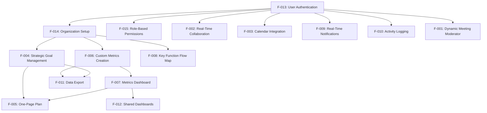
```mermaid
graph TD
    F013[F-013: User Authentication] --> F014[F-014: Organization Setup]
    F013 --> F015[F-015: Role-Based Permissions]
    F013 --> F002[F-002: Real-Time Collaboration]
    F013 --> F003[F-003: Calendar Integration]
    F013 --> F009[F-009: Real-Time Notifications]
    F013 --> F010[F-010: Activity Logging]
    F014 --> F004[F-004: Strategic Goal Management]
    F014 --> F006[F-006: Custom Metrics Creation]
    F014 --> F008[F-008: Key Function Flow Map]
    F004 --> F005[F-005: One-Page Plan]
    F006 --> F007[F-007: Metrics Dashboard]
    F006 --> F011[F-011: Data Export]
    F004 --> F011
    F007 --> F012[F-012: Shared Dashboards]
    F007 --> F005
    F013 --> F001[F-001: Dynamic Meeting Moderator]
```

#### 2.3.2 Integration Points

| Feature | Integration Point | Description |
| --- | --- | --- |
| F-003: Calendar Integration | Google Calendar API | Two-way synchronization of meeting events |
| F-003: Calendar Integration | Microsoft Graph API | Two-way synchronization of meeting events |
| F-013: User Authentication | Google Identity Platform | SSO authentication for Google accounts |
| F-013: User Authentication | Microsoft Identity Platform | SSO authentication for Microsoft accounts |
| F-009: Real-Time Notifications | Browser Push API | Delivery of browser notifications |
| F-009: Real-Time Notifications | Email Service | Delivery of email notifications |

#### 2.3.3 Shared Components

| Component | Used By | Description |
| --- | --- | --- |
| Real-Time Database | F-001, F-002, F-009 | Firebase Firestore for synchronous updates |
| Authentication Service | F-013, F-015, F-012 | Firebase Authentication for user identity |
| Metrics Engine | F-006, F-007, F-005 | Calculation and storage of metrics data |
| Dashboard Renderer | F-007, F-012 | Visualization of metrics and goals |

### 2.4 IMPLEMENTATION CONSIDERATIONS

#### 2.4.1 Technical Constraints

| Feature | Constraint | Impact |
| --- | --- | --- |
| F-002: Real-Time Collaboration | Maximum 1 second latency for updates | Requires optimized real-time database and efficient client-side rendering |
| F-007: Metrics Dashboard | Support for complex calculations and visualizations | May require specialized charting libraries and optimization for large datasets |
| F-008: Key Function Flow Map | Interactive diagram editing | Requires robust diagram editing component with undo/redo capability |
| F-013: User Authentication | Secure credential storage | Must follow industry best practices for authentication security |

#### 2.4.2 Performance Requirements

| Feature | Requirement | Measurement |
| --- | --- | --- |
| F-001: Dynamic Meeting Moderator | Support 50+ concurrent users in a single meeting | Response time \< 1 second for all operations |
| F-002: Real-Time Collaboration | Real-time updates visible to all participants | Updates propagate within 1 second to all clients |
| F-007: Metrics Dashboard | Fast loading of complex dashboards | Initial dashboard load \< 3 seconds, filter changes \< 1 second |
| F-013: User Authentication | Quick authentication process | Authentication completes within 2 seconds |

#### 2.4.3 Security Implications

| Feature | Security Consideration | Mitigation |
| --- | --- | --- |
| F-013: User Authentication | Credential theft | Implement OAuth, MFA, and secure credential storage |
| F-012: Shared Dashboards | Data exposure | Granular control over what data is shared, expiring links |
| F-015: Role-Based Permissions | Unauthorized access | Regular permission audits, principle of least privilege |
| F-010: Activity Logging | Tampering with logs | Immutable logs, separation of logging from application code |

#### 2.4.4 Traceability Matrix

| Requirement ID | Business Need | Technical Implementation | Validation Method |
| --- | --- | --- | --- |
| F-001-RQ-001 | Structured meeting facilitation | React component with step navigation | User acceptance testing |
| F-004-RQ-001 | Strategic goal alignment | Goal management database schema | Functional testing |
| F-006-RQ-001 | Custom performance tracking | Flexible metrics data model | Integration testing |
| F-013-RQ-001 | Secure user access | Firebase Authentication integration | Security testing |

## 3. TECHNOLOGY STACK

### 3.1 PROGRAMMING LANGUAGES

| Component | Language | Version | Justification |
| --- | --- | --- | --- |
| Frontend | TypeScript | 5.8+ | Provides type safety and improved developer experience for complex React applications |
| Backend | Typescript (Node.js) | 22.x LTS | Enables shared code between frontend and backend, consistent developer experience |

### 3.2 FRAMEWORKS & LIBRARIES

#### 3.2.1 Frontend

| Framework/Library | Version | Purpose | Justification |
| --- | --- | --- | --- |
| React with typescript | 19.x | UI component library | Specified in requirements; provides component-based architecture for complex UIs |
| React Router | 7.x | Client-side routing | Specified in requirements; enables SPA navigation with clean URLs |
| React Query | 5.x | Data fetching/caching | Specified in requirements; optimizes API calls with automatic caching |
| PrimeReact with typescript | 10.x | UI component library | Specified in requirements; provides comprehensive set of accessible components |
| PrimeFlex | 4.x | CSS utility framework | Specified in requirements; complements PrimeReact for responsive layouts |
| Chart.js | 4.x | Data visualization | Lightweight charting library for metrics dashboards with good React integration |
| React DnD | 16.x | Drag-and-drop | Required for interactive KFFM editor functionality |
| MermaidJS | 10.x | Diagram rendering | Visualization of organizational structures and function flows |
| Firebase Firestore Client | 4.x | Real-time communication | Frontend will be listening to docs updates to provide realtime updates in the browser |

#### 3.2.2 Backend

| Framework/Library | Version | Purpose | Justification |
| --- | --- | --- | --- |
| Express.js with typescript | 4.x | Web framework | Industry standard Node.js framework with robust middleware ecosystem |
| Prisma | 4.x | ORM | Specified in requirements; type-safe database access with migrations support |
| Firebase Admin SDK | 4.x | Real-time communication | The backend sends data to firebase firestore using the firebase admin sdk |
| Zod | 3.x | Validation | Schema validation for API requests to ensure data integrity |
| Winston | 3.x | Logging | Structured logging for monitoring and debugging |

### 3.3 DATABASES & STORAGE

| Database/Storage | Version | Purpose | Justification |
| --- | --- | --- | --- |
| PostgreSQL | 15.x | Primary database | Specified in requirements; robust relational database for structured data with strong ACID compliance |
| Firebase Firestore | Latest | Real-time database | Specified in requirements; optimized for real-time collaboration features |
| Redis | 7.x | Caching & session store | Improves performance for frequently accessed data and manages user sessions |
| Amazon S3 | N/A | Document storage | Secure, scalable storage for meeting attachments and exports |

#### 3.3.1 Data Persistence Strategy

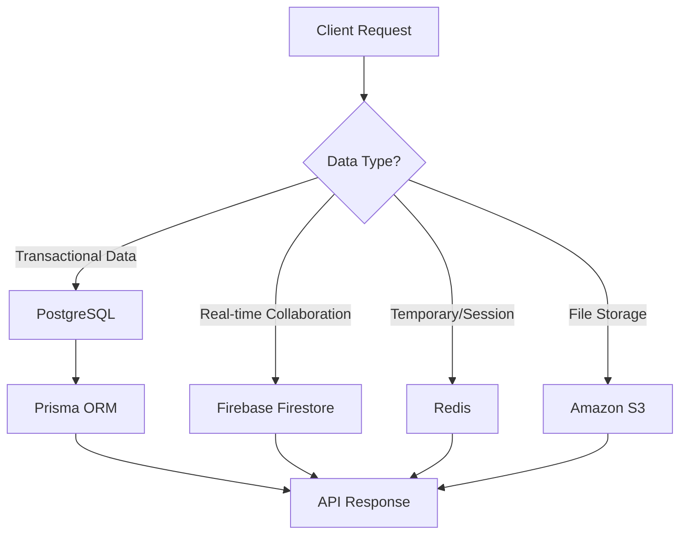
```mermaid
flowchart TD
    A[Client Request] --> B{Data Type?}
    B -->|Transactional Data| C[PostgreSQL]
    B -->|Real-time Collaboration| D[Firebase Firestore]
    B -->|Temporary/Session| E[Redis]
    B -->|File Storage| F[Amazon S3]
    C --> G[Prisma ORM]
    G --> H[API Response]
    D --> H
    E --> H
    F --> H
```

### 3.4 THIRD-PARTY SERVICES

| Service | Purpose | Integration Method | Justification |
| --- | --- | --- | --- |
| Firebase Authentication | User authentication | SDK | Specified in requirements; supports Google/Microsoft SSO and email/password |
| Google Calendar API | Calendar integration | REST API | Specified in requirements; enables two-way sync with Google Calendar |
| Microsoft Graph API | Calendar/Outlook integration | REST API | Specified in requirements; enables two-way sync with Outlook |
| Firebase Cloud Messaging | Push notifications | SDK | Real-time notifications for meeting reminders and metric alerts |
| SendGrid | Email notifications | REST API | Reliable email delivery for notifications and summaries |
| Honeycomb | Observability | SDK | Specified in requirements; provides detailed monitoring and performance insights |

### 3.5 DEVELOPMENT & DEPLOYMENT

#### 3.5.1 Development Tools

| Tool | Version | Purpose | Justification |
| --- | --- | --- | --- |
| ESLint | 8.x | Code linting | Ensures code quality and consistency across the codebase |
| Prettier | 2.x | Code formatting | Standardizes code style to reduce review friction |
| Jest | 29.x | Testing framework | Comprehensive testing solution for both frontend and backend |
| React Testing Library | 14.x | Component testing | Testing React components in a user-centric way |
| Cypress | 12.x | E2E testing | End-to-end testing of critical user flows |

#### 3.5.2 Infrastructure & Deployment

| Tool/Service | Version | Purpose | Justification |
| --- | --- | --- | --- |
| Docker | Latest | Containerization | Consistent environments across development and production |
| Terraform | 1.5+ | Infrastructure as Code | Specified in requirements; declarative infrastructure management |
| GitHub Actions | N/A | CI/CD | Specified in requirements; automated testing and deployment pipelines |
| AWS | N/A | Cloud platform | Scalable infrastructure with comprehensive service offerings |
| AWS ECS | N/A | Container orchestration | Managed container service for simplified operations |
| AWS RDS | N/A | Managed PostgreSQL | Reliable, scalable database service with automated backups |
| AWS CloudFront | N/A | CDN | Global content delivery for improved frontend performance |

#### 3.5.3 Deployment Architecture

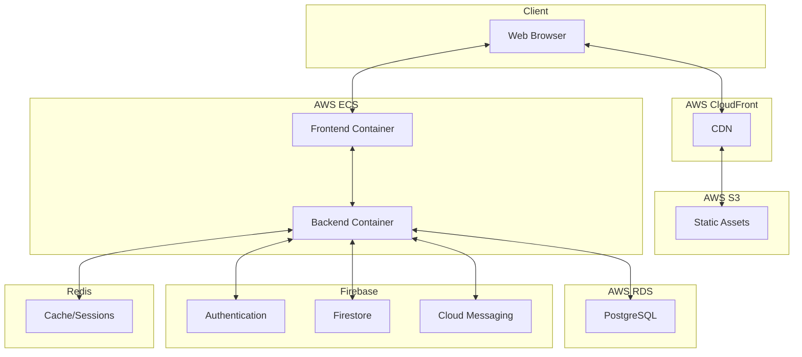
```mermaid
flowchart TD
    subgraph "Client"
        A[Web Browser]
    end
    
    subgraph "AWS CloudFront"
        B[CDN]
    end
    
    subgraph "AWS S3"
        C[Static Assets]
    end
    
    subgraph "AWS ECS"
        D[Frontend Container]
        E[Backend Container]
    end
    
    subgraph "AWS RDS"
        F[PostgreSQL]
    end
    
    subgraph "Firebase"
        G[Authentication]
        H[Firestore]
        I[Cloud Messaging]
    end
    
    subgraph "Redis"
        J[Cache/Sessions]
    end
    
    A <--> B
    B <--> C
    A <--> D
    D <--> E
    E <--> F
    E <--> G
    E <--> H
    E <--> I
    E <--> J
```

### 3.6 SECURITY CONSIDERATIONS

| Component | Security Measure | Implementation |
| --- | --- | --- |
| Authentication | Multi-factor authentication | Firebase Authentication with optional MFA |
| API Security | JWT validation | Token-based authentication for all API requests |
| Data Protection | Encryption at rest | AWS RDS and S3 encryption |
| Data Protection | Encryption in transit | HTTPS/TLS for all communications |
| Access Control | Role-based permissions | Custom middleware for authorization checks |
| Audit | Activity logging | Comprehensive logging of all security-relevant events |

## 4. PROCESS FLOWCHART

### 4.1 SYSTEM WORKFLOWS

#### 4.1.1 Core Business Processes

##### Meeting Management Workflow

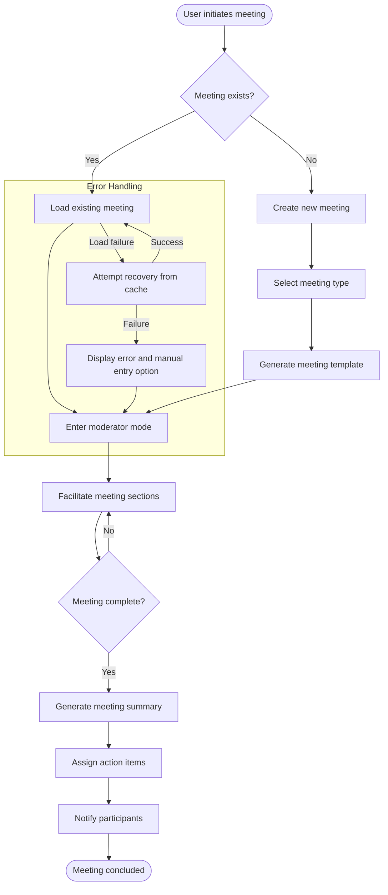
```mermaid
flowchart TD
    Start([User initiates meeting]) --> A{Meeting exists?}
    A -->|Yes| B[Load existing meeting]
    A -->|No| C[Create new meeting]
    C --> D[Select meeting type]
    D --> E[Generate meeting template]
    B --> F[Enter moderator mode]
    E --> F
    F --> G[Facilitate meeting sections]
    G --> H{Meeting complete?}
    H -->|No| G
    H -->|Yes| I[Generate meeting summary]
    I --> J[Assign action items]
    J --> K[Notify participants]
    K --> End([Meeting concluded])
    
    subgraph "Error Handling"
        B -->|Load failure| B1[Attempt recovery from cache]
        B1 -->|Success| B
        B1 -->|Failure| B2[Display error and manual entry option]
        B2 --> F
    end
```

##### Strategic Goal Management Workflow

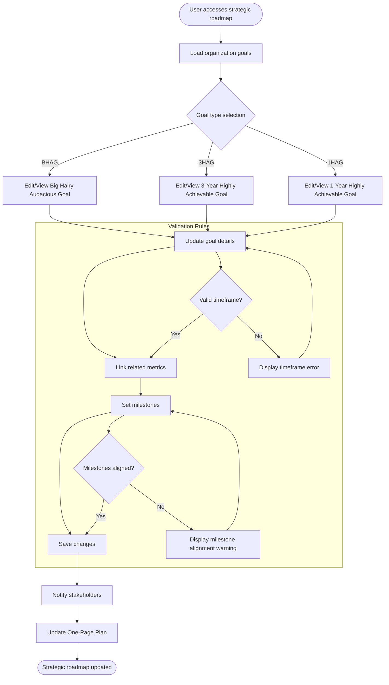
```mermaid
flowchart TD
    Start([User accesses strategic roadmap]) --> A[Load organization goals]
    A --> B{Goal type selection}
    B -->|BHAG| C[Edit/View Big Hairy Audacious Goal]
    B -->|3HAG| D[Edit/View 3-Year Highly Achievable Goal]
    B -->|1HAG| E[Edit/View 1-Year Highly Achievable Goal]
    C --> F[Update goal details]
    D --> F
    E --> F
    F --> G[Link related metrics]
    G --> H[Set milestones]
    H --> I[Save changes]
    I --> J[Notify stakeholders]
    J --> K[Update One-Page Plan]
    K --> End([Strategic roadmap updated])
    
    subgraph "Validation Rules"
        F --> F1{Valid timeframe?}
        F1 -->|Yes| G
        F1 -->|No| F2[Display timeframe error]
        F2 --> F
        H --> H1{Milestones aligned?}
        H1 -->|Yes| I
        H1 -->|No| H2[Display milestone alignment warning]
        H2 --> H
    end
```

##### Metrics Management Workflow

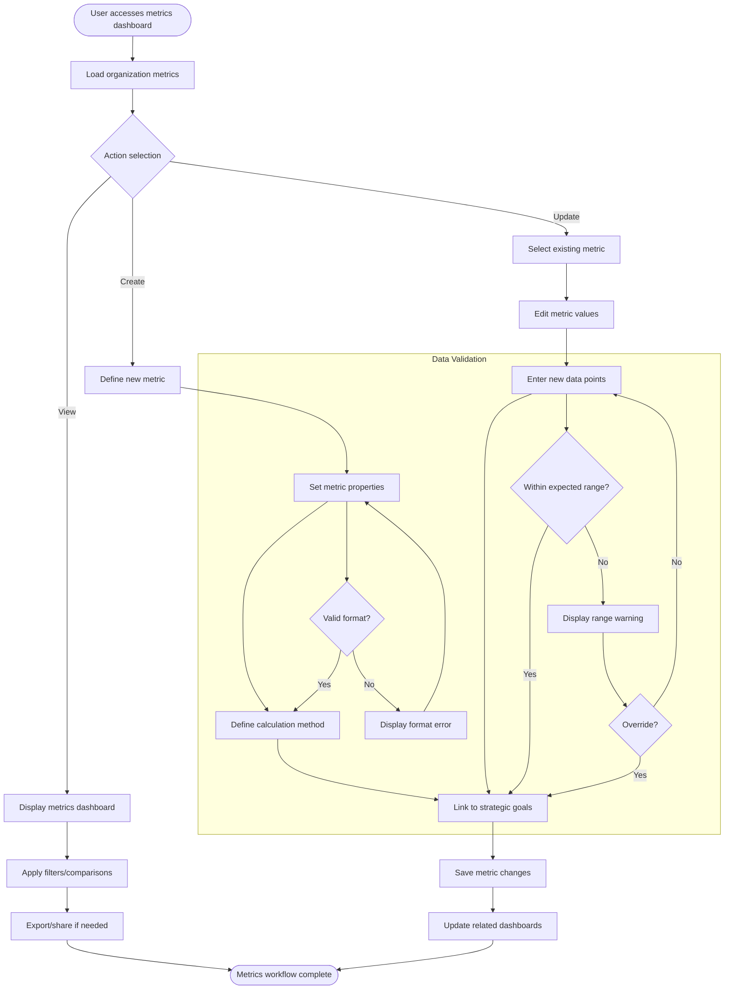
```mermaid
flowchart TD
    Start([User accesses metrics dashboard]) --> A[Load organization metrics]
    A --> B{Action selection}
    B -->|Create| C[Define new metric]
    B -->|Update| D[Select existing metric]
    B -->|View| E[Display metrics dashboard]
    C --> F[Set metric properties]
    D --> G[Edit metric values]
    F --> H[Define calculation method]
    G --> I[Enter new data points]
    H --> J[Link to strategic goals]
    I --> J
    E --> K[Apply filters/comparisons]
    J --> L[Save metric changes]
    K --> M[Export/share if needed]
    L --> N[Update related dashboards]
    M --> End([Metrics workflow complete])
    N --> End
    
    subgraph "Data Validation"
        F --> F1{Valid format?}
        F1 -->|Yes| H
        F1 -->|No| F2[Display format error]
        F2 --> F
        I --> I1{Within expected range?}
        I1 -->|Yes| J
        I1 -->|No| I2[Display range warning]
        I2 --> I3{Override?}
        I3 -->|Yes| J
        I3 -->|No| I
    end
```

##### KFFM Editing Workflow

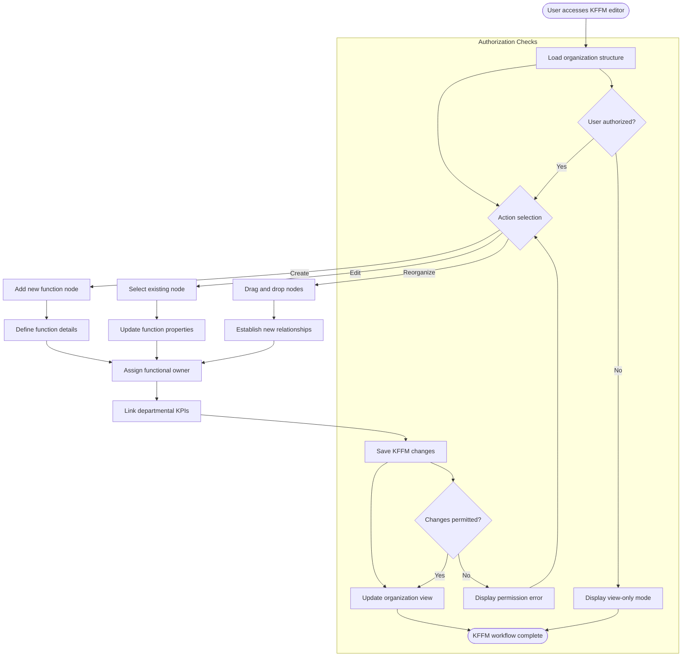
```mermaid
flowchart TD
    Start([User accesses KFFM editor]) --> A[Load organization structure]
    A --> B{Action selection}
    B -->|Create| C[Add new function node]
    B -->|Edit| D[Select existing node]
    B -->|Reorganize| E[Drag and drop nodes]
    C --> F[Define function details]
    D --> G[Update function properties]
    E --> H[Establish new relationships]
    F --> I[Assign functional owner]
    G --> I
    H --> I
    I --> J[Link departmental KPIs]
    J --> K[Save KFFM changes]
    K --> L[Update organization view]
    L --> End([KFFM workflow complete])
    
    subgraph "Authorization Checks"
        A --> A1{User authorized?}
        A1 -->|Yes| B
        A1 -->|No| A2[Display view-only mode]
        A2 --> End
        K --> K1{Changes permitted?}
        K1 -->|Yes| L
        K1 -->|No| K2[Display permission error]
        K2 --> B
    end
```

#### 4.1.2 Integration Workflows

##### Calendar Integration Workflow

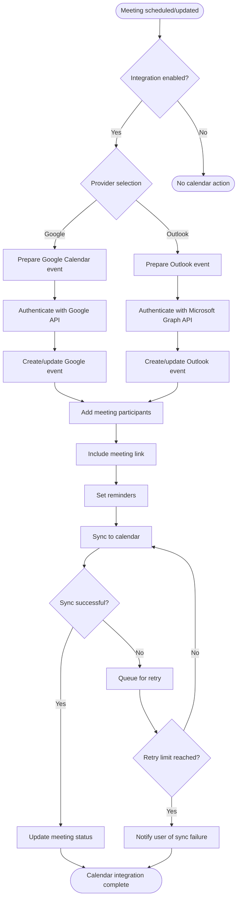
```mermaid
flowchart TD
    Start([Meeting scheduled/updated]) --> A{Integration enabled?}
    A -->|Yes| B{Provider selection}
    A -->|No| End([No calendar action])
    B -->|Google| C[Prepare Google Calendar event]
    B -->|Outlook| D[Prepare Outlook event]
    C --> E[Authenticate with Google API]
    D --> F[Authenticate with Microsoft Graph API]
    E --> G[Create/update Google event]
    F --> H[Create/update Outlook event]
    G --> I[Add meeting participants]
    H --> I
    I --> J[Include meeting link]
    J --> K[Set reminders]
    K --> L[Sync to calendar]
    L --> M{Sync successful?}
    M -->|Yes| N[Update meeting status]
    M -->|No| O[Queue for retry]
    N --> End2([Calendar integration complete])
    O --> P{Retry limit reached?}
    P -->|No| L
    P -->|Yes| Q[Notify user of sync failure]
    Q --> End2
```

##### Authentication Integration Workflow

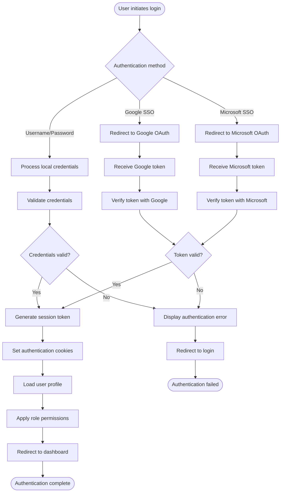
```mermaid
flowchart TD
    Start([User initiates login]) --> A{Authentication method}
    A -->|Google SSO| B[Redirect to Google OAuth]
    A -->|Microsoft SSO| C[Redirect to Microsoft OAuth]
    A -->|Username/Password| D[Process local credentials]
    B --> E[Receive Google token]
    C --> F[Receive Microsoft token]
    D --> G[Validate credentials]
    E --> H[Verify token with Google]
    F --> I[Verify token with Microsoft]
    G --> J{Credentials valid?}
    H --> K{Token valid?}
    I --> K
    J -->|Yes| L[Generate session token]
    J -->|No| M[Display authentication error]
    K -->|Yes| L
    K -->|No| M
    L --> N[Set authentication cookies]
    M --> O[Redirect to login]
    N --> P[Load user profile]
    P --> Q[Apply role permissions]
    Q --> R[Redirect to dashboard]
    R --> End([Authentication complete])
    O --> End2([Authentication failed])
```

##### Notification Integration Workflow

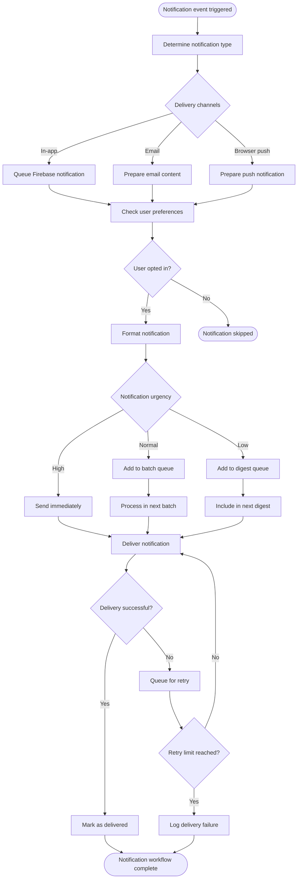
```mermaid
flowchart TD
    Start([Notification event triggered]) --> A[Determine notification type]
    A --> B{Delivery channels}
    B -->|In-app| C[Queue Firebase notification]
    B -->|Email| D[Prepare email content]
    B -->|Browser push| E[Prepare push notification]
    C --> F[Check user preferences]
    D --> F
    E --> F
    F --> G{User opted in?}
    G -->|Yes| H[Format notification]
    G -->|No| End([Notification skipped])
    H --> I{Notification urgency}
    I -->|High| J[Send immediately]
    I -->|Normal| K[Add to batch queue]
    I -->|Low| L[Add to digest queue]
    J --> M[Deliver notification]
    K --> N[Process in next batch]
    L --> O[Include in next digest]
    N --> M
    O --> M
    M --> P{Delivery successful?}
    P -->|Yes| Q[Mark as delivered]
    P -->|No| R[Queue for retry]
    Q --> End2([Notification workflow complete])
    R --> S{Retry limit reached?}
    S -->|No| M
    S -->|Yes| T[Log delivery failure]
    T --> End2
```

### 4.2 FLOWCHART REQUIREMENTS

#### 4.2.1 User Journey: Meeting Facilitation

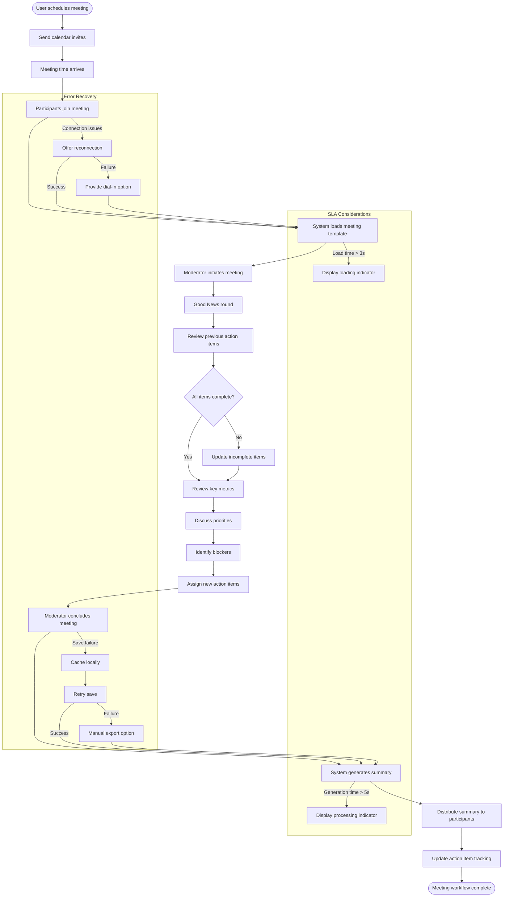
```mermaid
flowchart TD
    Start([User schedules meeting]) --> A[Send calendar invites]
    A --> B[Meeting time arrives]
    B --> C[Participants join meeting]
    C --> D[System loads meeting template]
    D --> E[Moderator initiates meeting]
    
    E --> F[Good News round]
    F --> G[Review previous action items]
    G --> H{All items complete?}
    H -->|Yes| J[Review key metrics]
    H -->|No| I[Update incomplete items]
    I --> J
    
    J --> K[Discuss priorities]
    K --> L[Identify blockers]
    L --> M[Assign new action items]
    M --> N[Moderator concludes meeting]
    N --> O[System generates summary]
    O --> P[Distribute summary to participants]
    P --> Q[Update action item tracking]
    Q --> End([Meeting workflow complete])
    
    subgraph "SLA Considerations"
        D -->|Load time > 3s| D1[Display loading indicator]
        O -->|Generation time > 5s| O1[Display processing indicator]
    end
    
    subgraph "Error Recovery"
        C -->|Connection issues| C1[Offer reconnection]
        C1 -->|Success| D
        C1 -->|Failure| C2[Provide dial-in option]
        C2 --> D
        N -->|Save failure| N1[Cache locally]
        N1 --> N2[Retry save]
        N2 -->|Success| O
        N2 -->|Failure| N3[Manual export option]
        N3 --> O
    end
```

#### 4.2.2 User Journey: Strategic Planning

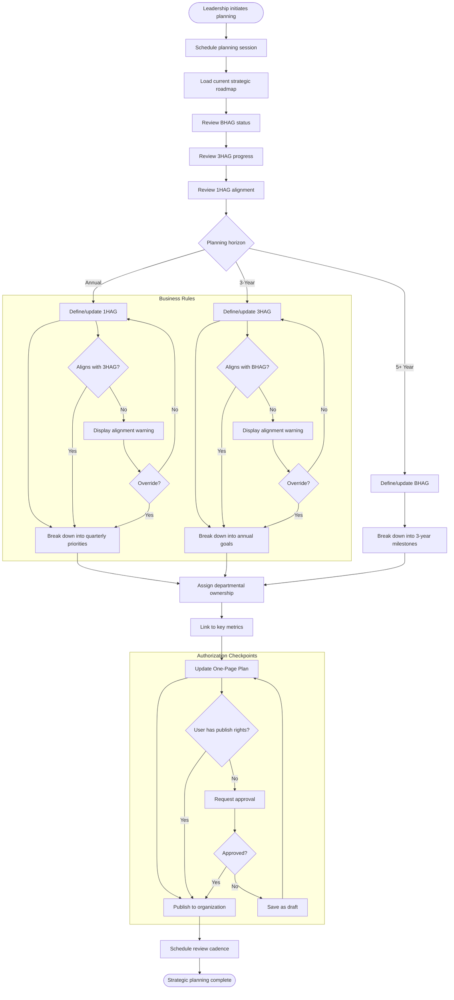
```mermaid
flowchart TD
    Start([Leadership initiates planning]) --> A[Schedule planning session]
    A --> B[Load current strategic roadmap]
    B --> C[Review BHAG status]
    C --> D[Review 3HAG progress]
    D --> E[Review 1HAG alignment]
    
    E --> F{Planning horizon}
    F -->|Annual| G[Define/update 1HAG]
    F -->|3-Year| H[Define/update 3HAG]
    F -->|5+ Year| I[Define/update BHAG]
    
    G --> J[Break down into quarterly priorities]
    H --> K[Break down into annual goals]
    I --> L[Break down into 3-year milestones]
    
    J --> M[Assign departmental ownership]
    K --> M
    L --> M
    
    M --> N[Link to key metrics]
    N --> O[Update One-Page Plan]
    O --> P[Publish to organization]
    P --> Q[Schedule review cadence]
    Q --> End([Strategic planning complete])
    
    subgraph "Authorization Checkpoints"
        O --> O1{User has publish rights?}
        O1 -->|Yes| P
        O1 -->|No| O2[Request approval]
        O2 --> O3{Approved?}
        O3 -->|Yes| P
        O3 -->|No| O4[Save as draft]
        O4 --> O
    end
    
    subgraph "Business Rules"
        G --> G1{Aligns with 3HAG?}
        G1 -->|Yes| J
        G1 -->|No| G2[Display alignment warning]
        G2 --> G3{Override?}
        G3 -->|Yes| J
        G3 -->|No| G
        
        H --> H1{Aligns with BHAG?}
        H1 -->|Yes| K
        H1 -->|No| H2[Display alignment warning]
        H2 --> H3{Override?}
        H3 -->|Yes| K
        H3 -->|No| H
    end
```

#### 4.2.3 User Journey: Metrics Management

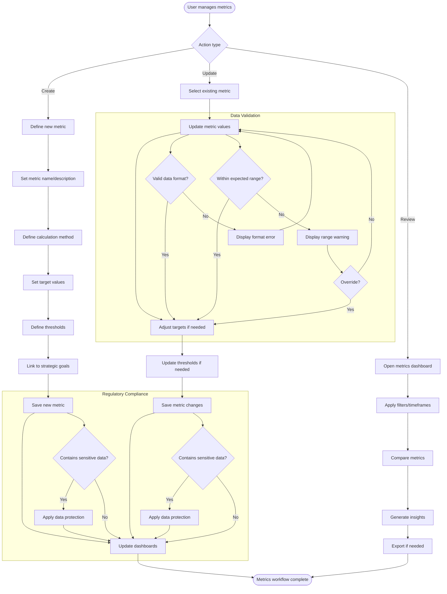
```mermaid
flowchart TD
    Start([User manages metrics]) --> A{Action type}
    A -->|Create| B[Define new metric]
    A -->|Update| C[Select existing metric]
    A -->|Review| D[Open metrics dashboard]
    
    B --> E[Set metric name/description]
    E --> F[Define calculation method]
    F --> G[Set target values]
    G --> H[Define thresholds]
    H --> I[Link to strategic goals]
    I --> J[Save new metric]
    
    C --> K[Update metric values]
    K --> L[Adjust targets if needed]
    L --> M[Update thresholds if needed]
    M --> N[Save metric changes]
    
    D --> O[Apply filters/timeframes]
    O --> P[Compare metrics]
    P --> Q[Generate insights]
    Q --> R[Export if needed]
    
    J --> S[Update dashboards]
    N --> S
    R --> End([Metrics workflow complete])
    S --> End
    
    subgraph "Data Validation"
        K --> K1{Valid data format?}
        K1 -->|Yes| L
        K1 -->|No| K2[Display format error]
        K2 --> K
        
        K --> K3{Within expected range?}
        K3 -->|Yes| L
        K3 -->|No| K4[Display range warning]
        K4 --> K5{Override?}
        K5 -->|Yes| L
        K5 -->|No| K
    end
    
    subgraph "Regulatory Compliance"
        J --> J1{Contains sensitive data?}
        J1 -->|Yes| J2[Apply data protection]
        J2 --> S
        J1 -->|No| S
        
        N --> N1{Contains sensitive data?}
        N1 -->|Yes| N2[Apply data protection]
        N2 --> S
        N1 -->|No| S
    end
```

### 4.3 TECHNICAL IMPLEMENTATION

#### 4.3.1 State Management: Meeting Lifecycle

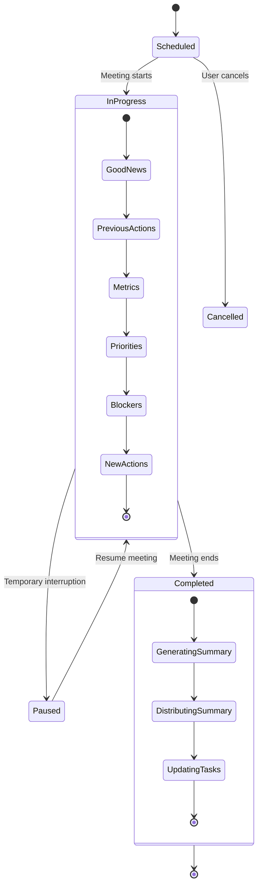
```mermaid
stateDiagram-v2
    [*] --> Scheduled
    Scheduled --> InProgress: Meeting starts
    Scheduled --> Cancelled: User cancels
    InProgress --> Paused: Temporary interruption
    Paused --> InProgress: Resume meeting
    InProgress --> Completed: Meeting ends
    Completed --> [*]
    
    state InProgress {
        [*] --> GoodNews
        GoodNews --> PreviousActions
        PreviousActions --> Metrics
        Metrics --> Priorities
        Priorities --> Blockers
        Blockers --> NewActions
        NewActions --> [*]
    }
    
    state Completed {
        [*] --> GeneratingSummary
        GeneratingSummary --> DistributingSummary
        DistributingSummary --> UpdatingTasks
        UpdatingTasks --> [*]
    }
```

#### 4.3.2 Error Handling: Real-Time Collaboration

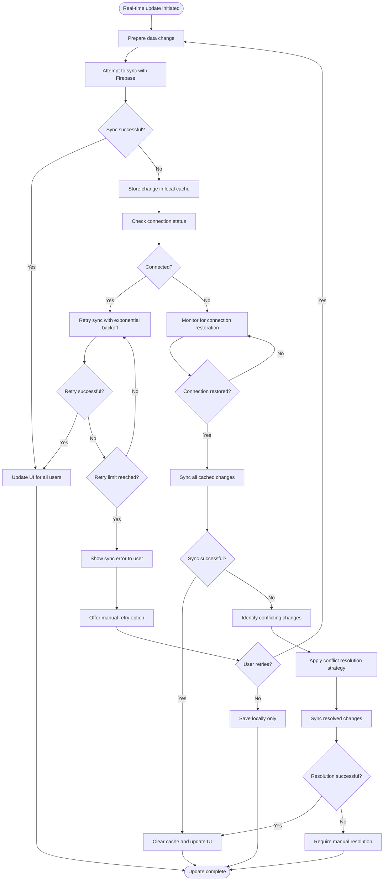
```mermaid
flowchart TD
    Start([Real-time update initiated]) --> A[Prepare data change]
    A --> B[Attempt to sync with Firebase]
    B --> C{Sync successful?}
    C -->|Yes| D[Update UI for all users]
    C -->|No| E[Store change in local cache]
    D --> End([Update complete])
    
    E --> F[Check connection status]
    F --> G{Connected?}
    G -->|Yes| H[Retry sync with exponential backoff]
    G -->|No| I[Monitor for connection restoration]
    
    H --> J{Retry successful?}
    J -->|Yes| D
    J -->|No| K{Retry limit reached?}
    K -->|No| H
    K -->|Yes| L[Show sync error to user]
    
    I --> M{Connection restored?}
    M -->|Yes| N[Sync all cached changes]
    M -->|No| I
    
    N --> O{Sync successful?}
    O -->|Yes| P[Clear cache and update UI]
    O -->|No| Q[Identify conflicting changes]
    
    Q --> R[Apply conflict resolution strategy]
    R --> S[Sync resolved changes]
    S --> T{Resolution successful?}
    T -->|Yes| P
    T -->|No| U[Require manual resolution]
    
    P --> End
    L --> V[Offer manual retry option]
    V --> W{User retries?}
    W -->|Yes| A
    W -->|No| X[Save locally only]
    X --> End
    U --> End
```

#### 4.3.3 Transaction Boundaries: Metrics Update

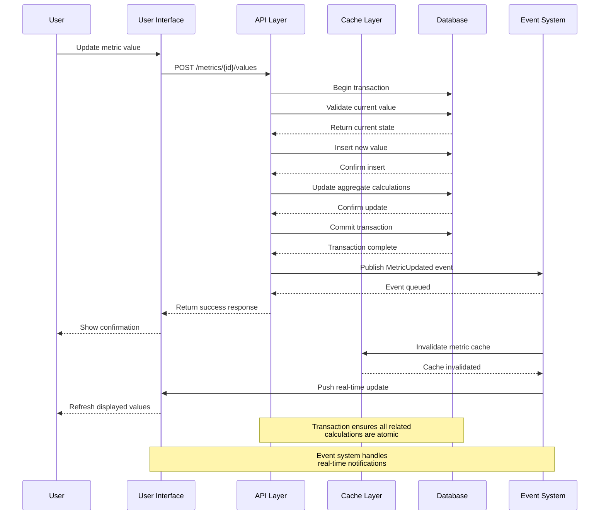
```mermaid
sequenceDiagram
    participant User
    participant UI as User Interface
    participant API as API Layer
    participant Cache as Cache Layer
    participant DB as Database
    participant Events as Event System
    
    User->>UI: Update metric value
    UI->>API: POST /metrics/{id}/values
    
    API->>DB: Begin transaction
    
    API->>DB: Validate current value
    DB-->>API: Return current state
    
    API->>DB: Insert new value
    DB-->>API: Confirm insert
    
    API->>DB: Update aggregate calculations
    DB-->>API: Confirm update
    
    API->>DB: Commit transaction
    DB-->>API: Transaction complete
    
    API->>Events: Publish MetricUpdated event
    Events-->>API: Event queued
    
    API-->>UI: Return success response
    UI-->>User: Show confirmation
    
    Events->>Cache: Invalidate metric cache
    Cache-->>Events: Cache invalidated
    
    Events->>UI: Push real-time update
    UI-->>User: Refresh displayed values
    
    Note over API,DB: Transaction ensures all related<br/>calculations are atomic
    Note over Events,UI: Event system handles<br/>real-time notifications
```

### 4.4 INTEGRATION SEQUENCE DIAGRAMS

#### 4.4.1 Calendar Integration Sequence

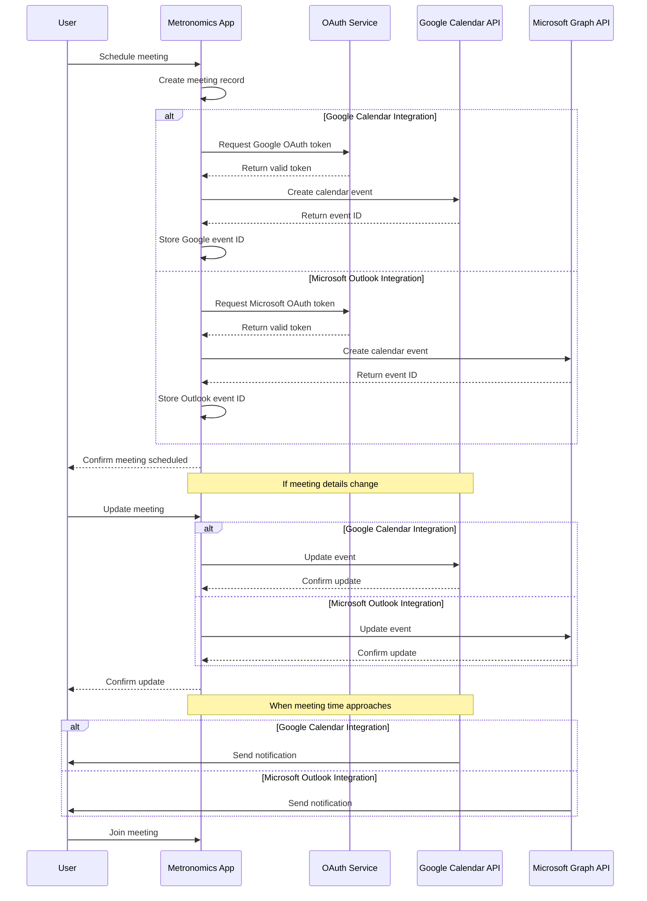
```mermaid
sequenceDiagram
    participant User
    participant App as Metronomics App
    participant Auth as OAuth Service
    participant Google as Google Calendar API
    participant MS as Microsoft Graph API
    
    User->>App: Schedule meeting
    App->>App: Create meeting record
    
    alt Google Calendar Integration
        App->>Auth: Request Google OAuth token
        Auth-->>App: Return valid token
        App->>Google: Create calendar event
        Google-->>App: Return event ID
        App->>App: Store Google event ID
    else Microsoft Outlook Integration
        App->>Auth: Request Microsoft OAuth token
        Auth-->>App: Return valid token
        App->>MS: Create calendar event
        MS-->>App: Return event ID
        App->>App: Store Outlook event ID
    end
    
    App-->>User: Confirm meeting scheduled
    
    Note over App,Google: If meeting details change
    
    User->>App: Update meeting
    
    alt Google Calendar Integration
        App->>Google: Update event
        Google-->>App: Confirm update
    else Microsoft Outlook Integration
        App->>MS: Update event
        MS-->>App: Confirm update
    end
    
    App-->>User: Confirm update
    
    Note over App,Google: When meeting time approaches
    
    alt Google Calendar Integration
        Google->>User: Send notification
    else Microsoft Outlook Integration
        MS->>User: Send notification
    end
    
    User->>App: Join meeting
```

#### 4.4.2 Authentication Flow Sequence

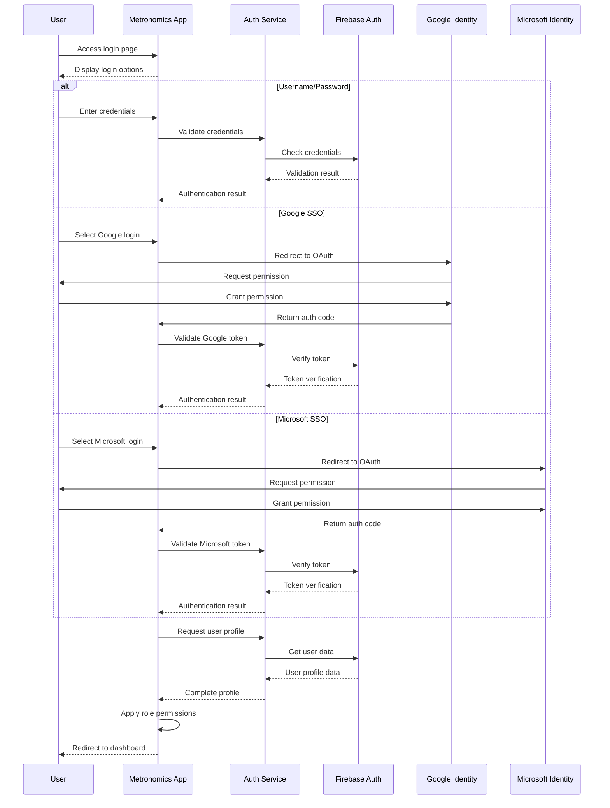
```mermaid
sequenceDiagram
    participant User
    participant App as Metronomics App
    participant Auth as Auth Service
    participant Firebase as Firebase Auth
    participant Google as Google Identity
    participant MS as Microsoft Identity
    
    User->>App: Access login page
    App-->>User: Display login options
    
    alt Username/Password
        User->>App: Enter credentials
        App->>Auth: Validate credentials
        Auth->>Firebase: Check credentials
        Firebase-->>Auth: Validation result
        Auth-->>App: Authentication result
    else Google SSO
        User->>App: Select Google login
        App->>Google: Redirect to OAuth
        Google->>User: Request permission
        User->>Google: Grant permission
        Google->>App: Return auth code
        App->>Auth: Validate Google token
        Auth->>Firebase: Verify token
        Firebase-->>Auth: Token verification
        Auth-->>App: Authentication result
    else Microsoft SSO
        User->>App: Select Microsoft login
        App->>MS: Redirect to OAuth
        MS->>User: Request permission
        User->>MS: Grant permission
        MS->>App: Return auth code
        App->>Auth: Validate Microsoft token
        Auth->>Firebase: Verify token
        Firebase-->>Auth: Token verification
        Auth-->>App: Authentication result
    end
    
    App->>Auth: Request user profile
    Auth->>Firebase: Get user data
    Firebase-->>Auth: User profile data
    Auth-->>App: Complete profile
    
    App->>App: Apply role permissions
    App-->>User: Redirect to dashboard
```

#### 4.4.3 Real-Time Collaboration Sequence

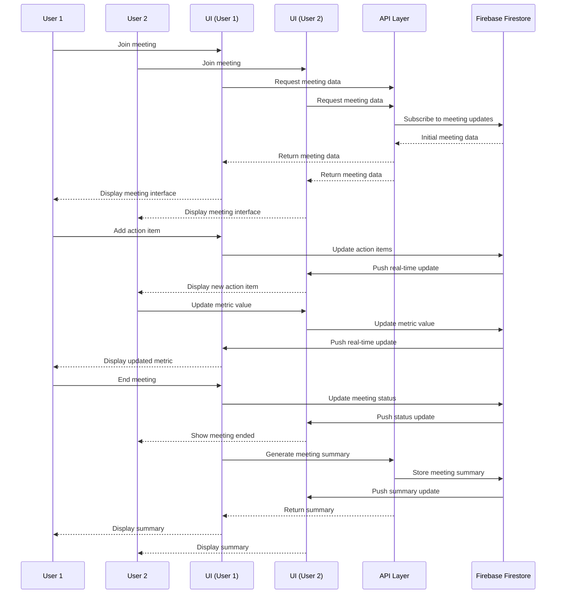
```mermaid
sequenceDiagram
    participant User1 as User 1
    participant User2 as User 2
    participant UI1 as UI (User 1)
    participant UI2 as UI (User 2)
    participant API as API Layer
    participant Firebase as Firebase Firestore
    
    User1->>UI1: Join meeting
    User2->>UI2: Join meeting
    
    UI1->>API: Request meeting data
    UI2->>API: Request meeting data
    
    API->>Firebase: Subscribe to meeting updates
    Firebase-->>API: Initial meeting data
    API-->>UI1: Return meeting data
    API-->>UI2: Return meeting data
    
    UI1-->>User1: Display meeting interface
    UI2-->>User2: Display meeting interface
    
    User1->>UI1: Add action item
    UI1->>Firebase: Update action items
    Firebase->>UI2: Push real-time update
    UI2-->>User2: Display new action item
    
    User2->>UI2: Update metric value
    UI2->>Firebase: Update metric value
    Firebase->>UI1: Push real-time update
    UI1-->>User1: Display updated metric
    
    User1->>UI1: End meeting
    UI1->>Firebase: Update meeting status
    Firebase->>UI2: Push status update
    UI2-->>User2: Show meeting ended
    
    UI1->>API: Generate meeting summary
    API->>Firebase: Store meeting summary
    Firebase->>UI2: Push summary update
    
    API-->>UI1: Return summary
    UI1-->>User1: Display summary
    UI2-->>User2: Display summary
```

### 4.5 HIGH-LEVEL SYSTEM WORKFLOW

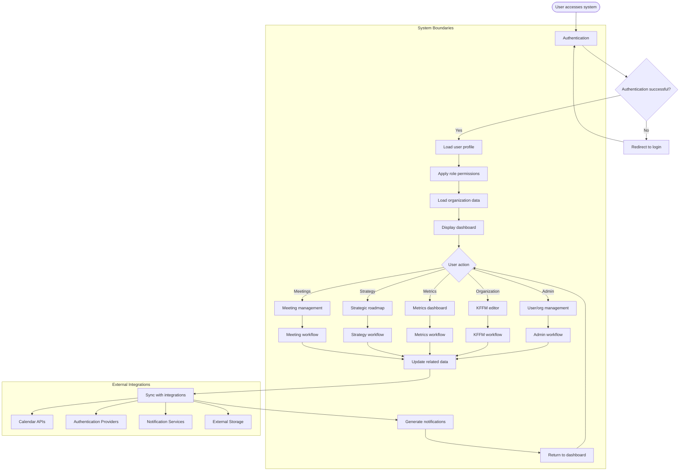
```mermaid
flowchart TD
    Start([User accesses system]) --> A[Authentication]
    A --> B{Authentication successful?}
    B -->|Yes| C[Load user profile]
    B -->|No| D[Redirect to login]
    D --> A
    
    C --> E[Apply role permissions]
    E --> F[Load organization data]
    F --> G[Display dashboard]
    
    G --> H{User action}
    H -->|Meetings| I[Meeting management]
    H -->|Strategy| J[Strategic roadmap]
    H -->|Metrics| K[Metrics dashboard]
    H -->|Organization| L[KFFM editor]
    H -->|Admin| M[User/org management]
    
    I --> N[Meeting workflow]
    J --> O[Strategy workflow]
    K --> P[Metrics workflow]
    L --> Q[KFFM workflow]
    M --> R[Admin workflow]
    
    N --> S[Update related data]
    O --> S
    P --> S
    Q --> S
    R --> S
    
    S --> T[Sync with integrations]
    T --> U[Generate notifications]
    U --> V[Return to dashboard]
    V --> H
    
    subgraph "System Boundaries"
        A
        C
        E
        F
        G
        H
        I
        J
        K
        L
        M
        N
        O
        P
        Q
        R
        S
        U
        V
    end
    
    subgraph "External Integrations"
        T1[Calendar APIs]
        T2[Authentication Providers]
        T3[Notification Services]
        T4[External Storage]
        T --> T1
        T --> T2
        T --> T3
        T --> T4
    end
```

## 5. SYSTEM ARCHITECTURE

### 5.1 HIGH-LEVEL ARCHITECTURE

#### 5.1.1 System Overview

The Metronomics Platform employs a multi-tier architecture with a clear separation of concerns, following a microservices-inspired approach while maintaining practical monolithic elements for simplicity. The architecture is designed around the following principles:

- **Event-Driven Real-Time Collaboration**: Core meeting and collaboration features leverage real-time event propagation to ensure all users have synchronized views.
- **Domain-Driven Design**: System components are organized around business domains (meetings, metrics, strategic planning) rather than technical functions.
- **API-First Development**: All functionality is exposed through well-defined APIs to enable future extensibility and integration.
- **Responsive Progressive Web Application**: A single responsive web application that adapts to different devices without requiring native mobile apps.

The system boundaries encompass:

- Frontend web application accessible via browsers
- Backend API services for business logic and data processing
- Real-time synchronization layer for collaborative features
- Persistent data storage for organizational information
- Integration interfaces with external calendar and authentication systems

#### 5.1.2 Core Components Table

| Component | Primary Responsibility | Key Dependencies | Critical Considerations |
| --- | --- | --- | --- |
| Web Client | Deliver responsive UI, manage client-side state, handle real-time updates | React, PrimeReact, Firebase SDK | Must maintain performance across devices, handle offline/reconnection scenarios |
| API Gateway | Route requests, handle authentication, enforce rate limits | Node.js, Express | Single point of entry for all API requests, must be highly available |
| Meeting Service | Manage meeting lifecycle, facilitate real-time collaboration | Firebase Firestore, Calendar APIs | Real-time synchronization is critical, must handle concurrent edits |
| Strategic Planning Service | Manage goals, roadmaps, and organizational structure | PostgreSQL, Prisma | Data integrity across related strategic elements is essential |
| Metrics Service | Track KPIs, calculate derived metrics, generate visualizations | PostgreSQL, Prisma | Must handle time-series data efficiently, support complex calculations |
| User Management Service | Handle authentication, authorization, and organization structure | Firebase Auth, PostgreSQL | Security is paramount, must enforce proper access controls |
| Notification Service | Deliver alerts, reminders, and system messages | Firebase Cloud Messaging, Email Service | Timely delivery with appropriate prioritization |

#### 5.1.3 Data Flow Description

The Metronomics Platform's data flows are organized around key business processes:

**Authentication Flow**: Users authenticate via Firebase Authentication (Google SSO, Microsoft SSO, or username/password). Upon successful authentication, the system retrieves user profile and permissions from PostgreSQL, establishing a session with appropriate role-based access controls.

**Meeting Collaboration Flow**: During meetings, real-time updates flow bidirectionally between clients and Firebase Firestore. When a user makes a change (adds an action item, updates a metric), the change is immediately synchronized to all connected clients. Concurrently, the system persists these changes to PostgreSQL for long-term storage and reporting.

**Strategic Planning Flow**: Updates to strategic goals (1HAG, 3HAG, BHAG) are processed through the API Gateway to the Strategic Planning Service, which validates and persists changes to PostgreSQL. These updates trigger notifications to relevant stakeholders and may cause cascading updates to related metrics or dashboards.

**Metrics Management Flow**: Metric definitions and values flow from the client through the API Gateway to the Metrics Service. Raw metric values are stored in PostgreSQL, while derived calculations may be computed on-demand or cached for performance. Historical metric data is retained for trend analysis and forecasting.

**Calendar Integration Flow**: Meeting schedules flow bidirectionally between the Meeting Service and external calendar systems (Google Calendar, Microsoft Outlook) through their respective APIs, ensuring synchronized scheduling across platforms.

#### 5.1.4 External Integration Points

| System Name | Integration Type | Data Exchange Pattern | Protocol/Format | SLA Requirements |
| --- | --- | --- | --- | --- |
| Google Calendar | Bidirectional | Synchronous API calls with webhooks for updates | REST/JSON | 99.9% availability, \<2s response time |
| Microsoft Outlook | Bidirectional | Synchronous API calls with webhooks for updates | REST/JSON | 99.9% availability, \<2s response time |
| Google Identity | Authentication | OAuth 2.0 flow with token validation | REST/JSON | 99.99% availability, \<1s response time |
| Microsoft Identity | Authentication | OAuth 2.0 flow with token validation | REST/JSON | 99.99% availability, \<1s response time |
| Email Service | Outbound | Asynchronous message queue | SMTP/MIME | 99.5% delivery rate, \<5min delivery time |

### 5.2 COMPONENT DETAILS

#### 5.2.1 Web Client

**Purpose and Responsibilities**:

- Provide responsive user interface across desktop and mobile devices
- Manage client-side state and UI rendering
- Handle real-time data synchronization
- Support limited offline functionality with data caching
- Implement progressive enhancement for varying device capabilities

**Technologies and Frameworks**:

- React 18.x for component-based UI
- React Router for client-side navigation
- React Query for data fetching and caching
- PrimeReact and PrimeFlex for UI components and layout
- Firebase SDK for real-time data and authentication
- Service Workers for offline capabilities

**Key Interfaces and APIs**:

- REST API endpoints for CRUD operations
- WebSocket/Firebase connections for real-time updates
- Browser Storage APIs for local caching
- OAuth endpoints for authentication

**Data Persistence Requirements**:

- Browser localStorage/IndexedDB for offline data
- Session storage for temporary state
- Secure storage of authentication tokens

**Scaling Considerations**:

- Code splitting for optimized bundle size
- Lazy loading of components and routes
- Efficient rendering with React virtualization for large datasets
- Optimistic UI updates to reduce perceived latency

```mermaid
stateDiagram-v2
    [*] --> Unauthenticated
    Unauthenticated --> Authenticating: User login attempt
    Authenticating --> Authenticated: Success
    Authenticating --> Unauthenticated: Failure
    Authenticated --> Loading: Initial data fetch
    Loading --> Ready: Data loaded
    Ready --> Collaborating: Join meeting
    Collaborating --> Ready: Exit meeting
    Ready --> Offline: Connection lost
    Offline --> Syncing: Connection restored
    Syncing --> Ready: Sync complete
    Authenticated --> Unauthenticated: Logout
```

#### 5.2.2 API Gateway

**Purpose and Responsibilities**:

- Provide a unified entry point for all API requests
- Handle authentication and authorization
- Route requests to appropriate backend services
- Implement rate limiting and request validation
- Manage API versioning and backward compatibility

**Technologies and Frameworks**:

- Node.js with Express
- JWT for token validation
- Redis for rate limiting and caching
- Helmet for security headers

**Key Interfaces and APIs**:

- RESTful endpoints for all platform functionality
- Authentication endpoints for token management
- Health check and monitoring endpoints

**Data Persistence Requirements**:

- Redis for token blacklisting and rate limiting
- No direct database access (proxies to services)

**Scaling Considerations**:

- Horizontal scaling behind load balancer
- Stateless design for easy replication
- Caching of frequently accessed resources
- Circuit breakers for downstream service failures

```mermaid
sequenceDiagram
    participant Client
    participant Gateway as API Gateway
    participant Auth as Auth Service
    participant Service as Backend Service
    
    Client->>Gateway: API Request with JWT
    Gateway->>Gateway: Validate JWT
    alt Invalid Token
        Gateway-->>Client: 401 Unauthorized
    else Valid Token
        Gateway->>Auth: Verify permissions
        Auth-->>Gateway: Permission response
        alt Insufficient permissions
            Gateway-->>Client: 403 Forbidden
        else Sufficient permissions
            Gateway->>Service: Forward request
            Service-->>Gateway: Service response
            Gateway-->>Client: API Response
        end
    end
```

#### 5.2.3 Meeting Service

**Purpose and Responsibilities**:

- Manage the lifecycle of meetings (scheduling, execution, follow-up)
- Facilitate real-time collaboration during meetings
- Track action items and meeting outcomes
- Integrate with external calendar systems
- Generate meeting summaries and reports

**Technologies and Frameworks**:

- Node.js with Express
- Firebase Firestore for real-time data
- Prisma ORM for PostgreSQL access
- Google Calendar and Microsoft Graph SDKs

**Key Interfaces and APIs**:

- Meeting CRUD operations
- Real-time collaboration endpoints
- Action item management
- Calendar synchronization
- Meeting template management

**Data Persistence Requirements**:

- Firebase Firestore for real-time meeting state
- PostgreSQL for permanent meeting records and analytics
- Blob storage for meeting attachments and exports

**Scaling Considerations**:

- Sharding of real-time data by organization
- Read replicas for meeting history and reporting
- Caching of meeting templates and static content
- Optimized queries for meeting dashboards

```mermaid
sequenceDiagram
    participant User1 as User 1
    participant User2 as User 2
    participant Client1 as Client (User 1)
    participant Client2 as Client (User 2)
    participant Meeting as Meeting Service
    participant Firestore as Firebase Firestore
    participant DB as PostgreSQL
    
    User1->>Client1: Start meeting
    Client1->>Meeting: Create meeting session
    Meeting->>Firestore: Initialize real-time session
    Meeting->>DB: Create meeting record
    Meeting-->>Client1: Session created
    
    User2->>Client2: Join meeting
    Client2->>Meeting: Join session request
    Meeting->>Firestore: Subscribe to session
    Meeting-->>Client2: Session joined
    
    User1->>Client1: Add action item
    Client1->>Firestore: Update action items
    Firestore->>Client2: Real-time update
    Client2-->>User2: Display new action item
    
    User1->>Client1: End meeting
    Client1->>Meeting: End session request
    Meeting->>Firestore: Close real-time session
    Meeting->>DB: Update meeting record
    Meeting->>Meeting: Generate summary
    Meeting-->>Client1: Meeting ended
    Meeting-->>Client2: Meeting ended
```

#### 5.2.4 Strategic Planning Service

**Purpose and Responsibilities**:

- Manage strategic goals (1HAG, 3HAG, BHAG)
- Maintain organizational structure and KFFM
- Track goal progress and milestones
- Link strategic objectives to metrics and actions
- Generate strategic roadmaps and visualizations

**Technologies and Frameworks**:

- Node.js with Express
- Prisma ORM for PostgreSQL access
- Redis for caching frequently accessed goals

**Key Interfaces and APIs**:

- Strategic goal CRUD operations
- Organizational structure management
- Goal progress tracking
- Milestone management
- One-Page Plan generation

**Data Persistence Requirements**:

- PostgreSQL for all strategic planning data
- Version history for strategic goals
- Relationship mapping between goals, metrics, and actions

**Scaling Considerations**:

- Read-heavy workload with infrequent updates
- Caching of organizational structure and goals
- Batch processing for goal progress calculations
- Optimized queries for dashboard generation

```mermaid
stateDiagram-v2
    [*] --> Draft: Create goal
    Draft --> InReview: Submit for review
    InReview --> Active: Approve
    InReview --> Draft: Request changes
    Active --> AtRisk: Progress below threshold
    AtRisk --> Active: Progress improved
    Active --> Completed: Goal achieved
    Active --> Archived: Goal deprecated
    AtRisk --> Archived: Goal deprecated
    Completed --> Archived: After review period
    Archived --> [*]
```

#### 5.2.5 Metrics Service

**Purpose and Responsibilities**:

- Define and manage custom metrics
- Collect and validate metric values
- Calculate derived metrics and forecasts
- Generate visualizations and comparisons
- Track metric thresholds and alerts

**Technologies and Frameworks**:

- Node.js with Express
- Prisma ORM for PostgreSQL access
- Time-series optimization for metrics data
- Statistical libraries for forecasting

**Key Interfaces and APIs**:

- Metric definition management
- Metric value recording
- Calculation and aggregation endpoints
- Visualization data preparation
- Threshold management and alerting

**Data Persistence Requirements**:

- PostgreSQL with time-series optimization
- Efficient storage of historical metric values
- Caching of frequently accessed metrics
- Aggregation tables for reporting performance

**Scaling Considerations**:

- Time partitioning for historical metrics
- Pre-calculation of common aggregations
- Batch processing for complex calculations
- Query optimization for dashboard performance

```mermaid
sequenceDiagram
    participant Client
    participant API as Metrics API
    participant Calc as Calculation Engine
    participant DB as PostgreSQL
    participant Cache as Redis Cache
    participant Notify as Notification Service
    
    Client->>API: Request metric update
    API->>DB: Validate current value
    DB-->>API: Return current state
    API->>DB: Store new value
    API->>Calc: Trigger recalculation
    Calc->>DB: Fetch dependent metrics
    DB-->>Calc: Return dependent data
    Calc->>Calc: Perform calculations
    Calc->>DB: Store calculated results
    Calc->>Cache: Update metric cache
    
    alt Threshold crossed
        Calc->>Notify: Send threshold alert
        Notify-->>Client: Push notification
    end
    
    API-->>Client: Return success
```

#### 5.2.6 User Management Service

**Purpose and Responsibilities**:

- Manage user authentication and authorization
- Handle organization and team structures
- Enforce role-based access control
- Maintain user profiles and preferences
- Support multi-tenancy for coaches and organizations

**Technologies and Frameworks**:

- Node.js with Express
- Firebase Authentication
- Prisma ORM for PostgreSQL access
- Redis for session management

**Key Interfaces and APIs**:

- User registration and profile management
- Organization and team management
- Role and permission management
- Session management
- User preference settings

**Data Persistence Requirements**:

- Firebase for authentication credentials
- PostgreSQL for user profiles and relationships
- Redis for active sessions and permissions cache

**Scaling Considerations**:

- Caching of frequently accessed permissions
- Efficient organization hierarchy traversal
- Optimized queries for access control checks
- Batch processing for user management operations

```mermaid
flowchart TD
    A[User Request] --> B{Has valid session?}
    B -->|Yes| C{Check permissions}
    B -->|No| D[Redirect to login]
    C -->|Has permission| E[Process request]
    C -->|No permission| F[Access denied]
    
    D --> G{Authentication method}
    G -->|SSO| H[OAuth flow]
    G -->|Username/Password| I[Credential validation]
    
    H --> J{OAuth successful?}
    I --> K{Credentials valid?}
    
    J -->|Yes| L[Create session]
    J -->|No| M[Authentication failed]
    K -->|Yes| L
    K -->|No| M
    
    L --> N[Load user profile]
    N --> O[Apply role permissions]
    O --> E
    
    M --> D
```

#### 5.2.7 Notification Service

**Purpose and Responsibilities**:

- Deliver real-time notifications to users
- Send email notifications and digests
- Manage notification preferences
- Handle meeting reminders and alerts
- Process metric threshold notifications

**Technologies and Frameworks**:

- Node.js with Express
- Firebase Cloud Messaging
- Email service integration (SendGrid)
- Redis for notification queuing

**Key Interfaces and APIs**:

- Notification delivery endpoints
- Preference management
- Notification history and status
- Batch notification processing
- Template management

**Data Persistence Requirements**:

- PostgreSQL for notification history and templates
- Redis for notification queues and processing
- Firebase for real-time delivery tracking

**Scaling Considerations**:

- Asynchronous processing of notifications
- Batching of similar notifications
- Rate limiting for external delivery services
- Priority queuing for urgent notifications

```mermaid
flowchart TD
    A[Notification Event] --> B[Determine recipients]
    B --> C[Check user preferences]
    C --> D{Delivery channels}
    D -->|In-app| E[Queue Firebase notification]
    D -->|Email| F[Queue email notification]
    D -->|Browser push| G[Queue push notification]
    
    E --> H{Priority level}
    F --> H
    G --> H
    
    H -->|High| I[Send immediately]
    H -->|Normal| J[Add to batch queue]
    H -->|Low| K[Add to digest queue]
    
    I --> L[Deliver notification]
    J --> M[Process in next batch]
    K --> N[Include in next digest]
    
    M --> L
    N --> L
    
    L --> O{Delivery successful?}
    O -->|Yes| P[Mark as delivered]
    O -->|No| Q[Queue for retry]
    
    Q --> R{Retry limit reached?}
    R -->|No| L
    R -->|Yes| S[Mark as failed]
```

### 5.3 TECHNICAL DECISIONS

#### 5.3.1 Architecture Style Decisions

| Decision | Options Considered | Selected Approach | Rationale |
| --- | --- | --- | --- |
| Overall Architecture | Monolithic, Microservices, Serverless | Hybrid with service boundaries | Balances development speed with scalability; allows independent scaling of real-time components |
| Frontend Architecture | MPA, SPA, PWA | Progressive Web App (PWA) | Provides app-like experience with browser compatibility; eliminates need for native mobile apps |
| API Design | REST, GraphQL, RPC | RESTful with some real-time endpoints | Familiar pattern with good tooling; simplifies integration with third-party services |
| Real-time Communication | WebSockets, Server-Sent Events, Firebase | Firebase Firestore | Managed service reduces operational complexity; built-in synchronization and conflict resolution |

#### 5.3.2 Communication Pattern Choices

| Pattern | Use Case | Implementation | Justification |
| --- | --- | --- | --- |
| Request-Response | Standard CRUD operations | RESTful API | Simple, well-understood pattern for most operations |
| Publish-Subscribe | Real-time updates, notifications | Firebase Firestore, Cloud Messaging | Efficient delivery of updates to multiple clients; decouples senders from receivers |
| Event Sourcing | Meeting activity tracking | Event logs in PostgreSQL | Provides complete audit trail of meeting activities; enables reconstruction of meeting state |
| Command Query Responsibility Segregation | Metrics reporting | Separate read/write models | Optimizes for different access patterns; improves reporting performance |

#### 5.3.3 Data Storage Solution Rationale

| Data Type | Storage Solution | Justification | Considerations |
| --- | --- | --- | --- |
| User Profiles & Organizations | PostgreSQL | Relational data with complex relationships; ACID compliance important | Proper indexing for hierarchical queries; role inheritance optimization |
| Meeting Real-time State | Firebase Firestore | Optimized for real-time synchronization; handles concurrent edits | Data size limitations; eventual consistency model |
| Strategic Goals & Roadmaps | PostgreSQL | Structured data with relationships to metrics and actions | Version history tracking; efficient querying for dashboards |
| Metrics History | PostgreSQL with time-series optimization | Efficient storage and querying of time-series data | Partitioning strategy; aggregation tables for reporting |
| Attachments & Exports | Amazon S3 | Cost-effective blob storage; scalable for large files | Access control; lifecycle policies for retention |

#### 5.3.4 Caching Strategy Justification

| Cache Type | Implementation | Use Cases | Invalidation Strategy |
| --- | --- | --- | --- |
| API Response Cache | Redis | Frequently accessed, rarely changing data (org structure, user profiles) | Time-based expiration with explicit invalidation on updates |
| Session Cache | Redis | User sessions, permissions, active meetings | Time-based expiration with sliding window refresh |
| Database Query Cache | PostgreSQL query cache | Complex metric calculations, dashboard queries | Automatic invalidation based on data changes |
| Client-side Cache | Browser cache, Service Worker | Static assets, offline functionality | Cache-Control headers, versioned assets |

```mermaid
flowchart TD
    A[Data Request] --> B{In client cache?}
    B -->|Yes| C[Return cached data]
    B -->|No| D{In API cache?}
    D -->|Yes| E[Return API cached data]
    D -->|No| F{In database cache?}
    F -->|Yes| G[Return DB cached data]
    F -->|No| H[Query database]
    H --> I[Store in DB cache]
    I --> J[Store in API cache]
    J --> K[Return data]
    K --> L[Update client cache]
    
    M[Data Update] --> N[Update database]
    N --> O[Invalidate DB cache]
    O --> P[Invalidate API cache]
    P --> Q[Publish change event]
    Q --> R[Clients update local cache]
```

#### 5.3.5 Security Mechanism Selection

| Security Concern | Selected Mechanism | Justification | Implementation Details |
| --- | --- | --- | --- |
| Authentication | Firebase Authentication | Managed service with multiple auth providers; reduces security burden | OAuth 2.0 integration with Google and Microsoft; JWT validation |
| Authorization | Custom RBAC middleware | Granular control over permissions; organization-specific roles | Permission checks at API Gateway; cached role definitions |
| Data Protection | TLS, field-level encryption | Defense in depth; protects sensitive data even if database is compromised | HTTPS for all connections; encryption for sensitive fields |
| API Security | Rate limiting, input validation | Prevents abuse; protects against injection attacks | Redis-based rate limiting; Joi schema validation |

### 5.4 CROSS-CUTTING CONCERNS

#### 5.4.1 Monitoring and Observability Approach

The Metronomics Platform implements a comprehensive observability strategy using Honeycomb as the primary tool, supplemented by service-specific monitoring:

- **Distributed Tracing**: All requests are traced across service boundaries to identify bottlenecks and errors
- **Metrics Collection**: Key performance indicators are collected at both infrastructure and application levels
- **Log Aggregation**: Structured logs from all components are centralized for analysis
- **Synthetic Monitoring**: Critical user journeys are regularly tested to ensure end-to-end functionality
- **Real User Monitoring (RUM)**: Client-side performance metrics are collected to understand actual user experience

| Observability Dimension | Implementation | Key Metrics |
| --- | --- | --- |
| Application Performance | Honeycomb APM | Request latency, error rates, throughput |
| Infrastructure Health | AWS CloudWatch | CPU, memory, disk usage, network throughput |
| User Experience | Client-side telemetry | Page load time, time to interactive, client errors |
| Business Metrics | Custom dashboards | Active users, meeting completions, goal achievements |

#### 5.4.2 Logging and Tracing Strategy

The platform employs a structured logging approach with consistent formatting across all components:

- **Log Levels**: ERROR, WARN, INFO, DEBUG with appropriate filtering
- **Contextual Information**: All logs include request ID, user ID, organization ID, and timestamp
- **Sensitive Data Handling**: PII and sensitive data are redacted from logs
- **Retention Policy**: Logs are retained for 30 days in hot storage, 1 year in cold storage

| Log Category | Storage Location | Retention | Access Control |
| --- | --- | --- | --- |
| Security Events | Dedicated secure storage | 2 years | Security team only |
| Application Logs | Centralized log store | 30 days | Development and operations |
| Audit Logs | Immutable storage | 7 years | Compliance team, limited access |
| Debug Logs | Temporary storage | 7 days | Development team only |

#### 5.4.3 Error Handling Patterns

The Metronomics Platform implements a consistent error handling strategy across all components:

- **Graceful Degradation**: System continues to function with reduced capabilities when components fail
- **Circuit Breaking**: Prevents cascading failures by failing fast when downstream services are unavailable
- **Retry with Exponential Backoff**: Automatically retries transient failures with increasing delays
- **Fallback Mechanisms**: Provides alternative data sources or cached results when primary sources fail

```mermaid
flowchart TD
    A[Client Request] --> B{Input Validation}
    B -->|Invalid| C[Return 400 Bad Request]
    B -->|Valid| D{Authentication}
    D -->|Failed| E[Return 401 Unauthorized]
    D -->|Success| F{Authorization}
    F -->|Insufficient| G[Return 403 Forbidden]
    F -->|Sufficient| H{Process Request}
    
    H -->|Success| I[Return 200 Success]
    H -->|Business Rule Violation| J[Return 422 Unprocessable Entity]
    H -->|Resource Not Found| K[Return 404 Not Found]
    H -->|Service Unavailable| L{Circuit Open?}
    
    L -->|Yes| M[Return 503 Service Unavailable]
    L -->|No| N{Retry Count < Max?}
    N -->|Yes| O[Exponential Backoff]
    O --> H
    N -->|No| P{Fallback Available?}
    P -->|Yes| Q[Use Fallback]
    Q --> I
    P -->|No| R[Return 500 Internal Error]
    
    subgraph ClientSideHandling[Client-Side Handling]
        C --> S[Display validation errors]
        E --> T[Redirect to login]
        G --> U[Show permission error]
        J --> V[Show business rule message]
        K --> W[Show not found message]
        M --> X[Show temporary unavailable]
        R --> Y[Show generic error with retry option]
    end
```

#### 5.4.4 Authentication and Authorization Framework

The Metronomics Platform implements a multi-layered security model:

- **Authentication**: Firebase Authentication provides identity verification with multiple providers
- **Session Management**: JWT tokens with appropriate expiration and refresh mechanisms
- **Authorization**: Role-based access control with hierarchical permissions
- **Multi-tenancy**: Strict isolation between different organizations' data

| Role | Description | Permission Scope | Example Capabilities |
| --- | --- | --- | --- |
| Coach | External consultant | Multiple organizations | Full access to assigned organizations, reporting across clients |
| CEO | Organization leader | Single organization | Full access to organization data, user management |
| Leadership | Department heads | Department scope | Full access to department data, limited organization-wide access |
| Team Member | Regular user | Personal scope + team | Access to own data, team meetings, limited metrics |
| Viewer | Read-only access | Configurable scope | View-only access to dashboards and reports |

#### 5.4.5 Performance Requirements and SLAs

The Metronomics Platform commits to the following performance targets:

- **API Response Time**: 95% of requests complete in \<500ms
- **Real-time Synchronization**: Updates propagate to all clients within 1 second
- **Page Load Time**: Initial page load completes in \<2 seconds (95th percentile)
- **System Availability**: 99.9% uptime (excluding scheduled maintenance)
- **Data Durability**: Zero data loss for committed transactions

| Operation Type | Response Time Target | Throughput Capacity | Degradation Policy |
| --- | --- | --- | --- |
| Meeting Collaboration | \<1s for updates | 50+ concurrent users per meeting | Graceful degradation to polling if real-time fails |
| Dashboard Rendering | \<3s for complex dashboards | 1000+ concurrent dashboard views | Progressive loading, cached data if live data unavailable |
| Metric Calculations | \<5s for complex calculations | 100+ calculations per second | Background processing for non-critical calculations |
| Strategic Planning | \<2s for updates | 100+ concurrent editors | Conflict resolution for simultaneous edits |

#### 5.4.6 Disaster Recovery Procedures

The Metronomics Platform implements a comprehensive disaster recovery strategy:

- **Backup Schedule**: Full database backups daily, transaction logs every 15 minutes
- **Recovery Point Objective (RPO)**: Maximum 15 minutes of data loss in catastrophic failure
- **Recovery Time Objective (RTO)**: System restored within 1 hour of disaster declaration
- **Geographic Redundancy**: Data replicated across multiple AWS regions
- **Failover Testing**: Quarterly disaster recovery drills to validate procedures

| Disaster Scenario | Recovery Procedure | Expected Timeline | Business Impact |
| --- | --- | --- | --- |
| Database Corruption | Restore from latest backup, replay transaction logs | \<30 minutes | Potential loss of recent changes |
| Service Region Outage | Activate standby region, redirect traffic | \<15 minutes | Brief service interruption |
| Data Center Loss | Failover to secondary data center | \<60 minutes | Limited functionality during recovery |
| Ransomware Attack | Isolate affected systems, restore from clean backups | \<4 hours | Potential extended outage |

```mermaid
flowchart TD
    A[Incident Detected] --> B{Severity Assessment}
    B -->|Critical| C[Declare Disaster]
    B -->|Major| D[Escalate to On-Call Team]
    B -->|Minor| E[Standard Incident Response]
    
    C --> F[Activate DR Team]
    F --> G[Assess Damage Scope]
    G --> H{Data Loss?}
    
    H -->|Yes| I[Determine Recovery Point]
    H -->|No| J[Prepare Service Restoration]
    
    I --> K[Restore from Backups]
    K --> L[Validate Data Integrity]
    L --> J
    
    J --> M[Restore Services]
    M --> N[Verify Functionality]
    N --> O{All Systems Operational?}
    
    O -->|Yes| P[Return to Normal Operations]
    O -->|No| Q[Address Remaining Issues]
    Q --> M
    
    P --> R[Conduct Post-Mortem]
    R --> S[Implement Preventive Measures]
    S --> T[Update DR Plan]
    
    D --> U[Investigate and Resolve]
    U --> V[Document Incident]
    V --> W[Implement Fixes]
    
    E --> X[Resolve via Standard Process]
    X --> Y[Update Knowledge Base]
```

## 6. SYSTEM COMPONENTS DESIGN

### 6.1 FRONTEND ARCHITECTURE

#### 6.1.1 Component Structure

The frontend architecture follows a modular component-based structure organized by feature domains:

```mermaid
graph TD
    A[App Root] --> B[Core Components]
    A --> C[Feature Modules]
    A --> D[Shared Components]
    
    B --> B1[Layout]
    B --> B2[Navigation]
    B --> B3[Authentication]
    
    C --> C1[Meeting Module]
    C --> C2[Strategic Planning Module]
    C --> C3[Metrics Module]
    C --> C4[Organization Module]
    C --> C5[User Management Module]
    
    D --> D1[UI Components]
    D --> D2[Form Components]
    D --> D3[Chart Components]
    D --> D4[Utility Components]
    
    C1 --> C1A[Meeting Moderator]
    C1 --> C1B[Meeting Calendar]
    C1 --> C1C[Action Items]
    
    C2 --> C2A[Goal Management]
    C2 --> C2B[One-Page Plan]
    C2 --> C2C[Roadmap Visualization]
    
    C3 --> C3A[Metrics Dashboard]
    C3 --> C3B[Metric Editor]
    C3 --> C3C[Forecasting Tools]
    
    C4 --> C4A[KFFM Editor]
    C4 --> C4B[Org Structure]
    
    D1 --> D1A[Cards]
    D1 --> D1B[Tables]
    D1 --> D1C[Modals]
    
    D2 --> D2A[Input Controls]
    D2 --> D2B[Form Validation]
    
    D3 --> D3A[Line Charts]
    D3 --> D3B[Bar Charts]
    D3 --> D3C[Gauges]
    
    D4 --> D4A[Notifications]
    D4 --> D4B[Loaders]
    D4 --> D4C[Error Boundaries]
```

#### 6.1.2 State Management Strategy

The application employs a hybrid state management approach:

| State Type | Management Strategy | Implementation | Use Cases |
| --- | --- | --- | --- |
| UI State | Local Component State | React useState/useReducer | Form inputs, toggles, modals |
| Feature State | Context API | React Context + useReducer | Feature-specific state shared across related components |
| Server State | React Query | useQuery/useMutation hooks | API data fetching, caching, and synchronization |
| Global App State | Context API | React Context + useReducer | Authentication, theme, global settings |
| Real-time State | Firebase | Firebase SDK + custom hooks | Meeting collaboration, notifications |

```mermaid
flowchart TD
    A[Component] --> B{State Type?}
    B -->|UI State| C[Local useState/useReducer]
    B -->|Feature State| D[Feature Context]
    B -->|Server Data| E[React Query]
    B -->|Global State| F[App Context]
    B -->|Real-time Data| G[Firebase Hooks]
    
    C --> H[Component Rendering]
    D --> H
    E --> H
    F --> H
    G --> H
    
    E <--> I[API Service Layer]
    I <--> J[Backend API]
    
    G <--> K[Firebase Firestore]
```

#### 6.1.3 Responsive Design Approach

The application implements a mobile-first responsive design strategy using PrimeFlex's utility classes and responsive breakpoints:

| Device Category | Breakpoint | Layout Approach |
| --- | --- | --- |
| Mobile | \< 576px | Single column, stacked components, simplified navigation |
| Tablet | 576px - 992px | Two-column layouts, collapsible sidebars, optimized forms |
| Desktop | \> 992px | Multi-column layouts, expanded dashboards, advanced visualizations |

Key responsive design principles:

- Fluid grid system using PrimeFlex's responsive utilities
- Flexible image and media sizing with appropriate aspect ratios
- Touch-friendly UI elements with adequate spacing for mobile
- Progressive enhancement for advanced features on larger screens
- Conditional rendering of complex components based on screen size

#### 6.1.4 Key Component Specifications

##### Meeting Moderator Component

| Property | Specification |
| --- | --- |
| Purpose | Facilitate real-time meeting collaboration with guided prompts |
| State Management | Firebase Firestore for real-time updates + React Query for meeting data |
| Key Subcomponents | Meeting Header, Participant List, Meeting Stages, Action Item Tracker, Timer |
| Props Interface | `meetingId`, `organizationId`, `isModerator`, `meetingType` |
| Events | `onMeetingStart`, `onMeetingEnd`, `onStageChange`, `onActionItemCreate` |
| Accessibility | ARIA roles for interactive elements, keyboard navigation support |

```mermaid
stateDiagram-v2
    [*] --> Setup: Initialize
    Setup --> GoodNews: Start Meeting
    GoodNews --> PreviousActions: Next Stage
    PreviousActions --> Metrics: Next Stage
    Metrics --> Priorities: Next Stage
    Priorities --> Blockers: Next Stage
    Blockers --> NewActions: Next Stage
    NewActions --> Summary: Next Stage
    Summary --> [*]: End Meeting
    
    Setup --> [*]: Cancel Meeting
    GoodNews --> Setup: Previous Stage
    PreviousActions --> GoodNews: Previous Stage
    Metrics --> PreviousActions: Previous Stage
    Priorities --> Metrics: Previous Stage
    Blockers --> Priorities: Previous Stage
    NewActions --> Blockers: Previous Stage
    Summary --> NewActions: Previous Stage
```

##### Strategic Roadmap Component

| Property | Specification |
| --- | --- |
| Purpose | Visualize and manage 1HAG, 3HAG, and BHAG goals with milestones |
| State Management | React Query for goal data + Context API for roadmap interactions |
| Key Subcomponents | Goal Timeline, Milestone Editor, Goal Details Panel, Progress Indicators |
| Props Interface | `organizationId`, `viewMode`, `selectedGoalType`, `editPermission` |
| Events | `onGoalSelect`, `onGoalUpdate`, `onMilestoneCreate`, `onMilestoneUpdate` |
| Accessibility | High contrast mode, screen reader descriptions for visual elements |

##### Metrics Dashboard Component

| Property | Specification |
| --- | --- |
| Purpose | Display and interact with key metrics and performance indicators |
| State Management | React Query for metrics data + local state for filter/view preferences |
| Key Subcomponents | Metric Cards, Chart Container, Comparison View, Forecast Panel, Filter Controls |
| Props Interface | `organizationId`, `defaultMetrics`, `timeRange`, `refreshInterval` |
| Events | `onMetricSelect`, `onTimeRangeChange`, `onExport`, `onThresholdAlert` |
| Performance | Virtualized lists for large metric sets, memoized calculations, lazy-loaded charts |

##### KFFM Editor Component

| Property | Specification |
| --- | --- |
| Purpose | Create and edit Key Function Flow Maps with drag-and-drop functionality |
| State Management | React Query for organization data + local state for editor interactions |
| Key Subcomponents | Canvas, Node Palette, Connection Manager, Property Panel, Minimap |
| Props Interface | `organizationId`, `editMode`, `initialData`, `autoSave` |
| Events | `onNodeCreate`, `onNodeUpdate`, `onConnectionCreate`, `onSave` |
| Technical Requirements | React DnD for drag-and-drop, SVG/Canvas for connections |

### 6.2 BACKEND ARCHITECTURE

#### 6.2.1 API Design

The backend implements a RESTful API design with resource-oriented endpoints:

| Resource | Endpoints | Methods | Description |
| --- | --- | --- | --- |
| Authentication | `/api/auth/login`<br>`/api/auth/refresh`<br>`/api/auth/logout` | POST<br>POST<br>POST | User authentication endpoints |
| Users | `/api/users`<br>`/api/users/:id` | GET, POST<br>GET, PUT, DELETE | User management |
| Organizations | `/api/organizations`<br>`/api/organizations/:id` | GET, POST<br>GET, PUT, DELETE | Organization management |
| Meetings | `/api/meetings`<br>`/api/meetings/:id`<br>`/api/meetings/:id/participants`<br>`/api/meetings/:id/action-items` | GET, POST<br>GET, PUT, DELETE<br>GET, POST<br>GET, POST | Meeting management |
| Goals | `/api/goals`<br>`/api/goals/:id`<br>`/api/goals/:id/milestones` | GET, POST<br>GET, PUT, DELETE<br>GET, POST, PUT | Strategic goal management |
| Metrics | `/api/metrics`<br>`/api/metrics/:id`<br>`/api/metrics/:id/values` | GET, POST<br>GET, PUT, DELETE<br>GET, POST | Metrics management |
| KFFM | `/api/kffm`<br>`/api/kffm/:id`<br>`/api/kffm/:id/nodes` | GET, POST<br>GET, PUT, DELETE<br>GET, POST, PUT, DELETE | KFFM management |

API versioning strategy:

- URI path versioning (e.g., `/api/v1/resources`)
- Content negotiation with `Accept` header for backward compatibility

#### 6.2.2 Service Layer Design

The backend is organized into domain-specific services with clear boundaries:

```mermaid
graph TD
    A[API Gateway] --> B[Authentication Service]
    A --> C[User Service]
    A --> D[Organization Service]
    A --> E[Meeting Service]
    A --> F[Strategic Planning Service]
    A --> G[Metrics Service]
    A --> H[KFFM Service]
    A --> I[Notification Service]
    
    B --> J[Firebase Auth]
    
    C --> K[User Repository]
    D --> L[Organization Repository]
    E --> M[Meeting Repository]
    F --> N[Goal Repository]
    G --> O[Metric Repository]
    H --> P[KFFM Repository]
    
    K --> Q[PostgreSQL]
    L --> Q
    M --> Q
    N --> Q
    O --> Q
    P --> Q
    
    E --> R[Firebase Firestore]
    I --> S[Firebase Cloud Messaging]
```

#### 6.2.3 Data Access Layer

The data access layer uses Prisma ORM with a repository pattern:

| Repository | Primary Responsibilities | Key Methods |
| --- | --- | --- |
| UserRepository | User CRUD, role management | `findByEmail`, `findByOrganization`, `updateRole` |
| OrganizationRepository | Organization management, team structure | `findWithMembers`, `addMember`, `updateStructure` |
| MeetingRepository | Meeting records, action items | `findUpcoming`, `findWithActionItems`, `updateStatus` |
| GoalRepository | Strategic goals, milestones | `findByType`, `findWithMilestones`, `updateProgress` |
| MetricRepository | Metrics definitions, values | `findWithHistory`, `calculateTrend`, `updateValue` |
| KFFMRepository | KFFM structure, nodes | `findLatestVersion`, `updateNode`, `createConnection` |

#### 6.2.4 Real-Time Synchronization

The real-time synchronization layer leverages Firebase Firestore with the following design:

| Collection | Document Structure | Update Pattern | Sync Strategy |
| --- | --- | --- | --- |
| `meetings` | `{ id, status, currentStage, participants, lastUpdate }` | Server and client updates | Two-way sync with conflict resolution |
| `meeting-stages` | `{ meetingId, stage, content, timestamp }` | Server and client updates | Two-way sync with conflict resolution |
| `action-items` | `{ id, meetingId, description, assignee, status, dueDate }` | Server and client updates | Two-way sync with conflict resolution |
| `user-presence` | `{ userId, status, lastSeen }` | Client heartbeat | Client-to-server only |
| `notifications` | `{ userId, type, content, read, timestamp }` | Server updates | Server-to-client only |

Real-time synchronization flow:

```mermaid
sequenceDiagram
    participant Client1 as Client 1
    participant Client2 as Client 2
    participant API as API Server
    participant Firestore as Firebase Firestore
    participant DB as PostgreSQL
    
    Client1->>API: Join meeting (GET /meetings/:id)
    API->>DB: Fetch meeting data
    DB-->>API: Return meeting data
    API->>Firestore: Subscribe to meeting updates
    Firestore-->>API: Initial meeting state
    API-->>Client1: Return meeting data + Firestore path
    
    Client1->>Firestore: Subscribe to meeting updates
    Firestore-->>Client1: Initial meeting state
    
    Client2->>API: Join meeting (GET /meetings/:id)
    API->>DB: Fetch meeting data
    DB-->>API: Return meeting data
    API-->>Client2: Return meeting data + Firestore path
    
    Client2->>Firestore: Subscribe to meeting updates
    Firestore-->>Client2: Initial meeting state
    
    Client1->>Firestore: Update action item
    Firestore->>Client2: Push update
    
    Firestore->>API: Webhook notification
    API->>DB: Persist change to PostgreSQL
    
    Note over Client1,DB: Changes sync in real-time between clients and eventually persist to PostgreSQL
```

### 6.3 DATABASE DESIGN

#### 6.3.1 Entity Relationship Diagram

```mermaid
erDiagram
    Organization ||--o{ User : "has members"
    Organization ||--o{ Team : "has teams"
    Organization ||--o{ Goal : "has goals"
    Organization ||--o{ Metric : "has metrics"
    Organization ||--o{ Meeting : "has meetings"
    Organization ||--o{ KFFM : "has function maps"
    
    User }|--o{ Team : "belongs to"
    User }|--o{ Meeting : "participates in"
    User ||--o{ ActionItem : "is assigned"
    User ||--o{ MetricValue : "records"
    
    Team ||--o{ User : "has members"
    Team ||--o{ Metric : "owns metrics"
    
    Goal ||--o{ Milestone : "has milestones"
    Goal }|--o{ Metric : "is measured by"
    
    Meeting ||--o{ ActionItem : "generates"
    Meeting ||--o{ MeetingNote : "has notes"
    Meeting ||--o{ MeetingStage : "has stages"
    
    Metric ||--o{ MetricValue : "has values"
    Metric ||--o{ MetricThreshold : "has thresholds"
    
    KFFM ||--o{ KFFMNode : "has nodes"
    KFFMNode ||--o{ KFFMConnection : "has connections"
    KFFMNode }|--o{ Metric : "tracks metrics"
```

#### 6.3.2 PostgreSQL Schema

| Table | Primary Key | Foreign Keys | Key Fields | Indexes |
| --- | --- | --- | --- | --- |
| organizations | id | - | name, created_at, settings | name |
| users | id | organization_id | email, name, role, auth_id | email, organization_id |
| teams | id | organization_id | name, description | organization_id |
| team_members | id | team_id, user_id | role | team_id, user_id |
| goals | id | organization_id | type, title, description, start_date, end_date, status | organization_id, type |
| milestones | id | goal_id | title, due_date, status | goal_id, due_date |
| metrics | id | organization_id, team_id, goal_id | name, description, unit, comparison_type, calculation_method | organization_id, team_id |
| metric_values | id | metric_id, user_id | value, timestamp | metric_id, timestamp |
| metric_thresholds | id | metric_id | threshold_type, value, color | metric_id |
| meetings | id | organization_id | title, meeting_type, start_time, end_time, status | organization_id, start_time |
| meeting_participants | id | meeting_id, user_id | role, attendance_status | meeting_id, user_id |
| meeting_stages | id | meeting_id | stage_type, content, sequence | meeting_id, sequence |
| action_items | id | meeting_id, assignee_id | description, due_date, status | meeting_id, assignee_id, status |
| kffm | id | organization_id | title, version, status | organization_id |
| kffm_nodes | id | kffm_id, owner_id | title, description, position_x, position_y | kffm_id |
| kffm_connections | id | kffm_id, source_node_id, target_node_id | label, type | kffm_id, source_node_id, target_node_id |

#### 6.3.3 Firebase Firestore Schema

| Collection | Document ID | Fields | Purpose |
| --- | --- | --- | --- |
| organizations | organization_id | { name, settings, created_at } | Basic organization info |
| users | user_id | { email, name, role, organization_id, status, last_active } | User presence and basic info |
| active_meetings | meeting_id | { title, status, current_stage, start_time, organization_id, participants } | Currently active meetings |
| meeting_stages | meeting_id_stage_id | { meeting_id, type, content, sequence, last_updated, updated_by } | Real-time meeting content |
| action_items | action_item_id | { description, meeting_id, assignee_id, status, due_date, created_at } | Real-time action item tracking |
| notifications | notification_id | { user_id, type, content, read, created_at } | User notifications |

### 6.4 INTEGRATION DESIGN

#### 6.4.1 Calendar Integration

The system integrates with Google Calendar and Microsoft Outlook using their respective APIs:

| Integration Point | API/SDK | Authentication | Data Flow | Sync Frequency |
| --- | --- | --- | --- | --- |
| Google Calendar | Google Calendar API v3 | OAuth 2.0 | Bidirectional | Real-time + 15-minute polling |
| Microsoft Outlook | Microsoft Graph API | OAuth 2.0 | Bidirectional | Real-time + 15-minute polling |

Calendar integration workflow:

```mermaid
sequenceDiagram
    participant User
    participant App as Metronomics App
    participant Service as Calendar Service
    participant Google as Google Calendar
    participant MS as Microsoft Outlook
    
    User->>App: Schedule meeting
    App->>Service: Create meeting request
    
    alt Google Calendar
        Service->>Google: Create event (OAuth token)
        Google-->>Service: Return event ID
        Service->>App: Store Google event ID with meeting
    else Microsoft Outlook
        Service->>MS: Create event (OAuth token)
        MS-->>Service: Return event ID
        Service->>App: Store Outlook event ID with meeting
    end
    
    App-->>User: Confirm meeting scheduled
    
    Note over App,Google: When meeting details change
    
    User->>App: Update meeting
    App->>Service: Update meeting request
    
    alt Google Calendar
        Service->>Google: Update event
        Google-->>Service: Confirm update
    else Microsoft Outlook
        Service->>MS: Update event
        MS-->>Service: Confirm update
    end
    
    Service-->>App: Confirm calendar update
    App-->>User: Confirm meeting update
    
    Note over Google,App: External calendar changes
    
    alt Google Calendar
        Google->>Service: Webhook notification
        Service->>App: Update meeting details
    else Microsoft Outlook
        MS->>Service: Webhook notification
        Service->>App: Update meeting details
    end
    
    App-->>User: Notify of external update
```

#### 6.4.2 Authentication Integration

The system integrates with Firebase Authentication for identity management:

| Integration Point | API/SDK | Authentication Method | User Data Flow |
| --- | --- | --- | --- |
| Google Identity | Firebase Auth SDK | OAuth 2.0 | Email, name, profile picture |
| Microsoft Identity | Firebase Auth SDK | OAuth 2.0 | Email, name, profile picture |
| Email/Password | Firebase Auth SDK | JWT | Email verification required |

Authentication flow:

```mermaid
sequenceDiagram
    participant User
    participant Client as Web Client
    participant Auth as Auth Service
    participant Firebase as Firebase Auth
    participant DB as PostgreSQL
    
    User->>Client: Access login page
    Client-->>User: Display login options
    
    alt Google SSO
        User->>Client: Select Google login
        Client->>Firebase: initializeSignIn(Google)
        Firebase->>User: Google consent screen
        User->>Firebase: Grant permission
        Firebase-->>Client: Return auth result
    else Microsoft SSO
        User->>Client: Select Microsoft login
        Client->>Firebase: initializeSignIn(Microsoft)
        Firebase->>User: Microsoft consent screen
        User->>Firebase: Grant permission
        Firebase-->>Client: Return auth result
    else Email/Password
        User->>Client: Enter credentials
        Client->>Firebase: signInWithEmailPassword()
        Firebase-->>Client: Return auth result
    end
    
    Client->>Auth: Authenticate (auth token)
    Auth->>Firebase: Verify token
    Firebase-->>Auth: Token valid
    
    Auth->>DB: Find or create user
    DB-->>Auth: User record
    
    Auth->>Auth: Generate session token
    Auth-->>Client: Return session token + user data
    
    Client->>Client: Store token, update UI
    Client-->>User: Redirect to dashboard
```

#### 6.4.3 Notification Integration

The system implements a multi-channel notification system:

| Notification Channel | Technology | Delivery Method | Use Cases |
| --- | --- | --- | --- |
| In-App Notifications | Firebase Firestore | Real-time updates | Meeting reminders, mentions, action items |
| Browser Push | Firebase Cloud Messaging | Push API | Meeting starts, urgent updates, threshold alerts |
| Email | SendGrid | SMTP | Daily digests, meeting summaries, weekly reports |

Notification flow:

```mermaid
flowchart TD
    A[Notification Event] --> B{Notification Type}
    B -->|Meeting Reminder| C[Create Notification]
    B -->|Metric Alert| C
    B -->|Action Item| C
    B -->|Mention| C
    
    C --> D{Delivery Channels}
    D -->|In-App| E[Store in Firestore]
    D -->|Browser Push| F[Send via FCM]
    D -->|Email| G[Queue Email]
    
    E --> H[Real-time client update]
    F --> I[Browser notification]
    G --> J[Process email queue]
    J --> K[Send via SendGrid]
    
    H --> L[Mark as delivered]
    I --> L
    K --> L
    
    L --> M[Update notification status]
```

### 6.5 SECURITY DESIGN

#### 6.5.1 Authentication & Authorization

The system implements a comprehensive security model:

| Security Layer | Implementation | Purpose |
| --- | --- | --- |
| Authentication | Firebase Authentication | Identity verification, SSO integration |
| Session Management | JWT with short expiration + refresh tokens | Secure session handling |
| Authorization | Role-based access control | Permission enforcement |
| API Security | Request validation, rate limiting | Prevent abuse and injection |

Role-based permission matrix:

| Feature | Coach | CEO | Leadership | Team Member | Viewer |
| --- | --- | --- | --- | --- | --- |
| User Management | Full (multi-org) | Full (own org) | View + Team Edit | View Own | None |
| Organization Settings | Full (assigned orgs) | Full (own org) | View | None | None |
| Meeting Management | Full | Full | Full (own teams) | Participate | View |
| Strategic Goals | Full | Full | Edit (own area) | View | View |
| Metrics | Full | Full | Edit (own area) | Update Assigned | View |
| KFFM | Full | Full | Edit (own area) | View | View |
| Reports & Exports | Full | Full | Own Area | None | None |

#### 6.5.2 Data Protection

The system implements multiple layers of data protection:

| Protection Layer | Implementation | Purpose |
| --- | --- | --- |
| Transport Security | TLS 1.3 | Encrypt data in transit |
| Database Encryption | PostgreSQL encryption at rest | Protect stored data |
| Field-Level Encryption | Sensitive field encryption | Additional protection for PII |
| Data Isolation | Multi-tenant architecture with strict separation | Prevent cross-organization data access |

#### 6.5.3 Audit & Compliance

The system maintains comprehensive audit trails:

| Audit Category | Data Captured | Retention Period | Access Control |
| --- | --- | --- | --- |
| Authentication Events | User ID, timestamp, IP, success/failure | 1 year | Admin only |
| Data Modifications | User ID, timestamp, before/after values | 1 year | Admin only |
| Access Attempts | User ID, resource, timestamp, success/failure | 90 days | Admin only |
| User Management | Admin ID, action, affected user, timestamp | 2 years | Admin only |

### 6.6 PERFORMANCE OPTIMIZATION

#### 6.6.1 Frontend Optimizations

| Optimization Technique | Implementation | Expected Impact |
| --- | --- | --- |
| Code Splitting | React.lazy and dynamic imports | Reduced initial load time |
| Memoization | React.memo, useMemo, useCallback | Reduced re-renders |
| Virtualization | React-window for long lists | Smooth scrolling for large datasets |
| Image Optimization | Responsive images, WebP format | Faster page loads |
| Bundle Optimization | Webpack optimization, tree shaking | Smaller bundle size |

#### 6.6.2 Backend Optimizations

| Optimization Technique | Implementation | Expected Impact |
| --- | --- | --- |
| Query Optimization | Efficient SQL, proper indexing | Faster data retrieval |
| Caching | Redis for frequent queries | Reduced database load |
| Connection Pooling | Database connection management | Efficient resource utilization |
| Asynchronous Processing | Background jobs for non-critical tasks | Improved response times |
| Horizontal Scaling | Stateless API design | Linear scalability |

#### 6.6.3 Database Optimizations

| Optimization Technique | Implementation | Expected Impact |
| --- | --- | --- |
| Indexing Strategy | Targeted indexes for common queries | Faster query execution |
| Partitioning | Time-based partitioning for metrics data | Improved query performance for large datasets |
| Normalization Balance | Strategic denormalization where appropriate | Reduced join complexity |
| Query Caching | PostgreSQL query plan caching | Faster repeated queries |
| Connection Management | Connection pooling, timeout policies | Efficient resource utilization |

#### 6.6.4 Network Optimizations

| Optimization Technique | Implementation | Expected Impact |
| --- | --- | --- |
| CDN Integration | Static asset delivery via CDN | Faster global access |
| HTTP/2 Support | Modern protocol support | Reduced latency, multiplexing |
| Compression | gzip/Brotli for API responses | Reduced bandwidth usage |
| Request Batching | GraphQL or batch endpoints for multiple resources | Reduced network overhead |
| Websocket Optimization | Connection sharing, heartbeat management | Efficient real-time updates |

### 6.7 MONITORING & OBSERVABILITY

#### 6.7.1 Monitoring Strategy

| Monitoring Dimension | Tools | Metrics | Alert Thresholds |
| --- | --- | --- | --- |
| Application Performance | Honeycomb | Response time, error rate, throughput | \>500ms p95 latency, \>1% error rate |
| Infrastructure Health | AWS CloudWatch | CPU, memory, disk, network | \>80% CPU, \>85% memory, \>80% disk |
| User Experience | Client-side telemetry | Page load time, interaction time | \>3s page load, \>300ms interaction |
| Business Metrics | Custom dashboards | Active users, meeting completions | \<80% expected usage |

#### 6.7.2 Logging Strategy

| Log Category | Content | Storage | Retention | Format |
| --- | --- | --- | --- | --- |
| Application Logs | Errors, warnings, key events | CloudWatch Logs | 30 days | Structured JSON |
| Access Logs | API requests, response codes | CloudWatch Logs | 90 days | Combined Log Format |
| Audit Logs | Security events, data changes | Secure storage | 1 year | Structured JSON |
| Performance Logs | Slow queries, resource usage | Honeycomb | 30 days | Structured JSON |

#### 6.7.3 Alerting Strategy

| Alert Category | Triggers | Notification Channels | Response SLA |
| --- | --- | --- | --- |
| Critical Alerts | Service outage, security breach | PagerDuty, SMS | 15 minutes |
| Warning Alerts | Performance degradation, resource constraints | Email, Slack | 4 hours |
| Information Alerts | Unusual patterns, threshold approaches | Dashboard, Email | 24 hours |

#### 6.7.4 Health Checks

| Component | Health Check Type | Frequency | Failure Action |
| --- | --- | --- | --- |
| API Endpoints | HTTP status check | 30 seconds | Auto-restart, alert if multiple failures |
| Database | Connection and query test | 1 minute | Alert, failover if configured |
| Firebase Services | SDK status check | 1 minute | Alert, implement fallback mode |
| External Integrations | API connectivity test | 5 minutes | Alert, disable feature if persistent |

### 6.8 DEPLOYMENT ARCHITECTURE

#### 6.8.1 Infrastructure Components

```mermaid
graph TD
    A[Users] --> B[CloudFront CDN]
    B --> C[Application Load Balancer]
    
    C --> D[ECS Cluster]
    D --> D1[Frontend Container]
    D --> D2[API Container]
    D --> D3[Worker Container]
    
    D2 --> E[Amazon RDS]
    D2 --> F[Redis ElastiCache]
    D2 --> G[Firebase Services]
    
    G --> G1[Authentication]
    G --> G2[Firestore]
    G --> G3[Cloud Messaging]
    
    D3 --> H[SQS Queue]
    H --> D3
    
    D2 --> I[S3 Bucket]
    
    J[Terraform] --> K[AWS Resources]
    J --> G
    
    L[GitHub Actions] --> M[CI/CD Pipeline]
    M --> D
```

#### 6.8.2 Scaling Strategy

| Component | Scaling Dimension | Scaling Trigger | Scaling Method |
| --- | --- | --- | --- |
| Frontend | Horizontal | CPU utilization \>70%, request count | Auto-scaling group |
| API Servers | Horizontal | CPU utilization \>70%, request count | Auto-scaling group |
| Database | Vertical + Read Replicas | CPU utilization \>60%, connection count | Manual scaling, automatic read replicas |
| Redis Cache | Vertical | Memory utilization \>70% | Manual scaling |
| Worker Processes | Horizontal | Queue depth | Auto-scaling group |

#### 6.8.3 Deployment Process

```mermaid
flowchart TD
    A[Code Commit] --> B[GitHub Actions Trigger]
    B --> C[Run Tests]
    C --> D{Tests Pass?}
    D -->|No| E[Notify Developers]
    D -->|Yes| F[Build Docker Images]
    F --> G[Push to ECR]
    G --> H{Deployment Type?}
    H -->|Development| I[Deploy to Dev Environment]
    H -->|Staging| J[Deploy to Staging]
    H -->|Production| K[Deploy to Production]
    
    I --> L[Run Integration Tests]
    J --> M[Run Smoke Tests]
    K --> N[Incremental Rollout]
    
    L --> O{Tests Pass?}
    M --> O
    
    O -->|No| P[Rollback Deployment]
    O -->|Yes| Q[Update Documentation]
    
    N --> R[Monitor Deployment]
    R --> S{Issues Detected?}
    S -->|Yes| T[Rollback or Fix Forward]
    S -->|No| U[Complete Deployment]
    
    P --> V[Post-Mortem Analysis]
    T --> V
    U --> W[Update Status Page]
```

#### 6.8.4 Disaster Recovery

| Scenario | Recovery Strategy | RTO | RPO | Testing Frequency |
| --- | --- | --- | --- | --- |
| Database Failure | Automated failover to standby | 5 minutes | 5 minutes | Monthly |
| Availability Zone Outage | Multi-AZ deployment | 10 minutes | 5 minutes | Quarterly |
| Region Failure | Cross-region replication | 1 hour | 15 minutes | Bi-annually |
| Data Corruption | Point-in-time recovery | 2 hours | 1 hour | Quarterly |
| Service Compromise | Isolation and rebuild | 4 hours | 1 hour | Annually |

### 6.9 THIRD-PARTY INTEGRATIONS

#### 6.9.1 Integration Matrix

| Service | Purpose | Integration Method | Data Exchange | Fallback Strategy |
| --- | --- | --- | --- | --- |
| Google Calendar | Meeting scheduling | REST API | Two-way sync | Manual entry, local storage |
| Microsoft Outlook | Meeting scheduling | Graph API | Two-way sync | Manual entry, local storage |
| Firebase Authentication | User identity | SDK | Authentication flow | Local authentication |
| Firebase Firestore | Real-time data | SDK | Real-time sync | Polling REST API |
| Firebase Cloud Messaging | Notifications | SDK | Push notifications | In-app polling |
| SendGrid | Email delivery | REST API | Outbound emails | Queue and retry |

#### 6.9.2 API Rate Limits and Quotas

| Service | Rate Limit | Quota | Handling Strategy |
| --- | --- | --- | --- |
| Google Calendar API | 1,000,000 queries/day | N/A | Exponential backoff, batching |
| Microsoft Graph API | 10,000 requests/10 minutes | N/A | Request throttling, caching |
| Firebase Authentication | 100 requests/IP/second | N/A | Client-side throttling |
| Firebase Firestore | 1 write/second per document | N/A | Batching, conflict resolution |
| SendGrid | 100 requests/second | Based on plan | Queuing, prioritization |

#### 6.9.3 Authentication and Credentials Management

| Integration | Authentication Method | Credential Storage | Rotation Policy |
| --- | --- | --- | --- |
| Google APIs | OAuth 2.0 | Encrypted in database | User-initiated refresh |
| Microsoft APIs | OAuth 2.0 | Encrypted in database | User-initiated refresh |
| Firebase | Service account | AWS Secrets Manager | 90-day rotation |
| SendGrid | API key | AWS Secrets Manager | 90-day rotation |

#### 6.9.4 Webhook Handling

| Source | Event Types | Processing Strategy | Error Handling |
| --- | --- | --- | --- |
| Google Calendar | create, update, delete | Async queue processing | Retry with backoff, manual resolution |
| Microsoft Graph | create, update, delete | Async queue processing | Retry with backoff, manual resolution |
| Firebase | database changes | Real-time event handlers | Local caching, background sync |

## 6.1 CORE SERVICES ARCHITECTURE

The Metronomics Platform employs a modular service-oriented architecture that balances the benefits of microservices with the simplicity of a cohesive application. While not a pure microservices architecture, the system is designed with clear service boundaries to enable independent scaling, deployment, and maintenance of key components.

### 6.1.1 SERVICE COMPONENTS

#### Service Boundaries and Responsibilities

| Service | Primary Responsibilities | Key Dependencies |
| --- | --- | --- |
| API Gateway | Request routing, authentication verification, rate limiting | Auth Service |
| Auth Service | User authentication, token management, SSO integration | Firebase Auth |
| Meeting Service | Meeting lifecycle, real-time collaboration, action items | Firestore, Notification Service |
| Strategic Planning Service | Goal management, roadmaps, organizational structure | Metrics Service |
| Metrics Service | KPI definitions, data collection, calculations, visualizations | None |
| Notification Service | Alerts, reminders, real-time updates | Firebase Cloud Messaging |
| Integration Service | Calendar sync, external API connections | Google/Microsoft APIs |

#### Inter-service Communication Patterns

```mermaid
flowchart TD
    Client[Client Application]
    Gateway[API Gateway]
    Auth[Auth Service]
    Meeting[Meeting Service]
    Strategic[Strategic Planning Service]
    Metrics[Metrics Service]
    Notification[Notification Service]
    Integration[Integration Service]
    
    Client <--> Gateway
    Gateway <--> Auth
    Gateway <--> Meeting
    Gateway <--> Strategic
    Gateway <--> Metrics
    Gateway <--> Integration
    
    Meeting -- "REST/Events" --> Notification
    Meeting -- "REST" --> Metrics
    Strategic -- "REST" --> Metrics
    Integration -- "Webhooks" --> Meeting
    Integration -- "Webhooks" --> Notification
    
    subgraph "Synchronous (REST)"
        Gateway
        Auth
    end
    
    subgraph "Hybrid (REST + Events)"
        Meeting
        Strategic
        Metrics
        Integration
    end
    
    subgraph "Asynchronous (Events)"
        Notification
    end
```

The system employs three primary communication patterns:

1. **Synchronous Request-Response (REST)**: Used for CRUD operations and data retrieval where immediate responses are required
2. **Asynchronous Event-Based**: Used for notifications, background processing, and cross-service updates
3. **Real-time Streaming**: Used for meeting collaboration and live updates via Firebase Firestore

#### Service Discovery and Load Balancing

| Mechanism | Implementation | Purpose |
| --- | --- | --- |
| Service Registry | AWS Application Load Balancer | Route requests to appropriate service instances |
| Health Checks | Regular endpoint polling | Verify service availability and readiness |
| Load Balancing | Round-robin with sticky sessions | Distribute traffic while maintaining session affinity |
| DNS Resolution | Route 53 with health checks | High-availability service discovery |

#### Circuit Breaker and Resilience Patterns

| Pattern | Implementation | Purpose |
| --- | --- | --- |
| Circuit Breaker | Node.js circuit-breaker library | Prevent cascading failures when services are degraded |
| Retry Mechanism | Exponential backoff with jitter | Handle transient failures gracefully |
| Fallback Responses | Cached data or degraded functionality | Provide service continuity during outages |
| Bulkhead Pattern | Resource isolation per service | Contain failures within service boundaries |

```mermaid
stateDiagram-v2
    [*] --> Closed
    Closed --> Open: Error threshold exceeded
    Open --> HalfOpen: Timeout period elapsed
    HalfOpen --> Closed: Success threshold met
    HalfOpen --> Open: Errors continue
    Open --> [*]: Service restored
```

### 6.1.2 SCALABILITY DESIGN

#### Scaling Approach

The Metronomics Platform employs a hybrid scaling strategy:

| Service | Scaling Approach | Scaling Triggers | Resource Allocation |
| --- | --- | --- | --- |
| API Gateway | Horizontal | Request rate, CPU utilization | Small instances, auto-scaling group |
| Auth Service | Horizontal | Authentication rate | Small instances, auto-scaling group |
| Meeting Service | Horizontal | Active meetings, concurrent users | Medium instances, auto-scaling group |
| Strategic Planning Service | Horizontal | Request rate | Small instances, auto-scaling group |
| Metrics Service | Vertical + Horizontal | Calculation complexity, data volume | Medium-large instances, manual scaling |
| Notification Service | Horizontal | Notification volume | Small instances, auto-scaling group |
| Integration Service | Horizontal | Integration activity | Small instances, auto-scaling group |

#### Auto-scaling Configuration

```mermaid
flowchart TD
    A[Monitoring Metrics] --> B{Threshold Exceeded?}
    B -->|Yes| C[Trigger Scaling Event]
    B -->|No| A
    
    C --> D{Scale Direction}
    D -->|Scale Out| E[Add Service Instances]
    D -->|Scale In| F[Remove Service Instances]
    
    E --> G[Wait for Instance Readiness]
    G --> H[Update Load Balancer]
    H --> I[Monitor Stabilization]
    I --> A
    
    F --> J[Drain Connections]
    J --> K[Terminate Instances]
    K --> I
```

#### Performance Optimization Techniques

| Technique | Implementation | Services Affected |
| --- | --- | --- |
| Caching | Redis for frequent queries | API Gateway, Metrics Service |
| Query Optimization | Efficient SQL, proper indexing | Strategic Planning, Metrics Service |
| Connection Pooling | Database connection management | All database-dependent services |
| Asynchronous Processing | Background jobs for non-critical tasks | Notification, Integration Service |
| Data Partitioning | Time-series partitioning for metrics | Metrics Service |

#### Capacity Planning Guidelines

The system is designed to scale based on the following metrics:

1. **Organizations**: Each organization requires dedicated storage and processing capacity
2. **Active Users**: Concurrent users impact real-time collaboration resources
3. **Meeting Volume**: Number and size of active meetings affect real-time synchronization needs
4. **Metrics Volume**: Number and complexity of metrics impact calculation and storage requirements

Initial capacity planning assumes:

- 100 organizations with 50 users each
- 25% concurrent user rate during peak hours
- 10-20 active meetings during business hours
- 50-100 metrics per organization with daily updates

### 6.1.3 RESILIENCE PATTERNS

#### Fault Tolerance Mechanisms

| Mechanism | Implementation | Purpose |
| --- | --- | --- |
| Service Redundancy | Multiple instances per service | Ensure availability if individual instances fail |
| Database Replication | PostgreSQL read replicas | Distribute database load, provide failover capability |
| Graceful Degradation | Feature-specific fallbacks | Maintain core functionality during partial outages |
| Request Throttling | Rate limiting at API Gateway | Prevent resource exhaustion during traffic spikes |

#### Disaster Recovery Procedures

```mermaid
flowchart TD
    A[Disaster Event] --> B[Assess Impact]
    B --> C{Impact Severity}
    
    C -->|Critical| D[Activate Full DR Plan]
    C -->|Major| E[Partial Recovery]
    C -->|Minor| F[Component Recovery]
    
    D --> G[Failover to Secondary Region]
    G --> H[Verify Data Integrity]
    H --> I[Restore Services]
    I --> J[Validate Functionality]
    J --> K[Return to Normal Operations]
    
    E --> L[Activate Affected Service Recovery]
    L --> M[Restore from Backups if Needed]
    M --> N[Verify Service Integration]
    N --> K
    
    F --> O[Restart Affected Components]
    O --> P[Verify Component Health]
    P --> K
```

#### Data Redundancy Approach

| Data Type | Redundancy Strategy | Recovery Mechanism |
| --- | --- | --- |
| User Data | Multi-region replication | Point-in-time recovery |
| Meeting Data | Real-time Firestore + PostgreSQL backup | Firestore recovery with PostgreSQL fallback |
| Strategic Goals | PostgreSQL with regular backups | Point-in-time recovery |
| Metrics History | Time-series partitioning with backups | Partition-level recovery |

#### Failover Configurations

| Component | Failover Strategy | Activation Mechanism | Recovery Time Objective |
| --- | --- | --- | --- |
| Database | Multi-AZ with automated failover | Automatic health checks | \< 5 minutes |
| API Services | Multi-region deployment | DNS failover with health checks | \< 10 minutes |
| Real-time Services | Firebase multi-region | Automatic by Firebase | \< 1 minute |
| Integration Services | Active-passive configuration | Manual with monitoring alerts | \< 30 minutes |

#### Service Degradation Policies

The system implements a tiered degradation policy to maintain critical functionality during outages:

1. **Tier 1 (Critical)**: Authentication, basic meeting functionality, view-only access to strategic data
2. **Tier 2 (Important)**: Real-time collaboration, metrics updates, notifications
3. **Tier 3 (Non-critical)**: Advanced analytics, exports, calendar integration

During service degradation:

- Tier 1 services are maintained at all costs
- Tier 2 services may operate with reduced functionality (e.g., polling instead of real-time)
- Tier 3 services may be temporarily disabled to preserve resources

```mermaid
flowchart TD
    A[System Health Monitoring] --> B{Health Status}
    
    B -->|Healthy| C[Full Functionality]
    B -->|Degraded| D[Implement Degradation Policy]
    B -->|Critical| E[Emergency Mode]
    
    D --> F{Affected Services}
    F -->|Tier 1| G[Maintain with Priority Resources]
    F -->|Tier 2| H[Reduce Functionality]
    F -->|Tier 3| I[Temporarily Disable]
    
    G --> J[Monitor Recovery]
    H --> J
    I --> J
    
    E --> K[Activate Only Tier 1 Services]
    K --> L[Implement Emergency Procedures]
    L --> J
    
    J --> M{Recovery Complete?}
    M -->|Yes| N[Restore Normal Operations]
    M -->|No| O[Continue Degraded Mode]
    O --> J
```

The Core Services Architecture provides the foundation for a resilient, scalable system that can grow with user demand while maintaining high availability and performance. By implementing clear service boundaries with appropriate communication patterns and resilience mechanisms, the Metronomics Platform can deliver a reliable user experience even during partial system failures or unexpected traffic spikes.

## 6.2 DATABASE DESIGN

### 6.2.1 SCHEMA DESIGN

#### Entity Relationships

The Metronomics Platform uses a relational database model with PostgreSQL as the primary data store, complemented by Firebase Firestore for real-time collaboration data. The schema is designed around core business domains with appropriate relationships to support the platform's functionality.

```mermaid
erDiagram
    Organizations ||--o{ Users : "has members"
    Organizations ||--o{ Teams : "has teams"
    Organizations ||--o{ Goals : "has goals"
    Organizations ||--o{ Metrics : "has metrics"
    Organizations ||--o{ Meetings : "has meetings"
    Organizations ||--o{ KFFMs : "has function maps"
    
    Users }o--o{ Teams : "belongs to"
    Users }o--o{ Meetings : "participates in"
    Users ||--o{ ActionItems : "is assigned"
    Users ||--o{ MetricValues : "records"
    
    Teams ||--o{ Metrics : "owns metrics"
    
    Goals ||--o{ Milestones : "has milestones"
    Goals }o--o{ Metrics : "is measured by"
    
    Meetings ||--o{ ActionItems : "generates"
    Meetings ||--o{ MeetingNotes : "has notes"
    Meetings ||--o{ MeetingStages : "has stages"
    
    Metrics ||--o{ MetricValues : "has values"
    Metrics ||--o{ MetricThresholds : "has thresholds"
    
    KFFMs ||--o{ KFFMNodes : "has nodes"
    KFFMNodes ||--o{ KFFMConnections : "has connections"
    KFFMNodes }o--o{ Metrics : "tracks metrics"
```

#### Data Models and Structures

| Entity | Primary Purpose | Key Attributes | Relationships |
| --- | --- | --- | --- |
| Organizations | Multi-tenant isolation | id, name, settings, created_at | One-to-many with Users, Teams, Goals, Metrics, Meetings, KFFMs |
| Users | User identity and access | id, email, name, role, auth_id, org_id | Many-to-many with Teams, Meetings; One-to-many with ActionItems, MetricValues |
| Teams | Organizational structure | id, name, description, org_id | Many-to-many with Users; One-to-many with Metrics |
| Goals | Strategic objectives | id, type, title, description, start_date, end_date, status, org_id | One-to-many with Milestones; Many-to-many with Metrics |
| Metrics | Performance indicators | id, name, description, unit, comparison_type, calculation_method, org_id, team_id | One-to-many with MetricValues, MetricThresholds; Many-to-many with Goals, KFFMNodes |
| Meetings | Collaboration sessions | id, title, meeting_type, start_time, end_time, status, org_id | Many-to-many with Users; One-to-many with ActionItems, MeetingNotes, MeetingStages |
| KFFMs | Function flow maps | id, title, version, status, org_id | One-to-many with KFFMNodes |

#### Indexing Strategy

| Table | Index Type | Columns | Purpose |
| --- | --- | --- | --- |
| Users | B-tree | email, org_id | Fast user lookup by email within organization |
| Users | B-tree | auth_id | Quick authentication verification |
| Meetings | B-tree | org_id, start_time | Efficient meeting lookup by date range |
| Meetings | B-tree | status | Filter active/completed meetings |
| Goals | B-tree | org_id, type | Filter goals by type (1HAG, 3HAG, BHAG) |
| Metrics | B-tree | org_id, team_id | Team-specific metric queries |
| MetricValues | B-tree | metric_id, timestamp | Time-series data retrieval |
| ActionItems | B-tree | assignee_id, status | User task lists |
| ActionItems | B-tree | meeting_id | Meeting-specific action items |

#### Partitioning Approach

The database employs a strategic partitioning approach to optimize performance for time-series data and multi-tenant isolation:

| Table | Partition Type | Partition Key | Retention Strategy |
| --- | --- | --- | --- |
| MetricValues | Time-based | timestamp (monthly) | Rolling 36-month retention |
| MeetingNotes | Time-based | created_at (quarterly) | Rolling 24-month retention |
| ActionItems | List | status | Separate partitions for active vs. completed |
| Organizations | Hash | org_id | Even distribution across physical storage |

#### Replication Configuration

```mermaid
flowchart TD
    Primary[Primary DB] --> ReadReplica1[Read Replica 1]
    Primary --> ReadReplica2[Read Replica 2]
    Primary --> StandbyReplica[Standby Replica]
    
    subgraph "Primary Region"
        Primary
        ReadReplica1
        ReadReplica2
    end
    
    subgraph "Secondary Region"
        StandbyReplica
    end
    
    Client[Application] --> LoadBalancer[DB Load Balancer]
    LoadBalancer --> Primary
    LoadBalancer --> ReadReplica1
    LoadBalancer --> ReadReplica2
    
    Monitoring[Monitoring System] --> Primary
    Monitoring --> ReadReplica1
    Monitoring --> ReadReplica2
    Monitoring --> StandbyReplica
```

| Replica Type | Purpose | Sync Method | Failover Strategy |
| --- | --- | --- | --- |
| Read Replicas | Distribute read load | Asynchronous | Manual promotion if needed |
| Standby Replica | Disaster recovery | Semi-synchronous | Automatic failover |

#### Backup Architecture

| Backup Type | Frequency | Retention | Storage Location |
| --- | --- | --- | --- |
| Full Database | Daily | 30 days | Primary and secondary regions |
| Transaction Logs | 15 minutes | 7 days | Primary and secondary regions |
| Logical Exports | Weekly | 1 year | Cold storage (S3 Glacier) |

```mermaid
flowchart TD
    DB[PostgreSQL Database] --> TL[Transaction Logs]
    DB --> FB[Full Backups]
    DB --> LE[Logical Exports]
    
    TL --> S3TL[S3 - Transaction Logs]
    FB --> S3FB[S3 - Full Backups]
    LE --> S3LE[S3 - Logical Exports]
    
    S3TL --> GlacierTL[Glacier - Long-term Archive]
    S3FB --> GlacierFB[Glacier - Long-term Archive]
    S3LE --> GlacierLE[Glacier - Long-term Archive]
    
    subgraph "Backup Verification"
        BV[Backup Verification Job]
        TR[Test Restoration]
    end
    
    S3FB --> BV
    BV --> TR
```

### 6.2.2 DATA MANAGEMENT

#### Migration Procedures

The database migration strategy employs Prisma Migrate for schema changes with the following workflow:

| Migration Phase | Tools | Validation Steps | Rollback Strategy |
| --- | --- | --- | --- |
| Development | Prisma Migrate | Local testing, CI validation | Revert migration files |
| Staging | Prisma Migrate | Integration tests, data integrity checks | Point-in-time recovery |
| Production | Prisma Migrate | Blue/green deployment, canary testing | Failover to standby |

Migration workflow:

```mermaid
flowchart TD
    Dev[Development Environment] --> SM[Schema Modification]
    SM --> PMG[Prisma Migration Generation]
    PMG --> LT[Local Testing]
    LT --> PR[Pull Request]
    PR --> CI[CI Validation]
    CI --> ST[Staging Deployment]
    ST --> IT[Integration Testing]
    IT --> PD[Production Deployment]
    
    subgraph "Production Deployment"
        Backup[Database Backup]
        Apply[Apply Migration]
        Verify[Verify Success]
        Monitor[Monitor Performance]
    end
    
    PD --> Backup
    Backup --> Apply
    Apply --> Verify
    Verify --> Monitor
    
    Verify -->|Failure| Rollback[Rollback to Backup]
    Monitor -->|Issues| Rollback
```

#### Versioning Strategy

| Version Element | Implementation | Purpose |
| --- | --- | --- |
| Schema Version | Database metadata table | Track applied migrations |
| Data Version | Entity-level version field | Optimistic concurrency control |
| API Version | URI path versioning | Backward compatibility |

#### Archival Policies

| Data Type | Active Retention | Archive Trigger | Archive Storage |
| --- | --- | --- | --- |
| Meeting Records | 12 months | Age + completion status | Compressed table partition |
| Metric History | 36 months | Age | Time-series optimized storage |
| Action Items | 12 months | Completion + age | Compressed table partition |
| Audit Logs | 3 months | Age | Immutable archive storage |

#### Data Storage and Retrieval Mechanisms

| Data Category | Storage Mechanism | Retrieval Pattern | Optimization |
| --- | --- | --- | --- |
| Transactional Data | PostgreSQL tables | Direct queries via Prisma | Indexed lookups |
| Time-Series Data | PostgreSQL with TimescaleDB extension | Specialized time-series queries | Pre-aggregation |
| Real-time Data | Firebase Firestore | Subscription-based | Client-side caching |
| Binary Assets | S3 object storage | Signed URLs | CDN caching |

#### Caching Policies

| Cache Type | Implementation | Invalidation Strategy | TTL |
| --- | --- | --- | --- |
| Query Results | Redis | Key-based + time-based | 5 minutes |
| Aggregate Metrics | Redis | Event-based | 15 minutes |
| User Profiles | Redis | Event-based | 30 minutes |
| Static Reference Data | Redis | Manual + deployment | 24 hours |

### 6.2.3 COMPLIANCE CONSIDERATIONS

#### Data Retention Rules

| Data Category | Retention Period | Justification | Disposal Method |
| --- | --- | --- | --- |
| User Accounts | Duration of service + 90 days | Service provision | Soft delete, then anonymization |
| Meeting Records | 7 years | Business records | Archive, then secure deletion |
| Metrics History | 7 years | Business records | Archive, then secure deletion |
| Authentication Logs | 1 year | Security monitoring | Secure deletion |
| System Logs | 90 days | Troubleshooting | Secure deletion |

#### Backup and Fault Tolerance Policies

| Policy Element | Implementation | Verification Method | Recovery SLA |
| --- | --- | --- | --- |
| Backup Frequency | Daily full, 15-minute incremental | Automated restore tests | RPO: 15 minutes |
| Geographic Redundancy | Multi-region replication | Failover drills | RTO: 1 hour |
| Data Integrity | Checksums, validation | Automated verification | 100% integrity |
| Retention Compliance | Automated lifecycle policies | Audit reports | Regulatory compliance |

#### Privacy Controls

| Control Type | Implementation | Purpose | Verification |
| --- | --- | --- | --- |
| Data Encryption | AES-256 at rest, TLS in transit | Protect sensitive data | Security audits |
| Data Masking | Dynamic masking for PII | Limit exposure | Access reviews |
| Access Limitations | Row-level security | Multi-tenant isolation | Penetration testing |
| Data Subject Rights | API endpoints for export/deletion | GDPR/CCPA compliance | Compliance reviews |

#### Audit Mechanisms

| Audit Type | Implementation | Retention | Access Control |
| --- | --- | --- | --- |
| Schema Changes | Migration logs | 7 years | Database administrators |
| Data Modifications | Trigger-based audit tables | 3 years | Security team |
| Access Attempts | Connection logs | 1 year | Security team |
| Admin Actions | Application-level audit trail | 7 years | Compliance officers |

```mermaid
flowchart TD
    User[User Action] --> App[Application]
    App --> DB[Database]
    
    DB --> AT[Audit Tables]
    App --> AL[Application Logs]
    
    AT --> AS[Audit Storage]
    AL --> AS
    
    AS --> AR[Audit Reporting]
    AS --> AC[Compliance Checks]
    
    subgraph "Audit System"
        AT
        AL
        AS
        AR
        AC
    end
    
    AC -->|Issues| Alert[Compliance Alerts]
```

#### Access Controls

| Control Level | Implementation | Enforcement Point | Verification |
| --- | --- | --- | --- |
| Database Users | Role-based access | PostgreSQL roles | Regular review |
| Row-Level Security | Policy functions | PostgreSQL RLS | Automated tests |
| Column Encryption | Application-level encryption | Data access layer | Security review |
| API Access | JWT validation | API Gateway | Penetration testing |

### 6.2.4 PERFORMANCE OPTIMIZATION

#### Query Optimization Patterns

| Pattern | Implementation | Use Cases | Expected Improvement |
| --- | --- | --- | --- |
| Materialized Views | Refresh on schedule or event | Complex dashboards, reports | 10x for aggregate queries |
| Covering Indexes | Include frequently queried columns | User lookups, meeting searches | 2-5x for common queries |
| Query Rewriting | ORM optimization, raw SQL for complex queries | Metrics calculations | 3-10x for complex joins |
| Execution Plan Analysis | Regular EXPLAIN ANALYZE reviews | All critical queries | Ongoing optimization |

#### Caching Strategy

```mermaid
flowchart TD
    Client[Client Request] --> Cache{In Cache?}
    Cache -->|Yes| Return[Return Cached Data]
    Cache -->|No| DB[Query Database]
    DB --> Store[Store in Cache]
    Store --> Return
    
    Update[Data Update] --> Invalidate[Invalidate Cache]
    Invalidate --> Recalculate[Recalculate Derived Data]
    Recalculate --> UpdateCache[Update Cache]
    
    subgraph "Cache Layers"
        L1[Application Memory]
        L2[Redis Cache]
        L3[CDN Edge Cache]
    end
    
    Return --> Client
    
    Cache -.-> L1
    Cache -.-> L2
    Cache -.-> L3
```

| Cache Layer | Data Types | Invalidation Method | Fallback Strategy |
| --- | --- | --- | --- |
| Application Memory | User sessions, permissions | Time-based expiration | Fetch from Redis |
| Redis | Query results, aggregations | Key-based invalidation | Regenerate from database |
| CDN Edge | Static assets, public data | Cache-Control headers | Fetch from origin |

#### Connection Pooling

| Pool Type | Size Configuration | Scaling Strategy | Monitoring Metrics |
| --- | --- | --- | --- |
| Application Pool | Min: 5, Max: 20 per instance | Based on concurrent users | Connection wait time, utilization |
| Read Replica Pool | Min: 3, Max: 15 per instance | Based on query volume | Read/write ratio, latency |
| Admin Connection Pool | Min: 2, Max: 5 | Fixed | Administrative query performance |

#### Read/Write Splitting

```mermaid
flowchart TD
    App[Application] --> Router[Query Router]
    Router -->|Writes| Primary[Primary Database]
    Router -->|Reads| ReadBalancer[Read Balancer]
    
    ReadBalancer -->|Analytics| Analytics[Analytics Replica]
    ReadBalancer -->|Reporting| Reporting[Reporting Replica]
    ReadBalancer -->|Standard Reads| Standard[Standard Replica]
    
    Primary -->|Replication| Analytics
    Primary -->|Replication| Reporting
    Primary -->|Replication| Standard
    
    subgraph "Query Classification"
        QC[Query Classifier]
        QC -->|Write| W[Write Queue]
        QC -->|Read| R[Read Queue]
        QC -->|Analytics| A[Analytics Queue]
        QC -->|Report| RP[Report Queue]
    end
    
    App --> QC
    W --> Primary
    R --> Standard
    A --> Analytics
    RP --> Reporting
```

| Query Type | Routing Destination | Consistency Requirements | Load Distribution |
| --- | --- | --- | --- |
| Transactional Writes | Primary | Immediate consistency | N/A |
| Standard Reads | Read replicas | Eventually consistent | Round-robin |
| Analytics Queries | Analytics replica | Eventually consistent | Dedicated instance |
| Report Generation | Reporting replica | Point-in-time consistent | Dedicated instance |

#### Batch Processing Approach

| Process Type | Implementation | Scheduling | Resource Management |
| --- | --- | --- | --- |
| Metric Aggregation | Background workers | Hourly | Off-peak hours |
| Report Generation | Queue-based processing | On-demand + scheduled | Resource limits |
| Data Archiving | Scheduled jobs | Weekly | Throttled I/O |
| Index Maintenance | Automated maintenance | Daily | Off-peak hours |

```mermaid
flowchart TD
    Trigger[Trigger Event] --> Queue[Job Queue]
    Schedule[Scheduled Task] --> Queue
    
    Queue --> Worker[Worker Pool]
    Worker --> DB[Database]
    
    subgraph "Resource Governor"
        RG[Resource Limits]
        Throttle[Rate Limiting]
        Priority[Job Prioritization]
    end
    
    Worker --> RG
    RG --> Worker
    
    Worker --> Results[Results Storage]
    Results --> Notification[Completion Notification]
```

The database design for the Metronomics Platform balances performance, scalability, and compliance requirements while supporting the real-time collaboration features essential to the application. By leveraging PostgreSQL's robust features alongside Firebase Firestore for real-time data, the system provides a solid foundation for the platform's functionality while ensuring data integrity, security, and optimal performance.

## 6.3 INTEGRATION ARCHITECTURE

The Metronomics Platform requires integration with several external systems to provide a seamless user experience. This section outlines the integration architecture that enables communication between the platform and these external systems.

### 6.3.1 API DESIGN

#### Protocol Specifications

| Protocol | Usage | Implementation Details |
| --- | --- | --- |
| REST | Primary API protocol | JSON payloads, standard HTTP methods (GET, POST, PUT, DELETE) |
| WebSocket | Real-time updates | Used for meeting collaboration and live notifications |
| OAuth 2.0 | Authentication flows | Used for SSO integration with Google and Microsoft |

#### Authentication Methods

| Method | Use Case | Implementation |
| --- | --- | --- |
| JWT | API authentication | Short-lived tokens (1 hour) with refresh token pattern |
| OAuth 2.0 | SSO integration | Authorization code flow with PKCE for web applications |
| API Keys | External service access | Used for calendar integrations and third-party services |

#### Authorization Framework

```mermaid
flowchart TD
    A[API Request] --> B{Has valid JWT?}
    B -->|No| C[Return 401 Unauthorized]
    B -->|Yes| D[Decode & Validate Token]
    D --> E{Token Valid?}
    E -->|No| C
    E -->|Yes| F[Extract User & Roles]
    F --> G{Has Required Permission?}
    G -->|No| H[Return 403 Forbidden]
    G -->|Yes| I[Process Request]
    I --> J[Return Response]
```

The platform implements a role-based access control (RBAC) system with the following permission hierarchy:

| Role | Permission Level | Access Scope |
| --- | --- | --- |
| Coach | Administrative | Multiple organizations |
| CEO | Administrative | Single organization |
| Leadership | Managerial | Department/team scope |
| Team Member | Operational | Personal + team scope |
| Viewer | Read-only | Configurable scope |

#### Rate Limiting Strategy

| API Consumer | Rate Limit | Burst Allowance | Enforcement Point |
| --- | --- | --- | --- |
| Authenticated Users | 100 requests/minute | 150 requests/minute | API Gateway |
| Anonymous Users | 20 requests/minute | 30 requests/minute | API Gateway |
| Internal Services | 1000 requests/minute | 1500 requests/minute | Service-to-service |

Rate limit responses include the following headers:

- `X-RateLimit-Limit`: Maximum requests allowed in the time window
- `X-RateLimit-Remaining`: Remaining requests in the current window
- `X-RateLimit-Reset`: Time when the rate limit window resets (Unix timestamp)

#### Versioning Approach

The API implements URI path versioning with the following structure:

```
https://api.metronomics.io/v1/resources
```

| Version | Status | Support Timeline | Migration Path |
| --- | --- | --- | --- |
| v1 | Current | Minimum 24 months | N/A |
| v2 | Planned | TBD | Migration guide will be provided |

Backward compatibility is maintained within major versions. Breaking changes trigger a major version increment.

#### Documentation Standards

| Documentation Type | Tool/Format | Audience | Update Frequency |
| --- | --- | --- | --- |
| API Reference | OpenAPI 3.0 | Developers | With each release |
| Integration Guides | Markdown | Implementation teams | Monthly |
| Code Examples | GitHub repositories | Developers | With each release |

### 6.3.2 MESSAGE PROCESSING

#### Event Processing Patterns

```mermaid
flowchart TD
    A[Event Source] --> B[Event Router]
    B --> C{Event Type}
    C -->|User Action| D[User Event Queue]
    C -->|System Event| E[System Event Queue]
    C -->|Integration Event| F[Integration Event Queue]
    
    D --> G[User Event Processor]
    E --> H[System Event Processor]
    F --> I[Integration Event Processor]
    
    G --> J[Database]
    G --> K[Notification Service]
    
    H --> J
    H --> L[Monitoring Service]
    
    I --> M[External Integration Service]
    I --> J
    
    M <-->|API Calls| N[External Systems]
```

The platform uses an event-driven architecture for key workflows:

| Event Category | Examples | Processing Pattern |
| --- | --- | --- |
| User Events | Meeting updates, metric changes | Immediate processing with real-time updates |
| System Events | Scheduled jobs, alerts | Asynchronous processing with prioritization |
| Integration Events | Calendar updates, SSO events | Guaranteed delivery with retry mechanism |

#### Message Queue Architecture

| Queue | Purpose | Implementation | Delivery Guarantee |
| --- | --- | --- | --- |
| Real-time Updates | Meeting collaboration | Firebase Firestore | At-least-once |
| Background Tasks | Report generation, exports | Redis Queue | At-least-once with DLQ |
| Integration Events | Calendar sync, notifications | SQS/Redis | At-least-once with retry |

#### Stream Processing Design

```mermaid
flowchart LR
    A[Event Producer] --> B[Event Stream]
    B --> C[Stream Processor]
    C --> D[State Store]
    C --> E[Notification Service]
    C --> F[Analytics Store]
```

| Stream | Purpose | Processing Pattern | Latency Target |
| --- | --- | --- | --- |
| Meeting Updates | Real-time collaboration | Stateful processing | \<500ms |
| Metric Changes | Dashboard updates | Aggregation and calculation | \<2s |
| User Activity | Analytics and auditing | Windowed aggregation | \<5s |

#### Batch Processing Flows

| Batch Process | Frequency | Data Volume | Processing Window |
| --- | --- | --- | --- |
| Metric Aggregation | Hourly | Medium | 10 minutes |
| Report Generation | Daily | Large | 2 hours (off-peak) |
| Data Archiving | Weekly | Very Large | 8 hours (weekend) |

```mermaid
sequenceDiagram
    participant Scheduler
    participant JobQueue
    participant Worker
    participant Database
    participant Storage
    
    Scheduler->>JobQueue: Schedule batch job
    JobQueue->>Worker: Assign job
    Worker->>Database: Fetch data
    Database-->>Worker: Return data
    Worker->>Worker: Process data
    Worker->>Storage: Store results
    Worker->>JobQueue: Mark job complete
    JobQueue->>Scheduler: Update job status
```

#### Error Handling Strategy

| Error Type | Handling Approach | Retry Strategy | Fallback Mechanism |
| --- | --- | --- | --- |
| Transient Errors | Automatic retry | Exponential backoff (max 5 retries) | Alert after max retries |
| Validation Errors | No retry, log error | N/A | Error response to client |
| Integration Failures | Retry with backoff | Exponential backoff (max 24 hours) | Manual resolution queue |

```mermaid
flowchart TD
    A[Message Processing] --> B{Error Type?}
    B -->|Transient| C[Retry with Backoff]
    B -->|Validation| D[Log Error]
    B -->|Integration| E[Queue for Retry]
    
    C --> F{Max Retries?}
    F -->|No| A
    F -->|Yes| G[Move to DLQ]
    
    D --> H[Return Error Response]
    
    E --> I{Retry Successful?}
    I -->|Yes| J[Process Message]
    I -->|No| K{Max Retries?}
    K -->|No| E
    K -->|Yes| L[Alert for Manual Resolution]
```

### 6.3.3 EXTERNAL SYSTEMS

#### Third-party Integration Patterns

| System | Integration Pattern | Data Exchange | Resilience Strategy |
| --- | --- | --- | --- |
| Google Calendar | API Client + Webhooks | Bidirectional | Circuit breaker, fallback to local storage |
| Microsoft Outlook | API Client + Webhooks | Bidirectional | Circuit breaker, fallback to local storage |
| Firebase Authentication | SDK | Bidirectional | Graceful degradation to local auth |
| SendGrid | API Client | Outbound only | Retry with exponential backoff |

#### Legacy System Interfaces

Not applicable for initial implementation as this is a new platform without legacy system dependencies.

#### API Gateway Configuration

```mermaid
flowchart TD
    A[Client] --> B[API Gateway]
    B --> C{Route Type}
    C -->|REST API| D[API Service]
    C -->|WebSocket| E[Real-time Service]
    C -->|Authentication| F[Auth Service]
    
    D --> G[Service Mesh]
    E --> G
    F --> G
    
    G --> H[Backend Services]
    
    subgraph "Cross-Cutting Concerns"
        I[Rate Limiting]
        J[Authentication]
        K[Request Validation]
        L[Response Caching]
        M[Logging & Monitoring]
    end
    
    B --> I
    B --> J
    B --> K
    B --> L
    B --> M
```

| Gateway Feature | Implementation | Purpose |
| --- | --- | --- |
| Request Routing | Path-based + header-based | Direct traffic to appropriate services |
| Authentication | JWT validation | Verify user identity |
| Rate Limiting | Redis-based token bucket | Prevent abuse |
| Request Validation | JSON Schema validation | Ensure data integrity |
| Response Caching | Redis cache | Improve performance |

#### External Service Contracts

##### Google Calendar Integration

```mermaid
sequenceDiagram
    participant MP as Metronomics Platform
    participant GC as Google Calendar API
    
    MP->>MP: User schedules meeting
    MP->>GC: Create calendar event (OAuth)
    GC-->>MP: Return event ID
    MP->>MP: Store event ID with meeting
    
    Note over MP,GC: When meeting details change
    
    MP->>GC: Update calendar event
    GC-->>MP: Confirm update
    
    Note over GC,MP: When calendar event changes externally
    
    GC->>MP: Send webhook notification
    MP->>MP: Update meeting details
```

##### Microsoft Outlook Integration

```mermaid
sequenceDiagram
    participant MP as Metronomics Platform
    participant MS as Microsoft Graph API
    
    MP->>MP: User schedules meeting
    MP->>MS: Create calendar event (OAuth)
    MS-->>MP: Return event ID
    MP->>MP: Store event ID with meeting
    
    Note over MP,MS: When meeting details change
    
    MP->>MS: Update calendar event
    MS-->>MP: Confirm update
    
    Note over MS,MP: When calendar event changes externally
    
    MS->>MP: Send webhook notification
    MP->>MP: Update meeting details
```

##### Firebase Authentication Integration

```mermaid
sequenceDiagram
    participant User
    participant MP as Metronomics Platform
    participant FA as Firebase Auth
    
    User->>MP: Access login page
    MP->>User: Display login options
    
    alt Google SSO
        User->>MP: Select Google login
        MP->>FA: Initialize Google sign-in
        FA->>User: Google consent screen
        User->>FA: Grant permission
        FA-->>MP: Return auth result
    else Microsoft SSO
        User->>MP: Select Microsoft login
        MP->>FA: Initialize Microsoft sign-in
        FA->>User: Microsoft consent screen
        User->>FA: Grant permission
        FA-->>MP: Return auth result
    else Email/Password
        User->>MP: Enter credentials
        MP->>FA: Sign in with email/password
        FA-->>MP: Return auth result
    end
    
    MP->>MP: Create session
    MP->>User: Redirect to dashboard
```

### 6.3.4 INTEGRATION DEPENDENCIES

| Integration | Dependency Type | Version Requirements | Contingency Plan |
| --- | --- | --- | --- |
| Google Calendar API | External API | v3 | Fallback to manual entry |
| Microsoft Graph API | External API | v1.0 | Fallback to manual entry |
| Firebase Authentication | Cloud Service | Latest | Local authentication fallback |
| Firebase Firestore | Cloud Service | Latest | Polling REST API fallback |
| Firebase Cloud Messaging | Cloud Service | Latest | In-app polling fallback |
| SendGrid | External API | v3 | Alternative email provider |

### 6.3.5 INTEGRATION SECURITY

| Security Aspect | Implementation | Verification Method |
| --- | --- | --- |
| API Authentication | OAuth 2.0, API Keys | Automated security testing |
| Data Encryption | TLS 1.3 for all connections | Regular security scans |
| Credential Storage | AWS Secrets Manager | Access auditing |
| Least Privilege | Scoped API permissions | Regular permission reviews |

The integration architecture provides a robust foundation for connecting the Metronomics Platform with external systems while maintaining security, performance, and reliability. By implementing standardized patterns for API design, message processing, and external system integration, the platform can deliver a seamless experience that leverages the capabilities of third-party services while maintaining control over core functionality.

## 6.4 SECURITY ARCHITECTURE

### 6.4.1 AUTHENTICATION FRAMEWORK

The Metronomics Platform implements a comprehensive authentication framework to ensure secure user identity verification and access management.

#### Identity Management

| Component | Implementation | Purpose |
| --- | --- | --- |
| Primary Identity Provider | Firebase Authentication | Centralized identity management with support for multiple authentication methods |
| Identity Federation | OAuth 2.0 | Enable SSO with Google and Microsoft identity providers |
| Local Authentication | Email/Password | Alternative authentication method with secure password handling |
| User Directory | PostgreSQL with Prisma | Store user profiles, roles, and organizational relationships |

#### Multi-factor Authentication

| MFA Method | Implementation | User Experience |
| --- | --- | --- |
| Time-based OTP | Firebase MFA | Optional second factor using authenticator apps |
| Email Verification | Firebase Email Actions | Required email verification for new accounts |
| Recovery Options | Backup codes | Emergency access method if primary MFA is unavailable |

#### Session Management

```mermaid
flowchart TD
    A[User Login] --> B[Authentication]
    B -->|Success| C[Generate JWT]
    C --> D[Set Session Cookie]
    D --> E[Apply RBAC Permissions]
    E --> F[Access Granted]
    
    B -->|Failure| G[Login Error]
    
    H[Session Activity] --> I{Session Valid?}
    I -->|Yes| J[Continue Session]
    I -->|No| K[Refresh Token Flow]
    
    K -->|Valid Refresh| L[Generate New JWT]
    K -->|Invalid Refresh| M[Force Re-authentication]
    
    L --> J
    M --> A
```

| Session Component | Implementation | Configuration |
| --- | --- | --- |
| Access Tokens | JWT with short expiration | 1-hour expiration, signed with RS256 |
| Refresh Tokens | HTTP-only secure cookies | 14-day expiration, rotation on use |
| Session Termination | Explicit logout + token revocation | Invalidates both access and refresh tokens |
| Inactivity Timeout | Automatic session expiration | 30 minutes of inactivity triggers logout |

#### Token Handling

| Token Type | Storage Location | Security Controls |
| --- | --- | --- |
| Access Tokens | Browser memory | Never persisted to local storage |
| Refresh Tokens | HTTP-only cookies | Secure, SameSite=Strict, HTTP-only flags |
| ID Tokens | Temporary browser memory | Used only during authentication flow |
| API Keys | AWS Secrets Manager | Server-side only, rotated regularly |

#### Password Policies

| Policy Element | Requirement | Enforcement Point |
| --- | --- | --- |
| Minimum Length | 12 characters | Firebase Auth + client validation |
| Complexity | Must include uppercase, lowercase, number, symbol | Firebase Auth + client validation |
| History | No reuse of last 5 passwords | Firebase Auth custom claims |
| Expiration | 90-day rotation recommended | Email notification workflow |

### 6.4.2 AUTHORIZATION SYSTEM

#### Role-Based Access Control

The platform implements a hierarchical RBAC model with the following roles:

```mermaid
flowchart TD
    A[System Administrator] --> B[Coach]
    A --> C[CEO]
    C --> D[Leadership]
    D --> E[Team Member]
    B -.-> C
    F[Viewer] -.-> E
    
    subgraph "Administrative Roles"
        A
        B
        C
    end
    
    subgraph "Operational Roles"
        D
        E
    end
    
    subgraph "Limited Access"
        F
    end
```

| Role | Access Scope | Special Privileges |
| --- | --- | --- |
| Coach | Multiple organizations | Cross-organization reporting, template management |
| CEO | Single organization | Full organizational access, user management |
| Leadership | Department/team scope | Department metrics, team management |
| Team Member | Personal + team scope | Personal metrics, meeting participation |
| Viewer | Read-only configurable scope | Dashboard viewing, export capabilities |

#### Permission Management

| Permission Category | Implementation | Granularity |
| --- | --- | --- |
| Resource Access | Resource-based permissions | Create, Read, Update, Delete per resource type |
| Functional Access | Feature flags | Enable/disable specific features by role |
| Data Access | Row-level security | Organization and team-based data isolation |

Permission inheritance follows the role hierarchy, with explicit overrides possible for special cases.

#### Resource Authorization

```mermaid
flowchart TD
    A[API Request] --> B[Authentication Verification]
    B --> C[Extract User Context]
    C --> D[Load User Permissions]
    D --> E{Permission Check}
    E -->|Authorized| F[Process Request]
    E -->|Unauthorized| G[Return 403 Forbidden]
    
    subgraph "Authorization Context"
        H[User Role]
        I[Organization]
        J[Team Membership]
        K[Resource Type]
        L[Action Type]
    end
    
    C --> H
    C --> I
    C --> J
    A --> K
    A --> L
    
    H --> E
    I --> E
    J --> E
    K --> E
    L --> E
```

| Resource Type | Authorization Rules | Implementation |
| --- | --- | --- |
| Organizations | Only accessible by members | Database queries filtered by org_id |
| Meetings | Accessible by participants and org admins | Join table with participant permissions |
| Strategic Goals | Org-wide visibility with role-based editing | Role-based edit permissions |
| Metrics | Team-specific with role-based editing | Team and role-based permissions |

#### Policy Enforcement Points

| Enforcement Point | Implementation | Protection Scope |
| --- | --- | --- |
| API Gateway | JWT validation, role verification | All API requests |
| Backend Services | Permission checks, data filtering | Business logic, data access |
| Database | Row-level security policies | Direct data access protection |
| Frontend | UI element visibility, action enablement | User interface controls |

#### Audit Logging

| Audit Category | Events Logged | Retention Period |
| --- | --- | --- |
| Authentication | Login attempts, password changes, MFA events | 1 year |
| Authorization | Permission changes, access attempts, role modifications | 1 year |
| Data Modifications | Create, update, delete operations with before/after values | 90 days |
| Administrative Actions | User management, organization changes, role assignments | 2 years |

Audit logs are stored in a separate, immutable storage system with strict access controls and are regularly reviewed for security anomalies.

### 6.4.3 DATA PROTECTION

#### Encryption Standards

| Data State | Encryption Standard | Implementation |
| --- | --- | --- |
| Data in Transit | TLS 1.3 | HTTPS for all communications |
| Data at Rest | AES-256 | Database and file storage encryption |
| Sensitive Fields | Field-level encryption | Additional protection for PII |

#### Key Management

```mermaid
flowchart TD
    A[AWS KMS] --> B[Master Key]
    B --> C[Data Encryption Keys]
    C --> D[Database Encryption]
    C --> E[File Encryption]
    C --> F[Field-level Encryption]
    
    G[Key Rotation] --> B
    G --> C
    
    H[Access Control] --> B
    H --> C
    
    I[Audit Logging] --> J[Key Usage Events]
    J --> K[Anomaly Detection]
```

| Key Type | Storage | Rotation Policy | Access Control |
| --- | --- | --- | --- |
| Master Keys | AWS KMS | Annual rotation | Strict IAM policies |
| Data Encryption Keys | Envelope encryption | Quarterly rotation | Application service accounts |
| TLS Certificates | AWS Certificate Manager | Automatic renewal | DevOps team only |

#### Data Masking Rules

| Data Category | Masking Technique | Visibility Rules |
| --- | --- | --- |
| Personal Identifiers | Partial masking | Last 4 digits visible |
| Contact Information | Role-based visibility | Full visibility only to admins |
| Financial Metrics | Aggregation | Team-level aggregation for non-leadership |

#### Secure Communication

| Communication Path | Security Controls | Verification Method |
| --- | --- | --- |
| Client to API | TLS 1.3, Certificate Pinning | HTTPS inspection, regular scans |
| Service to Service | Mutual TLS, Service Mesh | Certificate validation, traffic encryption |
| External Integrations | OAuth 2.0, API Keys | Token validation, request signing |

#### Compliance Controls

| Regulation | Control Implementation | Verification Method |
| --- | --- | --- |
| GDPR | Data subject rights API, consent management | Regular compliance audits |
| SOC 2 | Security controls, audit logging, access reviews | Annual certification |
| CCPA | Data inventory, deletion workflows | Compliance reviews |

### 6.4.4 SECURITY ZONES

```mermaid
graph TD
    subgraph "Public Zone"
        A[End Users]
        B[Public Internet]
    end
    
    subgraph "DMZ"
        C[CDN]
        D[WAF]
        E[Load Balancer]
    end
    
    subgraph "Application Zone"
        F[API Gateway]
        G[Frontend Containers]
        H[Backend Services]
    end
    
    subgraph "Data Zone"
        I[PostgreSQL]
        J[Redis Cache]
        K[Firebase Services]
    end
    
    subgraph "Admin Zone"
        L[Management Tools]
        M[Monitoring Systems]
    end
    
    A --> B
    B --> C
    C --> D
    D --> E
    E --> F
    F --> G
    F --> H
    H --> I
    H --> J
    H --> K
    L --> H
    L --> I
    M --> F
    M --> H
    M --> I
```

| Security Zone | Access Controls | Network Controls | Monitoring |
| --- | --- | --- | --- |
| Public Zone | None | N/A | DDoS protection |
| DMZ | IP restrictions | WAF rules, rate limiting | Traffic analysis |
| Application Zone | Service authentication | Internal network, security groups | API monitoring, container scanning |
| Data Zone | Service credentials | Private subnet, no public access | Database activity monitoring |
| Admin Zone | MFA, VPN | Restricted network access | Privileged access monitoring |

### 6.4.5 SECURITY CONTROL MATRIX

| Control Category | Control Objective | Implementation | Verification |
| --- | --- | --- | --- |
| Access Control | Prevent unauthorized access | RBAC, MFA, least privilege | Access reviews, penetration testing |
| Data Protection | Protect sensitive information | Encryption, masking, secure deletion | Security scans, data audits |
| Vulnerability Management | Minimize security flaws | Regular scanning, patching | Automated scanning, manual review |
| Incident Response | Detect and respond to breaches | Monitoring, alerting, response plan | Tabletop exercises, post-mortems |

### 6.4.6 AUTHENTICATION FLOWS

#### SSO Authentication Flow

```mermaid
sequenceDiagram
    participant User
    participant App as Metronomics App
    participant IdP as Identity Provider
    participant Auth as Auth Service
    participant DB as User Database
    
    User->>App: Access application
    App->>App: Check for session
    App->>User: Redirect to login
    User->>App: Select SSO provider
    App->>IdP: Redirect to IdP login
    IdP->>User: Present login form
    User->>IdP: Enter credentials
    IdP->>IdP: Validate credentials
    IdP->>App: Return auth code
    App->>Auth: Exchange code for tokens
    Auth->>IdP: Verify token
    IdP->>Auth: Confirm token validity
    Auth->>DB: Retrieve/create user profile
    DB->>Auth: Return user data
    Auth->>Auth: Apply RBAC permissions
    Auth->>App: Return session token
    App->>User: Display dashboard
```

#### Password Authentication Flow

```mermaid
sequenceDiagram
    participant User
    participant App as Metronomics App
    participant Auth as Auth Service
    participant Firebase as Firebase Auth
    participant DB as User Database
    
    User->>App: Access application
    App->>App: Check for session
    App->>User: Display login form
    User->>App: Enter email/password
    App->>Firebase: Authenticate user
    Firebase->>Firebase: Validate credentials
    Firebase->>App: Return auth result
    App->>Auth: Request user profile
    Auth->>DB: Retrieve user data
    DB->>Auth: Return user profile
    Auth->>Auth: Apply RBAC permissions
    Auth->>App: Return session token
    App->>User: Display dashboard
    
    alt Failed Authentication
        Firebase->>App: Return error
        App->>User: Display error message
    end
```

### 6.4.7 AUTHORIZATION FLOWS

#### Resource Access Authorization

```mermaid
sequenceDiagram
    participant User
    participant App as Metronomics App
    participant API as API Gateway
    participant Auth as Auth Service
    participant Resource as Resource Service
    
    User->>App: Request resource access
    App->>API: Send request with JWT
    API->>Auth: Validate JWT
    Auth->>Auth: Decode token
    Auth->>Auth: Check token validity
    Auth->>API: Return user context
    API->>Resource: Forward request with context
    Resource->>Resource: Check permissions
    
    alt Authorized
        Resource->>Resource: Process request
        Resource->>API: Return result
        API->>App: Return response
        App->>User: Display resource
    else Unauthorized
        Resource->>API: Return 403 Forbidden
        API->>App: Return error
        App->>User: Display access denied
    end
```

#### Cross-Organization Access (Coach Role)

```mermaid
sequenceDiagram
    participant Coach
    participant App as Metronomics App
    participant API as API Gateway
    participant Auth as Auth Service
    participant Orgs as Organization Service
    
    Coach->>App: Access coach dashboard
    App->>API: Request organizations
    API->>Auth: Validate coach permissions
    Auth->>API: Confirm coach role
    API->>Orgs: Request accessible organizations
    Orgs->>Orgs: Filter by coach access
    Orgs->>API: Return organization list
    API->>App: Return organizations
    App->>Coach: Display organization selector
    
    Coach->>App: Select organization
    App->>API: Set active organization
    API->>Auth: Update session context
    Auth->>App: Return updated session
    App->>Coach: Display organization dashboard
```

The security architecture of the Metronomics Platform provides a comprehensive approach to protecting user data, ensuring appropriate access controls, and maintaining compliance with relevant regulations. By implementing industry best practices for authentication, authorization, and data protection, the platform establishes a strong security foundation that can be continuously monitored and improved.

## 6.5 MONITORING AND OBSERVABILITY

### 6.5.1 MONITORING INFRASTRUCTURE

The Metronomics Platform implements a comprehensive monitoring infrastructure using Honeycomb as the primary observability tool, supplemented by service-specific monitoring components to ensure system health, performance, and reliability.

#### Metrics Collection

| Component | Metrics Source | Collection Method | Retention |
| --- | --- | --- | --- |
| Frontend | Browser Performance API | Client-side telemetry | 30 days |
| API Services | Express middleware | Honeycomb SDK | 90 days |
| Database | PostgreSQL metrics | AWS RDS monitoring | 90 days |
| Real-time Services | Firebase monitoring | Firebase console | 30 days |

The metrics collection system captures four primary categories of data:

1. **Technical metrics**: CPU, memory, disk I/O, network throughput
2. **Application metrics**: Request rates, error rates, response times
3. **Business metrics**: Active users, meeting completions, goal achievements
4. **User experience metrics**: Page load times, interaction delays, error encounters

#### Log Aggregation

```mermaid
flowchart TD
    A[Application Logs] --> B[Log Forwarder]
    C[System Logs] --> B
    D[Database Logs] --> B
    E[Integration Logs] --> B
    
    B --> F[Log Aggregation Service]
    F --> G[Structured Storage]
    
    G --> H[Log Search]
    G --> I[Log Analytics]
    G --> J[Alert Generation]
    
    H --> K[Troubleshooting Dashboard]
    I --> L[Trend Analysis]
    J --> M[Alert Manager]
```

| Log Type | Format | Processing | Retention |
| --- | --- | --- | --- |
| Application Logs | Structured JSON | Parsed, indexed | 30 days |
| System Logs | Syslog | Normalized, indexed | 14 days |
| Security Logs | CEF | Encrypted, indexed | 1 year |
| Audit Logs | Structured JSON | Immutable storage | 2 years |

#### Distributed Tracing

The platform implements distributed tracing using Honeycomb to track request flows across service boundaries:

| Tracing Element | Implementation | Purpose |
| --- | --- | --- |
| Trace Context | W3C Trace Context | Propagate context across services |
| Span Collection | Honeycomb SDK | Capture timing and metadata |
| Sampling Strategy | Dynamic sampling | Capture 100% of errors, sample normal traffic |

```mermaid
sequenceDiagram
    participant Client
    participant API as API Gateway
    participant Auth as Auth Service
    participant Meeting as Meeting Service
    participant DB as Database
    participant Tracing as Honeycomb
    
    Client->>API: Request with trace header
    API->>API: Create root span
    API->>Auth: Authenticate (with context)
    Auth->>Auth: Create auth span
    Auth->>API: Auth response
    API->>Meeting: Forward request (with context)
    Meeting->>Meeting: Create meeting span
    Meeting->>DB: Database query (with context)
    DB->>DB: Create DB span
    DB->>Meeting: Query result
    Meeting->>API: Service response
    API->>Client: Final response
    
    API->>Tracing: Report spans
    Auth->>Tracing: Report spans
    Meeting->>Tracing: Report spans
    DB->>Tracing: Report spans
```

#### Alert Management

The alert management system follows a tiered approach based on severity and impact:

| Alert Level | Criteria | Notification Channels | Response Time |
| --- | --- | --- | --- |
| Critical | Service outage, data loss risk | PagerDuty, SMS, phone | 15 minutes |
| Warning | Performance degradation, resource constraints | Slack, email | 4 hours |
| Info | Unusual patterns, threshold approaches | Dashboard, email digest | 24 hours |

Alert correlation and deduplication are implemented to prevent alert fatigue, with intelligent grouping of related issues.

#### Dashboard Design

```mermaid
flowchart TD
    subgraph "Executive Dashboard"
        A[System Health]
        B[SLA Compliance]
        C[Active Users]
        D[Business Metrics]
    end
    
    subgraph "Technical Dashboard"
        E[Service Health]
        F[Resource Utilization]
        G[Error Rates]
        H[Response Times]
    end
    
    subgraph "Operational Dashboard"
        I[Active Meetings]
        J[Integration Status]
        K[Queue Depths]
        L[Database Performance]
    end
    
    M[Data Sources] --> A
    M --> B
    M --> C
    M --> D
    M --> E
    M --> F
    M --> G
    M --> H
    M --> I
    M --> J
    M --> K
    M --> L
```

The platform provides three primary dashboard categories:

1. **Executive Dashboard**: High-level system health and business metrics
2. **Technical Dashboard**: Detailed performance and resource utilization
3. **Operational Dashboard**: Real-time operational status and alerts

### 6.5.2 OBSERVABILITY PATTERNS

#### Health Checks

The system implements multi-level health checks to ensure comprehensive monitoring:

| Health Check Type | Endpoints | Frequency | Failure Action |
| --- | --- | --- | --- |
| Basic Liveness | `/health` | 30 seconds | Restart container |
| Readiness | `/ready` | 1 minute | Remove from load balancer |
| Dependency | `/health/dependencies` | 2 minutes | Alert if dependencies fail |
| Deep Health | `/health/deep` | 5 minutes | Alert on business logic issues |

Health check implementation:

```mermaid
flowchart TD
    A[Health Check Request] --> B{Check Type}
    B -->|Liveness| C[Verify Process Running]
    B -->|Readiness| D[Verify Service Ready]
    B -->|Dependency| E[Check External Services]
    B -->|Deep| F[Verify Business Logic]
    
    C -->|Success| G[Return 200 OK]
    C -->|Failure| H[Return 503 Service Unavailable]
    
    D -->|Success| G
    D -->|Failure| H
    
    E --> I{All Dependencies Healthy?}
    I -->|Yes| G
    I -->|No| J[Return 207 Multi-Status]
    
    F -->|Success| G
    F -->|Failure| K[Return 500 Internal Error]
    
    H --> L[Container Orchestration Action]
    J --> M[Alert Generation]
    K --> M
```

#### Performance Metrics

| Metric Category | Key Metrics | Collection Method | Alert Threshold |
| --- | --- | --- | --- |
| API Performance | Response time, throughput, error rate | Middleware | p95 \> 500ms, error rate \> 1% |
| Database | Query time, connection count, cache hit ratio | Database monitoring | Query time p95 \> 200ms |
| Frontend | Page load time, time to interactive | Browser telemetry | Load time p95 \> 3s |
| Real-time | Message delivery time, sync latency | Firebase metrics | Sync latency \> 1s |

#### Business Metrics

| Metric | Definition | Data Source | Business Impact |
| --- | --- | --- | --- |
| Active Users | Unique users per day/week/month | Authentication logs | User adoption |
| Meeting Completion | Meetings started vs. completed | Meeting service | Process adherence |
| Goal Achievement | Goals met vs. total goals | Strategic planning service | Business outcomes |
| Metric Updates | Frequency of metric updates | Metrics service | Platform engagement |

#### SLA Monitoring

The platform tracks the following Service Level Indicators (SLIs) to ensure compliance with Service Level Objectives (SLOs):

| Service | SLI | SLO Target | Measurement Method |
| --- | --- | --- | --- |
| API Availability | Successful requests / total requests | 99.9% | Load balancer metrics |
| API Latency | Request processing time | 95% \< 500ms | Application metrics |
| Real-time Sync | Update propagation time | 95% \< 1s | Client-side measurement |
| Data Durability | Data loss incidents | Zero loss | Audit logs, checksums |

SLA compliance is tracked on a rolling 30-day window with automated alerts when SLO targets are at risk.

#### Capacity Tracking

```mermaid
flowchart TD
    A[Resource Utilization Data] --> B[Capacity Analysis]
    B --> C{Threshold Check}
    C -->|Below Warning| D[Normal Operations]
    C -->|Warning| E[Generate Alert]
    C -->|Critical| F[Emergency Scale]
    
    E --> G[Capacity Planning]
    F --> H[Auto-scaling]
    
    G --> I[Scheduled Scaling]
    H --> J[Immediate Scaling]
    
    I --> K[Resource Adjustment]
    J --> K
    
    K --> L[Verification]
    L --> A
```

| Resource | Capacity Metrics | Warning Threshold | Critical Threshold |
| --- | --- | --- | --- |
| CPU | Utilization percentage | 70% sustained | 85% sustained |
| Memory | Utilization percentage | 75% sustained | 90% sustained |
| Database | Connection count, storage | 70% of max connections | 90% of max connections |
| API Rate | Requests per second | 70% of rated capacity | 90% of rated capacity |

### 6.5.3 INCIDENT RESPONSE

#### Alert Routing

The platform implements intelligent alert routing based on incident type, severity, and affected components:

```mermaid
flowchart TD
    A[Alert Triggered] --> B{Severity Level}
    B -->|Critical| C[Immediate Response]
    B -->|Warning| D[Normal Response]
    B -->|Info| E[Monitoring Only]
    
    C --> F{Component Type}
    D --> F
    
    F -->|Frontend| G[UI Team]
    F -->|API| H[Backend Team]
    F -->|Database| I[Database Team]
    F -->|Integration| J[Integration Team]
    F -->|Infrastructure| K[DevOps Team]
    
    G --> L[Primary On-Call]
    H --> L
    I --> L
    J --> L
    K --> L
    
    L --> M{Acknowledgment}
    M -->|Yes| N[Investigation]
    M -->|No within SLA| O[Escalation]
    
    O --> P[Secondary On-Call]
    P --> N
```

#### Escalation Procedures

| Incident Level | Initial Response | Escalation Trigger | Secondary Escalation |
| --- | --- | --- | --- |
| Critical | Primary on-call engineer | No ack in 15 min | Secondary on-call + manager |
| Warning | Primary on-call engineer | No ack in 2 hours | Secondary on-call |
| Info | Team notification | No resolution in 24 hours | Primary on-call |

The escalation matrix includes contact information and backup contacts for each role, with automated escalation through the alerting system.

#### Runbooks

The platform maintains comprehensive runbooks for common incident scenarios:

| Incident Type | Runbook Contents | Automation Level |
| --- | --- | --- |
| Service Outage | Diagnostic steps, recovery procedures | Semi-automated |
| Database Issues | Performance troubleshooting, recovery options | Guided manual |
| Integration Failures | Connectivity checks, retry procedures | Automated |
| Security Incidents | Containment steps, investigation procedures | Guided manual |

Runbooks are stored in a centralized knowledge base with version control and regular reviews to ensure accuracy.

#### Post-Mortem Processes

```mermaid
flowchart TD
    A[Incident Resolved] --> B[Schedule Post-Mortem]
    B --> C[Collect Data]
    C --> D[Analyze Root Cause]
    D --> E[Document Timeline]
    E --> F[Identify Improvements]
    F --> G[Assign Action Items]
    G --> H[Share Findings]
    H --> I[Track Implementation]
    I --> J[Verify Effectiveness]
```

The post-mortem process follows a blameless approach focused on system improvement rather than individual fault. Each post-mortem includes:

1. Incident timeline with key events
2. Root cause analysis
3. Impact assessment
4. Action items to prevent recurrence
5. Lessons learned

#### Improvement Tracking

| Improvement Category | Tracking Method | Review Frequency | Success Criteria |
| --- | --- | --- | --- |
| System Reliability | SLO compliance trends | Monthly | Improved SLO metrics |
| Incident Response | Time to resolution | Quarterly | Decreased MTTR |
| Alert Quality | Alert-to-action ratio | Monthly | Reduced alert noise |
| Runbook Effectiveness | Runbook usage feedback | Quarterly | Positive team feedback |

Improvement initiatives are tracked in a dedicated project management system with regular reviews to ensure completion and effectiveness.

### 6.5.4 MONITORING ARCHITECTURE

```mermaid
flowchart TD
    subgraph "Data Sources"
        A1[Frontend Applications]
        A2[API Services]
        A3[Databases]
        A4[Infrastructure]
        A5[External Integrations]
    end
    
    subgraph "Collection Layer"
        B1[Browser Telemetry]
        B2[Service Instrumentation]
        B3[Log Forwarders]
        B4[Infrastructure Agents]
        B5[Integration Monitors]
    end
    
    subgraph "Processing Layer"
        C1[Metrics Pipeline]
        C2[Log Aggregation]
        C3[Trace Processing]
        C4[Alert Evaluation]
    end
    
    subgraph "Storage Layer"
        D1[Time-Series DB]
        D2[Log Storage]
        D3[Trace Storage]
    end
    
    subgraph "Visualization Layer"
        E1[Executive Dashboards]
        E2[Technical Dashboards]
        E3[Operational Dashboards]
        E4[Custom Reports]
    end
    
    subgraph "Action Layer"
        F1[Alert Manager]
        F2[Notification System]
        F3[Automated Remediation]
    end
    
    A1 --> B1
    A2 --> B2
    A3 --> B3
    A4 --> B4
    A5 --> B5
    
    B1 --> C1
    B2 --> C1
    B2 --> C3
    B3 --> C2
    B4 --> C1
    B5 --> C1
    
    C1 --> D1
    C2 --> D2
    C3 --> D3
    
    D1 --> C4
    D2 --> C4
    D3 --> C4
    
    D1 --> E1
    D1 --> E2
    D1 --> E3
    D1 --> E4
    
    D2 --> E2
    D2 --> E3
    D2 --> E4
    
    D3 --> E2
    D3 --> E4
    
    C4 --> F1
    F1 --> F2
    F1 --> F3
```

### 6.5.5 ALERT FLOW

```mermaid
sequenceDiagram
    participant System as Monitored System
    participant Collector as Metric Collector
    participant Evaluator as Alert Evaluator
    participant Manager as Alert Manager
    participant Notification as Notification System
    participant OnCall as On-Call Engineer
    participant Escalation as Escalation Contact
    
    System->>Collector: Generate metrics/logs
    Collector->>Evaluator: Process data
    Evaluator->>Evaluator: Evaluate alert conditions
    
    alt No Alert
        Evaluator->>Evaluator: Continue monitoring
    else Alert Triggered
        Evaluator->>Manager: Generate alert
        Manager->>Manager: Deduplicate & group
        Manager->>Notification: Send notification
        Notification->>OnCall: Deliver alert
        
        alt Acknowledged
            OnCall->>Manager: Acknowledge alert
            OnCall->>System: Investigate and resolve
            OnCall->>Manager: Close alert
        else No Acknowledgment
            Manager->>Manager: Wait for SLA timeout
            Manager->>Escalation: Escalate alert
            Escalation->>Manager: Acknowledge alert
            Escalation->>System: Investigate and resolve
            Escalation->>Manager: Close alert
        end
    end
    
    alt Resolved
        System->>Collector: Metrics return to normal
        Collector->>Evaluator: Process improved data
        Evaluator->>Manager: Generate resolution
        Manager->>Notification: Send resolution notice
        Notification->>OnCall: Deliver resolution
    end
```

### 6.5.6 DASHBOARD LAYOUTS

```mermaid
flowchart TD
    subgraph "System Health Dashboard"
        A1[Service Status Grid]
        A2[SLA Compliance Chart]
        A3[Error Rate Trends]
        A4[Resource Utilization]
    end
    
    subgraph "User Experience Dashboard"
        B1[Page Load Times]
        B2[API Response Times]
        B3[Error Counts by Feature]
        B4[User Satisfaction Metrics]
    end
    
    subgraph "Business Metrics Dashboard"
        C1[Active Users Trend]
        C2[Meeting Completion Rate]
        C3[Goal Achievement Rate]
        C4[Platform Engagement]
    end
    
    subgraph "Operations Dashboard"
        D1[Active Incidents]
        D2[Recent Deployments]
        D3[Infrastructure Status]
        D4[Integration Health]
    end
```

### 6.5.7 SLA REQUIREMENTS MATRIX

| Service Component | Availability Target | Latency Target | Data Durability | Recovery Time |
| --- | --- | --- | --- | --- |
| Web Application | 99.9% | p95 \< 3s load time | N/A | \< 5 minutes |
| API Services | 99.95% | p95 \< 500ms | 100% | \< 2 minutes |
| Real-time Services | 99.9% | p95 \< 1s sync | 100% | \< 5 minutes |
| Database | 99.99% | p95 \< 200ms query | 100% | \< 15 minutes |

### 6.5.8 ALERT THRESHOLD MATRIX

| Metric | Warning Threshold | Critical Threshold | Evaluation Period | Auto-remediation |
| --- | --- | --- | --- | --- |
| API Error Rate | \> 1% | \> 5% | 5 minutes | None |
| API Latency | p95 \> 500ms | p95 \> 1s | 5 minutes | None |
| CPU Utilization | \> 70% | \> 85% | 15 minutes | Auto-scale |
| Memory Usage | \> 75% | \> 90% | 15 minutes | Auto-scale |
| Disk Space | \> 80% | \> 90% | 30 minutes | Log rotation |
| Database Connections | \> 70% | \> 90% | 5 minutes | Connection pooling |
| Queue Depth | \> 1000 | \> 5000 | 5 minutes | Add workers |
| Failed Logins | \> 10/minute | \> 50/minute | 5 minutes | Rate limiting |

The monitoring and observability architecture for the Metronomics Platform provides comprehensive visibility into system health, performance, and business metrics. By implementing a multi-layered approach with Honeycomb as the primary observability tool, the platform can quickly detect, diagnose, and resolve issues before they impact users. The combination of technical and business metrics ensures that both system reliability and business outcomes are continuously monitored and improved.

## 6.6 TESTING STRATEGY

### 6.6.1 TESTING APPROACH

#### Unit Testing

| Aspect | Implementation | Details |
| --- | --- | --- |
| Testing Frameworks | Jest, React Testing Library | Primary testing frameworks for both frontend and backend components |
| Test Organization | Feature-based structure | Tests organized by feature modules matching the application structure |
| Mocking Strategy | Jest mock functions, MSW | Mock API responses, external services, and Firebase interactions |
| Code Coverage | 80% minimum coverage | Statement, branch, and function coverage with critical paths at 90%+ |

The unit testing approach follows a component-based strategy that aligns with the modular architecture of the Metronomics Platform:

**Frontend Unit Testing:**

- Component tests using React Testing Library with user-centric testing approach
- Hook tests for custom React hooks that manage state and side effects
- Utility function tests for pure JavaScript functions
- Redux/Context state management tests

**Backend Unit Testing:**

- Service layer tests for business logic
- Repository pattern tests with database mocks
- Middleware tests for authentication and authorization
- Utility and helper function tests

**Test Naming Conventions:**

```
[UnitOfWork]_[StateUnderTest]_[ExpectedBehavior]
```

Example: `MeetingService_WithInvalidParticipants_ThrowsValidationError`

**Test Data Management:**

- Factory functions to generate test data
- Fixtures for complex data structures
- Randomized data generation for edge cases
- Shared test data utilities across test suites

#### Integration Testing

| Aspect | Implementation | Details |
| --- | --- | --- |
| Service Integration | Supertest, Jest | Test API endpoints with in-memory database |
| API Testing | Postman collections, Newman | Automated API contract validation |
| Database Integration | Test containers, Prisma | Isolated database instances for integration tests |
| External Services | MSW, Nock | Mock external APIs and services |

The integration testing strategy focuses on validating the interactions between system components:

**API Integration Tests:**

- End-to-end API route testing with database interactions
- Authentication and authorization flow validation
- Error handling and edge case scenarios
- Request validation and response format verification

**Database Integration:**

- Schema validation tests
- Query performance tests
- Transaction integrity tests
- Migration tests for schema changes

**External Service Integration:**

- Calendar API integration tests (Google, Microsoft)
- Authentication provider integration tests
- Firebase Firestore integration tests
- Email service integration tests

**Test Environment Management:**

- Docker containers for isolated test environments
- Database seeding scripts for consistent test data
- Environment variable management for test configurations
- Cleanup procedures to reset state between test runs

#### End-to-End Testing

| Aspect | Implementation | Details |
| --- | --- | --- |
| E2E Framework | Cypress | Primary E2E testing framework with custom commands |
| UI Automation | Cypress, Testing Library | Component and page object patterns |
| Test Data | Seeded database, API fixtures | Consistent test data across E2E scenarios |
| Performance Testing | k6, Lighthouse | Load testing and frontend performance metrics |

The end-to-end testing approach validates complete user journeys through the application:

**Core E2E Test Scenarios:**

1. User authentication flows (login, logout, SSO)
2. Meeting creation and facilitation
3. Strategic goal management
4. Metrics creation and dashboard visualization
5. Real-time collaboration features
6. KFFM editing and visualization

**UI Automation Approach:**

- Page object model for UI component abstraction
- Custom Cypress commands for common operations
- Visual regression testing for critical UI components
- Accessibility testing integrated into E2E flows

**Cross-Browser Testing Strategy:**

- Primary support: Chrome, Firefox, Safari, Edge
- Mobile browser testing: iOS Safari, Android Chrome
- Responsive design validation across breakpoints
- Automated browser compatibility testing in CI pipeline

```mermaid
flowchart TD
    A[Test Execution] --> B{Test Type}
    B -->|Unit Tests| C[Jest/RTL]
    B -->|Integration Tests| D[Supertest/Jest]
    B -->|E2E Tests| E[Cypress]
    B -->|Performance Tests| F[k6/Lighthouse]
    
    C --> G[Component Tests]
    C --> H[Service Tests]
    C --> I[Utility Tests]
    
    D --> J[API Tests]
    D --> K[Database Tests]
    D --> L[External Service Tests]
    
    E --> M[User Flows]
    E --> N[Cross-Browser]
    E --> O[Accessibility]
    
    F --> P[Load Testing]
    F --> Q[Performance Metrics]
    
    G --> R[Test Reports]
    H --> R
    I --> R
    J --> R
    K --> R
    L --> R
    M --> R
    N --> R
    O --> R
    P --> R
    Q --> R
    
    R --> S[Quality Gates]
    S -->|Pass| T[Deploy]
    S -->|Fail| U[Fix Issues]
    U --> A
```

### 6.6.2 TEST AUTOMATION

| Aspect | Implementation | Details |
| --- | --- | --- |
| CI/CD Integration | GitHub Actions | Automated test execution on PR and merge events |
| Test Triggers | PR creation, merge to main, scheduled | Tests run on code changes and nightly builds |
| Parallel Execution | Jest workers, Cypress parallelization | Optimize test execution time in CI pipeline |
| Reporting | JUnit XML, HTML reports, GitHub annotations | Comprehensive test result reporting |

**Automated Test Pipeline:**

The Metronomics Platform implements a comprehensive automated testing pipeline integrated with the CI/CD process:

1. **Pre-commit Hooks:**

   - Linting and code formatting checks
   - Unit test execution for changed files
   - Type checking with TypeScript

2. **Pull Request Validation:**

   - Full unit test suite execution
   - Integration tests for affected services
   - Code coverage reporting
   - Static code analysis

3. **Merge to Main:**

   - Complete test suite execution (unit, integration, E2E)
   - Performance benchmark tests
   - Security scanning
   - Build validation

4. **Scheduled Tests:**

   - Nightly full E2E test suite
   - Weekly performance tests
   - Monthly security scans
   - Data migration tests

**Failed Test Handling:**

| Failure Type | Handling Approach | Notification |
| --- | --- | --- |
| Unit/Integration | Block PR merge | PR comments, Slack notification |
| E2E Failures | Block deployment | Slack, email to responsible team |
| Performance Regression | Warning, potential block | Dashboard alert, Slack notification |
| Security Issues | Block deployment | High-priority alert to security team |

**Flaky Test Management:**

The platform implements a systematic approach to managing flaky tests:

1. **Detection:** Automated identification of tests with inconsistent results
2. **Quarantine:** Isolation of flaky tests to prevent blocking the pipeline
3. **Analysis:** Root cause investigation with detailed logging
4. **Remediation:** Fix underlying issues or rewrite unstable tests
5. **Monitoring:** Track flaky test metrics over time to ensure improvement

```mermaid
sequenceDiagram
    participant Dev as Developer
    participant PR as Pull Request
    participant CI as CI Pipeline
    participant QA as QA Dashboard
    participant Deploy as Deployment
    
    Dev->>PR: Create/Update PR
    PR->>CI: Trigger CI Pipeline
    CI->>CI: Run Linting & Type Checking
    CI->>CI: Run Unit Tests
    CI->>CI: Run Integration Tests
    
    alt All Tests Pass
        CI->>QA: Update Test Results
        CI->>PR: Add Success Status
        PR->>Deploy: Merge & Deploy
    else Tests Fail
        CI->>QA: Report Failures
        CI->>PR: Add Failure Status
        QA->>Dev: Notify of Failures
        Dev->>PR: Fix Issues
    end
    
    Deploy->>CI: Trigger Post-Deploy Tests
    CI->>CI: Run E2E Tests
    CI->>CI: Run Performance Tests
    
    alt Post-Deploy Tests Pass
        CI->>QA: Update Test Results
        CI->>Deploy: Mark Deployment Successful
    else Post-Deploy Tests Fail
        CI->>QA: Report Failures
        CI->>Deploy: Trigger Rollback
        QA->>Dev: High Priority Alert
    end
```

### 6.6.3 QUALITY METRICS

| Metric | Target | Measurement Method |
| --- | --- | --- |
| Code Coverage | 80% overall, 90% for critical paths | Jest coverage reports |
| Test Success Rate | 100% pass rate for all test types | CI pipeline reports |
| UI Performance | 90+ Lighthouse score | Automated Lighthouse CI |
| API Performance | 95% of requests \< 500ms | k6 load testing |

**Code Quality Gates:**

The Metronomics Platform implements quality gates at various stages of the development lifecycle:

1. **PR Quality Gate:**

   - No linting errors or warnings
   - All unit and integration tests passing
   - Code coverage meets minimum thresholds
   - No security vulnerabilities in dependencies

2. **Merge Quality Gate:**

   - All tests passing (unit, integration, E2E)
   - Performance metrics within acceptable thresholds
   - Documentation updated for API changes
   - Code review approval from at least two team members

3. **Release Quality Gate:**

   - Full E2E test suite passing in staging environment
   - Load testing results within performance SLAs
   - Security scan completed with no critical issues
   - User acceptance testing completed

**Performance Test Thresholds:**

| Metric | Warning Threshold | Critical Threshold |
| --- | --- | --- |
| API Response Time | p95 \> 300ms | p95 \> 500ms |
| Page Load Time | \> 2 seconds | \> 3 seconds |
| Time to Interactive | \> 3 seconds | \> 5 seconds |
| Max Load | \> 70% CPU/Memory | \> 85% CPU/Memory |

**Documentation Requirements:**

Each test suite must include:

- Purpose and scope of the tests
- Setup and teardown procedures
- Test data requirements
- Expected outcomes and assertions
- Known limitations or edge cases

### 6.6.4 TEST ENVIRONMENT ARCHITECTURE

The Metronomics Platform employs a multi-environment testing strategy to ensure comprehensive validation across different contexts:

```mermaid
flowchart TD
    subgraph "Development Environment"
        A[Local Dev] --> B[Unit Tests]
        A --> C[Integration Tests]
        B --> D[Mock Services]
        C --> E[Test Containers]
    end
    
    subgraph "CI Environment"
        F[PR Validation] --> G[Unit Tests]
        F --> H[Integration Tests]
        F --> I[Limited E2E Tests]
        G --> J[Mock Services]
        H --> K[Ephemeral Test DB]
        I --> L[Headless Browser]
    end
    
    subgraph "Staging Environment"
        M[Full Test Suite] --> N[Complete E2E Tests]
        M --> O[Performance Tests]
        M --> P[Security Tests]
        N --> Q[Staging Services]
        O --> Q
        P --> Q
        Q --> R[Staging Database]
    end
    
    subgraph "Production Environment"
        S[Smoke Tests] --> T[Critical Path Tests]
        S --> U[Synthetic Monitoring]
        T --> V[Production Services]
        U --> V
        V --> W[Production Database]
    end
```

**Environment Configuration:**

| Environment | Purpose | Database | External Services |
| --- | --- | --- | --- |
| Development | Local development and testing | Local DB or test containers | Mocked services |
| CI | Automated testing in pipeline | Ephemeral test database | Test doubles |
| Staging | Pre-production validation | Replica of production | Test instances |
| Production | Smoke tests and monitoring | Production database | Production services |

**Test Data Management:**

The platform implements a structured approach to test data management across environments:

1. **Development:**

   - Seeded test data for local development
   - Data factories for generating test scenarios
   - Reset scripts to return to known state

2. **CI Environment:**

   - Automated data seeding before test execution
   - Isolated test data per test run
   - Complete cleanup after test completion

3. **Staging:**

   - Production-like data volume with anonymized content
   - Scheduled data refreshes from production
   - Preserved test accounts with known states

4. **Production:**

   - Synthetic monitoring accounts
   - Non-destructive test execution
   - Read-only test operations where possible

### 6.6.5 SECURITY TESTING

| Test Type | Implementation | Frequency | Tools |
| --- | --- | --- | --- |
| SAST | Static code analysis | Every PR | ESLint security plugins, SonarQube |
| Dependency Scanning | Vulnerability checks | Daily | Dependabot, npm audit |
| DAST | Dynamic application scanning | Weekly | OWASP ZAP |
| Penetration Testing | Manual security testing | Quarterly | External security team |

**Security Test Coverage:**

The security testing strategy focuses on these key areas:

1. **Authentication & Authorization:**

   - Authentication bypass attempts
   - Privilege escalation testing
   - Session management validation
   - Role-based access control verification

2. **Data Protection:**

   - Encryption validation for data in transit and at rest
   - PII handling compliance
   - Data leakage prevention
   - Cross-tenant isolation testing

3. **API Security:**

   - Input validation and sanitization
   - Rate limiting effectiveness
   - JWT token security
   - API endpoint authorization

4. **Frontend Security:**

   - XSS vulnerability testing
   - CSRF protection validation
   - Content Security Policy effectiveness
   - Client-side storage security

**Security Test Integration:**

Security testing is integrated throughout the development lifecycle:

- Developer security checklists during implementation
- Automated security scans in CI/CD pipeline
- Regular security review meetings
- Scheduled penetration testing by security specialists

### 6.6.6 TEST DATA FLOW

```mermaid
flowchart TD
    A[Test Data Sources] --> B{Data Type}
    B -->|Static Test Data| C[Fixtures & Constants]
    B -->|Dynamic Test Data| D[Data Factories]
    B -->|Production-like Data| E[Anonymized Samples]
    
    C --> F[Unit Tests]
    D --> F
    D --> G[Integration Tests]
    E --> H[E2E Tests]
    E --> I[Performance Tests]
    
    F --> J{Environment}
    G --> J
    H --> J
    I --> J
    
    J -->|Development| K[Local Storage]
    J -->|CI| L[Ephemeral Storage]
    J -->|Staging| M[Persistent Test DB]
    
    K --> N[Test Execution]
    L --> N
    M --> N
    
    N --> O[Test Results]
    N --> P[Test Artifacts]
    
    O --> Q[Quality Reports]
    P --> R[Debug Information]
    
    Q --> S[Quality Gates]
    R --> T[Issue Resolution]
```

### 6.6.7 TESTING RESPONSIBILITIES MATRIX

| Role | Unit Testing | Integration Testing | E2E Testing | Performance Testing | Security Testing |
| --- | --- | --- | --- | --- | --- |
| Developers | Primary | Shared | Support | Support | Support |
| QA Engineers | Review | Primary | Primary | Shared | Support |
| DevOps | Support | Support | Support | Primary | Support |
| Security Team | N/A | Support | Support | Support | Primary |

**Testing Workflow:**

1. **Developers:**

   - Write unit tests for all new code
   - Create integration tests for new services
   - Run local tests before committing
   - Fix failing tests in CI

2. **QA Engineers:**

   - Design test plans and test cases
   - Implement E2E test automation
   - Validate test coverage
   - Perform exploratory testing

3. **DevOps:**

   - Maintain test infrastructure
   - Configure test automation in CI/CD
   - Execute and analyze performance tests
   - Monitor test metrics and trends

4. **Security Team:**

   - Define security test requirements
   - Perform specialized security testing
   - Review security test results
   - Provide remediation guidance

### 6.6.8 TESTING TOOLS AND FRAMEWORKS

| Category | Tools | Purpose |
| --- | --- | --- |
| Unit Testing | Jest, React Testing Library | Component and service testing |
| API Testing | Supertest, Postman, Newman | API contract validation |
| E2E Testing | Cypress, Playwright | User flow validation |
| Performance | k6, Lighthouse, WebPageTest | Load and performance testing |
| Security | OWASP ZAP, SonarQube, npm audit | Security validation |

**Tool Selection Rationale:**

- **Jest & React Testing Library:** Industry standard for React applications with excellent mocking capabilities
- **Cypress:** Robust E2E testing framework with good developer experience and visual testing capabilities
- **k6:** Modern performance testing tool that integrates well with CI/CD pipelines
- **Postman/Newman:** Comprehensive API testing with collaboration features and CI integration
- **OWASP ZAP:** Open-source security testing tool with active community and comprehensive scanning capabilities

### 6.6.9 TEST COVERAGE STRATEGY

| Component | Coverage Target | Critical Paths |
| --- | --- | --- |
| Frontend Components | 80% | Authentication, Meeting Moderator, Metrics Dashboard |
| Backend Services | 85% | Authentication, Data Access, Business Logic |
| API Endpoints | 90% | All public endpoints |
| Database Access | 85% | Write operations, complex queries |

**Coverage Measurement Approach:**

1. **Statement Coverage:** Percentage of code statements executed during tests
2. **Branch Coverage:** Percentage of code branches (if/else paths) executed
3. **Function Coverage:** Percentage of functions called during tests
4. **Line Coverage:** Percentage of code lines executed during tests

**Critical Path Identification:**

Critical paths are identified based on:

- Business impact of failure
- Frequency of use
- Complexity of implementation
- Security sensitivity

These paths require higher coverage thresholds and more comprehensive testing.

### 6.6.10 REGRESSION TESTING STRATEGY

| Regression Type | Frequency | Scope | Automation Level |
| --- | --- | --- | --- |
| Smoke Tests | Every deployment | Critical paths | Fully automated |
| Feature Regression | Every PR affecting feature | Feature-specific tests | Fully automated |
| Full Regression | Weekly | All test suites | Fully automated |
| Visual Regression | Daily | Key UI components | Automated with manual review |

The regression testing strategy ensures that new changes don't break existing functionality:

1. **Automated Regression Suite:**

   - Core user journeys automated in Cypress
   - API contract tests for all endpoints
   - Unit tests for business logic components

2. **Visual Regression Testing:**

   - Screenshot comparison for critical UI components
   - Responsive design validation across breakpoints
   - Theme and accessibility validation

3. **Regression Test Selection:**

   - Impact analysis to determine affected areas
   - Risk-based test prioritization
   - Automated test selection based on code changes

## 7. USER INTERFACE DESIGN

The Metronomics Platform requires a comprehensive user interface that supports real-time collaboration, strategic planning, and metrics tracking. The UI design follows a responsive approach using React with PrimeReact and PrimeFlex components.

### 7.1 DESIGN PRINCIPLES

| Principle | Implementation |
| --- | --- |
| Consistency | Uniform component styling, predictable navigation patterns, and standardized layouts across all screens |
| Hierarchy | Clear visual hierarchy with primary actions emphasized and secondary functions appropriately de-emphasized |
| Feedback | Immediate visual feedback for user actions, with clear status indicators for asynchronous operations |
| Efficiency | Streamlined workflows with minimal clicks for common tasks, keyboard shortcuts for power users |
| Accessibility | WCAG 2.1 AA compliance with proper contrast, keyboard navigation, and screen reader support |

### 7.2 RESPONSIVE DESIGN APPROACH

The UI implements a mobile-first responsive design with three primary breakpoints:

| Device Category | Breakpoint | Layout Approach |
| --- | --- | --- |
| Mobile | \< 576px | Single column, stacked components, condensed navigation |
| Tablet | 576px - 992px | Two-column layouts, collapsible sidebars, optimized forms |
| Desktop | \> 992px | Multi-column layouts, expanded dashboards, advanced visualizations |

### 7.3 NAVIGATION STRUCTURE

```
+--------------------------------------------------+
| [#] METRONOMICS                           [@] [=]|
+--------------------------------------------------+
|                                                  |
| +----------------+  +-------------------------+  |
| | [#] Dashboard  |  |                         |  |
| | [#] Meetings   |  |                         |  |
| | [#] Strategy   |  |       MAIN CONTENT      |  |
| | [#] Metrics    |  |                         |  |
| | [#] KFFM       |  |                         |  |
| | [#] Users      |  |                         |  |
| +----------------+  +-------------------------+  |
|                                                  |
+--------------------------------------------------+
```

#### Navigation Components:

- **Top Navigation Bar**: Contains logo, organization selector, notifications, user profile, and settings
- **Side Navigation**: Primary navigation with icons and labels for main sections
- **Breadcrumbs**: Context-aware path display for deep navigation
- **Tab Navigation**: Used within sections for related content
- **Action Bar**: Context-specific actions relevant to the current view

### 7.4 CORE SCREENS

#### 7.4.1 Dashboard

```
+--------------------------------------------------+
| [#] METRONOMICS    [v] Acme Inc.         [@] [=]|
+--------------------------------------------------+
| [#] Dashboard  |  DASHBOARD                   [?]|
| [#] Meetings   |                                 |
| [#] Strategy   |  +---------------------------+  |
| [#] Metrics    |  | UPCOMING MEETINGS      [+]|  |
| [#] KFFM       |  | Today - Daily Huddle 9am  |  |
| [#] Users      |  | Wed - Weekly Review 2pm   |  |
+----------------+  | Fri - Sprint Planning 10am|  |
                    +---------------------------+  |
                                                   |
                    +---------------------------+  |
                    | KEY METRICS            [>]|  |
                    | Revenue: $1.2M [====] 92% |  |
                    | NPS:     78   [===]  86%  |  |
                    | Churn:   2.1% [=]    76%  |  |
                    +---------------------------+  |
                                                   |
                    +---------------------------+  |
                    | MY ACTION ITEMS        [+]|  |
                    | [x] Update Q3 forecast     |  |
                    | [ ] Review team metrics    |  |
                    | [ ] Prepare weekly report  |  |
                    +---------------------------+  |
                                                   |
                    +---------------------------+  |
                    | TEAM ANNOUNCEMENTS     [+]|  |
                    | [!] New 3HAG published     |  |
                    | [i] Q2 review scheduled    |  |
                    +---------------------------+  |
+--------------------------------------------------+
```

**Key Components:**

- **Upcoming Meetings**: Calendar integration showing next scheduled meetings
- **Key Metrics**: At-a-glance view of critical performance indicators
- **Action Items**: Personalized task list with completion status
- **Team Announcements**: Important updates and notifications

#### 7.4.2 Meeting Moderator

```
+--------------------------------------------------+
| [#] METRONOMICS    [v] Acme Inc.         [@] [=]|
+--------------------------------------------------+
| [#] Dashboard  |  DAILY HUDDLE - APR 15      [?]|
| [#] Meetings   |                                 |
| [#] Strategy   |  +---------------------------+  |
| [#] Metrics    |  | MEETING PROGRESS          |  |
| [#] KFFM       |  | [*] Good News                |
| [#] Users      |  | [ ] Previous Actions         |
+----------------+  | [ ] Metrics Review           |
                    | [ ] Today's Priorities       |
                    | [ ] Blockers                 |
                    | [ ] New Actions              |
                    +---------------------------+  |
                                                   |
                    +---------------------------+  |
                    | GOOD NEWS                 |  |
                    | [+] Add your good news    |  |
                    |                           |  |
                    | @john: Closed the XYZ deal|  |
                    | @sarah: New feature       |  |
                    | launched with zero bugs   |  |
                    |                           |  |
                    | @you: [...................|  |
                    | ........................] |  |
                    |                [Add Entry]|  |
                    +---------------------------+  |
                                                   |
                    +---------------------------+  |
                    | PARTICIPANTS (5)          |  |
                    | [@] John Smith (Moderator)|  |
                    | [@] Sarah Johnson         |  |
                    | [@] You                   |  |
                    | [@] Mike Brown            |  |
                    | [@] Lisa Davis            |  |
                    +---------------------------+  |
                                                   |
                    [Previous]          [Next Step]|
+--------------------------------------------------+
```

**Key Components:**

- **Meeting Progress**: Visual indicator of meeting stages
- **Current Stage**: Active section with relevant prompts and inputs
- **Participants**: List of attendees with status and roles
- **Navigation Controls**: Buttons to move between meeting stages

#### 7.4.3 Strategic Roadmap

```
+--------------------------------------------------+
| [#] METRONOMICS    [v] Acme Inc.         [@] [=]|
+--------------------------------------------------+
| [#] Dashboard  |  STRATEGIC ROADMAP           [?]|
| [#] Meetings   |                                 |
| [#] Strategy   |  [BHAG] [3HAG] [1HAG] [Quarterly]
| [#] Metrics    |                                 |
| [#] KFFM       |  +---------------------------+  |
| [#] Users      |  | 3-YEAR HIGHLY ACHIEVABLE  |  |
+----------------+  | GOAL (3HAG)            [*]|  |
                    |                           |  |
                    | $50M annual revenue with  |  |
                    | 20% EBITDA by EOY 2025    |  |
                    |                           |  |
                    | [Edit] [History] [Share]  |  |
                    +---------------------------+  |
                                                   |
                    +---------------------------+  |
                    | MILESTONES             [+]|  |
                    |                           |  |
                    | 2023 +--+ $20M revenue    |  |
                    |       |                   |  |
                    | 2024 +--+ $35M revenue    |  |
                    |       |                   |  |
                    | 2025 +--+ $50M revenue    |  |
                    |                           |  |
                    +---------------------------+  |
                                                   |
                    +---------------------------+  |
                    | LINKED METRICS         [+]|  |
                    |                           |  |
                    | Revenue Growth [>]        |  |
                    | Customer Acquisition [>]  |  |
                    | EBITDA % [>]              |  |
                    |                           |  |
                    +---------------------------+  |
                                                   |
                    +---------------------------+  |
                    | COMMENTS               [+]|  |
                    |                           |  |
                    | @coach: On track based on |  |
                    | current growth trajectory |  |
                    |                           |  |
                    | @you: [...................|  |
                    | ........................] |  |
                    |                [Add Comment]|  |
                    +---------------------------+  |
+--------------------------------------------------+
```

**Key Components:**

- **Goal Selection**: Tabs to switch between BHAG, 3HAG, 1HAG, and Quarterly goals
- **Goal Details**: Description, status, and actions for the selected goal
- **Milestones**: Timeline view of key checkpoints
- **Linked Metrics**: Performance indicators tied to the goal
- **Comments**: Collaborative discussion about the goal

#### 7.4.4 Metrics Dashboard

```
+--------------------------------------------------+
| [#] METRONOMICS    [v] Acme Inc.         [@] [=]|
+--------------------------------------------------+
| [#] Dashboard  |  METRICS DASHBOARD           [?]|
| [#] Meetings   |                                 |
| [#] Strategy   |  [All] [Financial] [Customer] [Team]
| [#] Metrics    |                                 |
| [#] KFFM       |  +---------------------------+  |
| [#] Users      |  | METRIC FILTERS             |  |
+----------------+  | Period: [v] Last 12 Months  |  |
                    | Compare: [v] Year over Year  |  |
                    | View: [v] Chart              |  |
                    |                    [Apply]   |  |
                    +---------------------------+  |
                                                   |
                    +---------------------------+  |
                    | REVENUE                [*]|  |
                    |                           |  |
                    | $1.2M                     |  |
                    | +15% vs Last Year         |  |
                    |                           |  |
                    | +------------------+      |  |
                    | |                  |      |  |
                    | |  /\              |      |  |
                    | | /  \    /\       |      |  |
                    | |/    \__/  \_/\__/|      |  |
                    | +------------------+      |  |
                    |                           |  |
                    | [Details] [Edit] [Export] |  |
                    +---------------------------+  |
                                                   |
                    +---------------------------+  |
                    | CUSTOMER ACQUISITION   [*]|  |
                    |                           |  |
                    | 145 new customers         |  |
                    | +5% vs Last Year          |  |
                    |                           |  |
                    | +------------------+      |  |
                    | |                  |      |  |
                    | |      /\          |      |  |
                    | |  /\_/  \__       |      |  |
                    | |_/          \_____|      |  |
                    | +------------------+      |  |
                    |                           |  |
                    | [Details] [Edit] [Export] |  |
                    +---------------------------+  |
                                                   |
                    [+ Add Metric]                 |
+--------------------------------------------------+
```

**Key Components:**

- **Category Filters**: Tabs to filter metrics by category
- **Time Period Controls**: Options to adjust the time range and comparison period
- **Metric Cards**: Individual metrics with current value, trend, and chart
- **Chart Visualization**: Time-series representation of metric values
- **Metric Actions**: Options to view details, edit, or export the metric

#### 7.4.5 Key Function Flow Map (KFFM)

```
+--------------------------------------------------+
| [#] METRONOMICS    [v] Acme Inc.         [@] [=]|
+--------------------------------------------------+
| [#] Dashboard  |  KEY FUNCTION FLOW MAP       [?]|
| [#] Meetings   |                                 |
| [#] Strategy   |  [Edit Mode] [View Mode] [History]
| [#] Metrics    |                                 |
| [#] KFFM       |  +---------------------------+  |
| [#] Users      |  | FUNCTION PALETTE           |  |
+----------------+  | [+] Department             |  |
                    | [+] Function               |  |
                    | [+] Connection             |  |
                    | [+] Metric                 |  |
                    +---------------------------+  |
                                                   |
                    +---------------------------+  |
                    | KFFM EDITOR               |  |
                    |                           |  |
                    | +-------+      +--------+ |  |
                    | |Product|----->|Marketing| |  |
                    | +-------+      +--------+ |  |
                    |     |              |      |  |
                    |     v              v      |  |
                    | +-------+      +--------+ |  |
                    | | R&D   |----->|  Sales  | |  |
                    | +-------+      +--------+ |  |
                    |                    |      |  |
                    |                    v      |  |
                    |               +--------+  |  |
                    |               |Customer|  |  |
                    |               |Success |  |  |
                    |               +--------+  |  |
                    |                           |  |
                    +---------------------------+  |
                                                   |
                    +---------------------------+  |
                    | SELECTED: MARKETING       |  |
                    | Owner: Sarah Johnson      |  |
                    | Team: 8 members           |  |
                    |                           |  |
                    | Linked Metrics:           |  |
                    | - Lead Generation         |  |
                    | - Conversion Rate         |  |
                    | - CAC                     |  |
                    |                           |  |
                    | [Edit Details]            |  |
                    +---------------------------+  |
                                                   |
                    [Save Changes] [Cancel]        |
+--------------------------------------------------+
```

**Key Components:**

- **Mode Selection**: Toggle between edit and view modes
- **Function Palette**: Tools to add and modify KFFM elements
- **KFFM Editor**: Interactive diagram showing organizational functions and relationships
- **Selection Details**: Properties and metrics for the selected function
- **Action Buttons**: Options to save or cancel changes

#### 7.4.6 User Management

```
+--------------------------------------------------+
| [#] METRONOMICS    [v] Acme Inc.         [@] [=]|
+--------------------------------------------------+
| [#] Dashboard  |  USER MANAGEMENT             [?]|
| [#] Meetings   |                                 |
| [#] Strategy   |  [Users] [Teams] [Roles] [Invites]
| [#] Metrics    |                                 |
| [#] KFFM       |  +---------------------------+  |
| [#] Users      |  | SEARCH & FILTERS           |  |
+----------------+  | [...................] [Search]|
                    | Role: [v] All               |  |
                    | Team: [v] All               |  |
                    | Status: [v] Active          |  |
                    +---------------------------+  |
                                                   |
                    +---------------------------+  |
                    | USERS                  [+]|  |
                    |                           |  |
                    | +-----+----------------+--+  |
                    | |     | Name           |Role |
                    | +-----+----------------+--+  |
                    | | [@] | John Smith     |CEO  |
                    | | [@] | Sarah Johnson  |Lead |
                    | | [@] | Mike Brown     |Team |
                    | | [@] | Lisa Davis     |Team |
                    | | [@] | Alex Wilson    |View |
                    | +-----+----------------+--+  |
                    |                           |  |
                    | Showing 5 of 24 users     |  |
                    | [<] [1] [2] [3] [>]       |  |
                    +---------------------------+  |
                                                   |
                    +---------------------------+  |
                    | SELECTED USER              |  |
                    | Name: Sarah Johnson        |  |
                    | Email: sarah@acmeinc.com   |  |
                    | Role: Leadership           |  |
                    | Teams: Marketing, Strategy |  |
                    | Status: Active             |  |
                    |                           |  |
                    | [Edit] [Deactivate] [Reset]|  |
                    +---------------------------+  |
                                                   |
                    [+ Invite User]                |
+--------------------------------------------------+
```

**Key Components:**

- **Section Tabs**: Navigation between users, teams, roles, and invites
- **Search & Filters**: Controls to find specific users
- **User List**: Table of users with key information
- **Pagination**: Controls for navigating through multiple pages
- **User Details**: Information and actions for the selected user
- **Invite Button**: Option to add new users to the organization

### 7.5 COMPONENT LIBRARY

#### 7.5.1 Navigation Components

```
+--------------------------------------------------+
| NAVIGATION COMPONENTS                            |
+--------------------------------------------------+
|                                                  |
| Top Navigation Bar:                              |
| +------------------------------------------+     |
| | [#] METRONOMICS    [v] Acme Inc.  [@] [=]|     |
| +------------------------------------------+     |
|                                                  |
| Side Navigation:                                 |
| +----------------+                               |
| | [#] Dashboard  |                               |
| | [#] Meetings   |                               |
| | [#] Strategy   |                               |
| | [#] Metrics    |                               |
| | [#] KFFM       |                               |
| | [#] Users      |                               |
| +----------------+                               |
|                                                  |
| Breadcrumbs:                                     |
| Dashboard > Metrics > Revenue                    |
|                                                  |
| Tab Navigation:                                  |
| [All] [Financial] [Customer] [Team]              |
|                                                  |
| Pagination:                                      |
| [<] [1] [2] [3] [>]                             |
|                                                  |
+--------------------------------------------------+
```

#### 7.5.2 Input Components

```
+--------------------------------------------------+
| INPUT COMPONENTS                                 |
+--------------------------------------------------+
|                                                  |
| Text Input:                                      |
| Label: [..............................]          |
|                                                  |
| Text Area:                                       |
| Description:                                     |
| [...................................]            |
| [...................................]            |
|                                                  |
| Dropdown:                                        |
| Status: [v] Active                               |
|                                                  |
| Checkbox:                                        |
| [x] Include inactive users                       |
|                                                  |
| Radio Buttons:                                   |
| View as: (•) List  ( ) Grid  ( ) Table           |
|                                                  |
| Date Picker:                                     |
| Start Date: [04/15/2023] [📅]                    |
|                                                  |
| Search:                                          |
| [...........................] [Search]           |
|                                                  |
| Slider:                                          |
| Target: 0 [===========|=====] 100                |
|                                                  |
+--------------------------------------------------+
```

#### 7.5.3 Display Components

```
+--------------------------------------------------+
| DISPLAY COMPONENTS                               |
+--------------------------------------------------+
|                                                  |
| Card:                                            |
| +---------------------------+                    |
| | CARD TITLE            [*]|                    |
| |                           |                    |
| | Card content goes here    |                    |
| | with multiple lines       |                    |
| |                           |                    |
| | [Action Button]           |                    |
| +---------------------------+                    |
|                                                  |
| Table:                                           |
| +-----+----------------+-------+                 |
| | ID  | Name           | Role  |                 |
| +-----+----------------+-------+                 |
| | 1   | John Smith     | CEO   |                 |
| | 2   | Sarah Johnson  | Lead  |                 |
| +-----+----------------+-------+                 |
|                                                  |
| Alert:                                           |
| +---------------------------+                    |
| | [!] Warning: Changes not saved [x]|            |
| +---------------------------+                    |
|                                                  |
| Progress:                                        |
| Task Completion: [==========----] 75%            |
|                                                  |
| Badge:                                           |
| Status: [Active]                                 |
|                                                  |
| Chart:                                           |
| +------------------+                             |
| |                  |                             |
| |  /\              |                             |
| | /  \    /\       |                             |
| |/    \__/  \_/\__/|                             |
| +------------------+                             |
|                                                  |
+--------------------------------------------------+
```

#### 7.5.4 Action Components

```
+--------------------------------------------------+
| ACTION COMPONENTS                                |
+--------------------------------------------------+
|                                                  |
| Primary Button:                                  |
| [Save Changes]                                   |
|                                                  |
| Secondary Button:                                |
| [Cancel]                                         |
|                                                  |
| Icon Button:                                     |
| [+] [x] [>] [?]                                 |
|                                                  |
| Dropdown Button:                                 |
| [Actions [v]]                                    |
|                                                  |
| Toggle:                                          |
| Dark Mode: OFF [===O] ON                         |
|                                                  |
| Floating Action Button:                          |
|                      [+]                         |
|                                                  |
| Menu:                                            |
| +------------------+                             |
| | Edit             |                             |
| | Duplicate        |                             |
| | Delete           |                             |
| | Share            |                             |
| +------------------+                             |
|                                                  |
+--------------------------------------------------+
```

### 7.6 INTERACTION PATTERNS

#### 7.6.1 Real-time Collaboration

```
+--------------------------------------------------+
| REAL-TIME COLLABORATION                          |
+--------------------------------------------------+
|                                                  |
| User Presence Indicator:                         |
| +---------------------------+                    |
| | PARTICIPANTS (5)          |                    |
| | [@] John Smith (Typing...)  |                    |
| | [@] Sarah Johnson (Viewing) |                    |
| | [@] You                   |                    |
| | [@] Mike Brown (Away)     |                    |
| | [@] Lisa Davis            |                    |
| +---------------------------+                    |
|                                                  |
| Concurrent Editing:                              |
| +---------------------------+                    |
| | MEETING NOTES             |                    |
| |                           |                    |
| | Team discussed Q2 targets |                    |
| | and agreed on 15% growth  |                    |
| | target.                   |                    |
| |                           |                    |
| | Sarah is editing this section...               |
| |                           |                    |
| +---------------------------+                    |
|                                                  |
| Change Indicators:                               |
| +---------------------------+                    |
| | REVENUE TARGET            |                    |
| |                           |                    |
| | $1.2M → $1.5M (John, 2m ago)                  |
| |                           |                    |
| +---------------------------+                    |
|                                                  |
+--------------------------------------------------+
```

#### 7.6.2 Notifications and Alerts

```
+--------------------------------------------------+
| NOTIFICATIONS AND ALERTS                         |
+--------------------------------------------------+
|                                                  |
| Notification Center:                             |
| +---------------------------+                    |
| | NOTIFICATIONS          [x]|                    |
| |                           |                    |
| | [!] Meeting starts in 5m  |                    |
| | Daily Huddle              |                    |
| |                           |                    |
| | [i] Sarah commented on    |                    |
| | Revenue metric            |                    |
| |                           |                    |
| | [i] 3HAG updated by John  |                    |
| | 30 minutes ago            |                    |
| |                           |                    |
| | [Mark All Read]           |                    |
| +---------------------------+                    |
|                                                  |
| Toast Notification:                              |
| +---------------------------+                    |
| | [i] Changes saved successfully [x]|            |
| +---------------------------+                    |
|                                                  |
| Alert Dialog:                                    |
| +---------------------------+                    |
| | [!] Confirm Deletion     [x]|                    |
| |                           |                    |
| | Are you sure you want to  |                    |
| | delete this metric?       |                    |
| |                           |                    |
| | [Cancel]      [Delete]    |                    |
| +---------------------------+                    |
|                                                  |
+--------------------------------------------------+
```

#### 7.6.3 Drag and Drop Interactions

```
+--------------------------------------------------+
| DRAG AND DROP INTERACTIONS                       |
+--------------------------------------------------+
|                                                  |
| KFFM Editor:                                     |
| +---------------------------+                    |
| | FUNCTION PALETTE           |                    |
| | [+] Department             |                    |
| | [+] Function               |                    |
| | [+] Connection             |                    |
| +---------------------------+                    |
|                                                  |
| +---------------------------+                    |
| | KFFM EDITOR               |                    |
| |                           |                    |
| | +-------+      +--------+ |                    |
| | |Product|----->|Marketing| |                    |
| | +-------+      +--------+ |                    |
| |     |              |      |                    |
| |     v              v      |                    |
| | +-------+      +--------+ |                    |
| | | R&D   |----->|  Sales  | |                    |
| | +-------+      +--------+ |                    |
| |                           |                    |
| | Drag new function here... |                    |
| |                           |                    |
| +---------------------------+                    |
|                                                  |
| Priority Ordering:                               |
| +---------------------------+                    |
| | PRIORITIES (drag to reorder)                  |
| |                           |                    |
| | 1. [≡] Increase revenue   |                    |
| | 2. [≡] Launch new product |                    |
| | 3. [≡] Reduce churn       |                    |
| | 4. [≡] Hire key positions |                    |
| |                           |                    |
| +---------------------------+                    |
|                                                  |
+--------------------------------------------------+
```

### 7.7 RESPONSIVE VARIATIONS

#### 7.7.1 Mobile View (\< 576px)

```
+---------------------------+
| [#] METRONOMICS      [=] |
+---------------------------+
| DASHBOARD             [?] |
|                           |
| +---------------------+   |
| | UPCOMING MEETINGS   |   |
| | Today - Daily Huddle|   |
| | Wed - Weekly Review |   |
| +---------------------+   |
|                           |
| +---------------------+   |
| | KEY METRICS         |   |
| | Revenue: $1.2M      |   |
| | NPS:     78         |   |
| | Churn:   2.1%       |   |
| +---------------------+   |
|                           |
| +---------------------+   |
| | MY ACTION ITEMS     |   |
| | [x] Update forecast |   |
| | [ ] Review metrics  |   |
| +---------------------+   |
|                           |
| [+]                       |
+---------------------------+
```

#### 7.7.2 Tablet View (576px - 992px)

```
+------------------------------------------+
| [#] METRONOMICS    [v] Acme Inc.    [=] |
+------------------------------------------+
| [#]|  DASHBOARD                      [?] |
| [#]|                                     |
| [#]|  +---------------------------+      |
| [#]|  | UPCOMING MEETINGS      [+]|      |
| [#]|  | Today - Daily Huddle 9am  |      |
| [#]|  | Wed - Weekly Review 2pm   |      |
| [=]|  +---------------------------+      |
|    |                                     |
|    |  +---------------------------+      |
|    |  | KEY METRICS            [>]|      |
|    |  | Revenue: $1.2M [====] 92% |      |
|    |  | NPS:     78   [===]  86%  |      |
|    |  +---------------------------+      |
|    |                                     |
|    |  +---------------------------+      |
|    |  | MY ACTION ITEMS        [+]|      |
|    |  | [x] Update Q3 forecast     |      |
|    |  | [ ] Review team metrics    |      |
|    |  +---------------------------+      |
|    |                                     |
+------------------------------------------+
```

### 7.8 ACCESSIBILITY CONSIDERATIONS

| Accessibility Feature | Implementation |
| --- | --- |
| Color Contrast | All text meets WCAG AA contrast requirements (4.5:1 for normal text, 3:1 for large text) |
| Keyboard Navigation | All interactive elements are accessible via keyboard with visible focus states |
| Screen Reader Support | Semantic HTML with appropriate ARIA attributes for complex components |
| Text Scaling | UI remains functional when text is scaled up to 200% |
| Alternative Text | All informational images include descriptive alt text |
| Focus Management | Proper focus handling for modals, dialogs, and dynamic content |
| Error Identification | Form errors are clearly identified with descriptive text |

### 7.9 ICON AND SYMBOL KEY

| Symbol | Meaning | Usage |
| --- | --- | --- |
| \[#\] | Menu/Navigation | Main navigation items |
| \[@\] | User/Profile | User avatars and profile links |
| \[=\] | Settings/Menu | Access to settings or expanded menu |
| \[?\] | Help/Info | Context-sensitive help |
| \[+\] | Add/Create | Create new items or add content |
| \[x\] | Close/Delete | Close dialogs or delete items |
| \[\<\] \[\>\] | Navigation | Pagination or directional navigation |
| \[!\] | Alert/Warning | Important notifications or warnings |
| \[\*\] | Favorite/Important | Starred or important items |
| \[v\] | Dropdown | Expandable dropdown menus |
| \[≡\] | Drag Handle | Indicates draggable items |
| \[ \] | Checkbox (unchecked) | Toggleable option, unchecked state |
| \[x\] | Checkbox (checked) | Toggleable option, checked state |
| (•) | Radio (selected) | Single-selection option, selected |
| ( ) | Radio (unselected) | Single-selection option, unselected |
| \[====\] | Progress Bar | Visual indicator of completion |

## 8. INFRASTRUCTURE

### 8.1 DEPLOYMENT ENVIRONMENT

#### 8.1.1 Target Environment Assessment

The Metronomics Platform will be deployed as a cloud-based SaaS solution to provide scalability, high availability, and global accessibility for users across different organizations.

| Aspect | Requirement | Justification |
| --- | --- | --- |
| Environment Type | Cloud-native | Enables rapid scaling, reduces operational overhead, and provides global accessibility |
| Geographic Distribution | Multi-region deployment | Ensures low latency for global users and meets data residency requirements |
| Primary Regions | US East, US West, EU West | Covers major user bases with option to expand to APAC as needed |
| Compliance Requirements | SOC 2, GDPR, CCPA | Addresses security, privacy, and data protection requirements |

**Resource Requirements:**

| Resource Type | Development | Staging | Production |
| --- | --- | --- | --- |
| Compute | 2 vCPU, 4 instances | 4 vCPU, 8 instances | 8 vCPU, 12+ instances (auto-scaling) |
| Memory | 8GB per instance | 16GB per instance | 32GB per instance |
| Storage | 100GB SSD | 500GB SSD | 1TB SSD + backup storage |
| Network | 1Gbps | 1Gbps | 10Gbps with CDN |

#### 8.1.2 Environment Management

**Infrastructure as Code Approach:**

The Metronomics Platform will use Terraform for infrastructure provisioning and management, enabling consistent, version-controlled infrastructure deployment across all environments.

| IaC Component | Tool | Purpose |
| --- | --- | --- |
| Infrastructure Provisioning | Terraform | Define and provision cloud resources |
| Configuration Management | Ansible | Configure instances and services |
| Secret Management | AWS Secrets Manager | Securely store and manage credentials |
| State Management | Terraform Cloud | Centralized state management and collaboration |

**Environment Promotion Strategy:**

```mermaid
flowchart TD
    A[Development] --> B[Build & Test]
    B --> C{Tests Pass?}
    C -->|Yes| D[Staging Deployment]
    C -->|No| A
    D --> E[Integration Testing]
    E --> F{Tests Pass?}
    F -->|Yes| G[Production Deployment]
    F -->|No| A
    G --> H[Post-Deployment Validation]
    H --> I{Validation Pass?}
    I -->|Yes| J[Release Complete]
    I -->|No| K[Rollback]
    K --> A
```

**Backup and Disaster Recovery:**

| Component | Backup Frequency | Retention Period | Recovery Time Objective |
| --- | --- | --- | --- |
| Database | Daily full, 15-min incremental | 30 days | \< 1 hour |
| File Storage | Daily | 30 days | \< 2 hours |
| Configuration | With each change | 90 days | \< 30 minutes |
| Complete System | Weekly | 90 days | \< 4 hours |

### 8.2 CLOUD SERVICES

#### 8.2.1 Cloud Provider Selection

Amazon Web Services (AWS) has been selected as the primary cloud provider for the Metronomics Platform based on its comprehensive service offerings, global presence, and robust security features.

| Selection Criteria | AWS Capability | Benefit |
| --- | --- | --- |
| Global Presence | 25+ regions worldwide | Low-latency access for global users |
| Service Maturity | Established, reliable services | Reduced operational risk |
| Security Compliance | Comprehensive compliance certifications | Easier regulatory compliance |
| Cost Optimization | Reserved instances, Savings Plans | Predictable, optimized costs |

#### 8.2.2 Core Services Required

| Service | Purpose | Configuration |
| --- | --- | --- |
| AWS ECS | Container orchestration | Fargate for serverless container management |
| AWS RDS | PostgreSQL database | Multi-AZ deployment with read replicas |
| AWS S3 | Object storage | Standard tier with lifecycle policies |
| AWS CloudFront | Content delivery network | Global distribution with edge caching |
| AWS Route 53 | DNS management | Health checks and failover routing |
| AWS Certificate Manager | SSL certificate management | Auto-renewal of certificates |

#### 8.2.3 High Availability Design

```mermaid
flowchart TD
    subgraph "Region 1"
        LB1[Load Balancer] --> AZ1A[Availability Zone 1A]
        LB1 --> AZ1B[Availability Zone 1B]
        AZ1A --> APP1A[Application Servers]
        AZ1B --> APP1B[Application Servers]
        APP1A --> DB1A[Primary DB]
        APP1B --> DB1A
        DB1A --> DB1B[Standby DB]
    end
    
    subgraph "Region 2"
        LB2[Load Balancer] --> AZ2A[Availability Zone 2A]
        LB2 --> AZ2B[Availability Zone 2B]
        AZ2A --> APP2A[Application Servers]
        AZ2B --> APP2B[Application Servers]
        APP2A --> DB2[Read Replica DB]
        APP2B --> DB2
    end
    
    DNS[Route 53] --> LB1
    DNS --> LB2
    DB1A -.-> DB2
    
    CDN[CloudFront] --> LB1
    CDN --> LB2
    
    Users --> CDN
    Users --> DNS
```

#### 8.2.4 Cost Optimization Strategy

| Strategy | Implementation | Expected Savings |
| --- | --- | --- |
| Reserved Instances | 1-year commitment for baseline capacity | 30-40% |
| Auto-scaling | Scale based on demand patterns | 15-25% |
| Storage Tiering | Lifecycle policies for S3 objects | 20-30% |
| Performance Optimization | Right-sizing and performance tuning | 10-20% |

**Estimated Monthly Infrastructure Costs:**

| Environment | Estimated Cost | Notes |
| --- | --- | --- |
| Development | $1,500 - $2,500 | Single region, minimal redundancy |
| Staging | $3,000 - $4,000 | Single region, moderate redundancy |
| Production | $8,000 - $12,000 | Multi-region, full redundancy |

### 8.3 CONTAINERIZATION

#### 8.3.1 Container Platform Selection

Docker will be used as the containerization platform for the Metronomics application components, providing consistency across environments and simplified deployment.

| Component | Base Image | Justification |
| --- | --- | --- |
| Frontend | node:18-alpine | Lightweight, security-focused image for React application |
| API Services | node:18-alpine | Consistent runtime for Node.js backend services |
| Workers | node:18-alpine | Optimized for background processing tasks |

#### 8.3.2 Image Versioning and Management

| Aspect | Strategy | Implementation |
| --- | --- | --- |
| Versioning Scheme | Semantic versioning + build ID | `{major}.{minor}.{patch}-{buildId}` |
| Registry | Amazon ECR | Private, integrated with AWS services |
| Scanning | Trivy + AWS ECR scanning | Pre-push and scheduled vulnerability scanning |
| Retention Policy | Keep latest 5 versions per branch | Automated cleanup of old images |

#### 8.3.3 Build Optimization Techniques

| Technique | Implementation | Benefit |
| --- | --- | --- |
| Multi-stage Builds | Separate build and runtime stages | Smaller final images |
| Layer Caching | Optimize Dockerfile order | Faster builds |
| Dependency Caching | npm/yarn cache in CI pipeline | Reduced build times |
| Image Compression | Alpine-based images | Smaller image size, reduced transfer time |

### 8.4 ORCHESTRATION

#### 8.4.1 Orchestration Platform Selection

AWS ECS with Fargate has been selected as the orchestration platform for the Metronomics application, providing serverless container management with tight AWS integration.

| Selection Criteria | ECS Capability | Benefit |
| --- | --- | --- |
| Operational Overhead | Fargate serverless model | No cluster management required |
| AWS Integration | Native AWS service | Simplified security, monitoring, and scaling |
| Cost Efficiency | Pay-per-use model | No idle capacity costs |
| Scaling Capabilities | Auto-scaling based on metrics | Handles variable workloads efficiently |

#### 8.4.2 Cluster Architecture

```mermaid
flowchart TD
    subgraph "ECS Cluster"
        subgraph "Frontend Service"
            FT1[Task 1]
            FT2[Task 2]
            FT3[Task 3]
        end
        
        subgraph "API Service"
            AT1[Task 1]
            AT2[Task 2]
            AT3[Task 3]
            AT4[Task 4]
        end
        
        subgraph "Worker Service"
            WT1[Task 1]
            WT2[Task 2]
        end
    end
    
    ALB[Application Load Balancer] --> FT1
    ALB --> FT2
    ALB --> FT3
    
    FT1 --> AT1
    FT2 --> AT2
    FT3 --> AT3
    FT1 --> AT4
    
    AT1 --> WT1
    AT2 --> WT1
    AT3 --> WT2
    AT4 --> WT2
    
    SQS[SQS Queue] --> WT1
    SQS --> WT2
```

#### 8.4.3 Service Deployment Strategy

| Service | Deployment Strategy | Scaling Policy | Resource Allocation |
| --- | --- | --- | --- |
| Frontend | Blue-green deployment | Scale based on CPU/request count | 1 vCPU, 2GB RAM per task |
| API Services | Rolling deployment | Scale based on CPU/request count | 2 vCPU, 4GB RAM per task |
| Workers | Rolling deployment | Scale based on queue depth | 2 vCPU, 4GB RAM per task |

#### 8.4.4 Auto-scaling Configuration

| Service | Min Instances | Max Instances | Scale-out Trigger | Scale-in Trigger |
| --- | --- | --- | --- | --- |
| Frontend | 3 | 20 | CPU \> 70% for 3 minutes | CPU \< 30% for 10 minutes |
| API Services | 4 | 30 | CPU \> 60% for 2 minutes | CPU \< 20% for 10 minutes |
| Workers | 2 | 15 | Queue depth \> 100 for 2 minutes | Queue depth \< 10 for 10 minutes |

### 8.5 CI/CD PIPELINE

#### 8.5.1 Build Pipeline

```mermaid
flowchart TD
    A[Code Commit] --> B[GitHub Actions Trigger]
    B --> C[Install Dependencies]
    C --> D[Lint & Type Check]
    D --> E[Unit Tests]
    E --> F[Build Application]
    F --> G[Build Docker Images]
    G --> H[Scan for Vulnerabilities]
    H --> I{Pass Security Scan?}
    I -->|Yes| J[Push to ECR]
    I -->|No| K[Fail Build]
    J --> L[Tag Images]
    L --> M[Update Deployment Manifests]
    M --> N[Store Artifacts]
```

**Quality Gates:**

| Gate | Criteria | Action on Failure |
| --- | --- | --- |
| Code Quality | ESLint rules, TypeScript checks | Fail build |
| Unit Tests | 90% code coverage, all tests pass | Fail build |
| Security Scan | No critical/high vulnerabilities | Fail build |
| Build Success | All artifacts generated correctly | Fail build |

#### 8.5.2 Deployment Pipeline

```mermaid
flowchart TD
    A[Deployment Trigger] --> B{Environment?}
    B -->|Development| C[Deploy to Dev]
    B -->|Staging| D[Deploy to Staging]
    B -->|Production| E[Deploy to Production]
    
    C --> F[Run Integration Tests]
    F --> G{Tests Pass?}
    G -->|Yes| H[Mark Dev Deployment Success]
    G -->|No| I[Rollback Dev Deployment]
    
    D --> J[Run Integration Tests]
    J --> K[Run Performance Tests]
    K --> L{All Tests Pass?}
    L -->|Yes| M[Mark Staging Deployment Success]
    L -->|No| N[Rollback Staging Deployment]
    
    E --> O[Canary Deployment 10%]
    O --> P[Monitor Metrics]
    P --> Q{Metrics Healthy?}
    Q -->|Yes| R[Increase Canary to 50%]
    Q -->|No| S[Rollback Production Deployment]
    
    R --> T[Monitor Metrics]
    T --> U{Metrics Healthy?}
    U -->|Yes| V[Complete Deployment 100%]
    U -->|No| S
    
    V --> W[Run Smoke Tests]
    W --> X{Tests Pass?}
    X -->|Yes| Y[Mark Production Deployment Success]
    X -->|No| S
```

**Deployment Strategies:**

| Environment | Strategy | Validation | Rollback Procedure |
| --- | --- | --- | --- |
| Development | Direct deployment | Integration tests | Redeploy previous version |
| Staging | Blue-green deployment | Integration & performance tests | Switch to previous environment |
| Production | Canary deployment | Phased rollout with monitoring | Redirect traffic to stable version |

### 8.6 INFRASTRUCTURE MONITORING

#### 8.6.1 Monitoring Approach

| Monitoring Type | Tools | Metrics | Alert Thresholds |
| --- | --- | --- | --- |
| Infrastructure | AWS CloudWatch, Honeycomb | CPU, memory, disk, network | CPU \> 80%, Memory \> 85%, Disk \> 90% |
| Application | Honeycomb, Custom metrics | Response time, error rate, throughput | Response time \> 500ms, Error rate \> 1% |
| Cost | AWS Cost Explorer, Budgets | Daily/weekly spend, forecast | 20% above forecast |
| Security | AWS GuardDuty, Security Hub | Threats, vulnerabilities, compliance | Any critical finding |

#### 8.6.2 Monitoring Dashboard

The monitoring dashboard will provide a comprehensive view of system health, performance, and cost metrics across all environments.

| Dashboard Section | Key Metrics | Refresh Rate | Access Level |
| --- | --- | --- | --- |
| System Health | Service status, error rates, response times | 1 minute | All technical staff |
| Resource Utilization | CPU, memory, disk usage by service | 5 minutes | DevOps, SRE |
| Cost Tracking | Daily/monthly spend, forecasts, anomalies | 1 hour | DevOps, Management |
| Security Status | Vulnerability count, compliance status | 1 hour | Security team, DevOps |

#### 8.6.3 Alerting Strategy

| Alert Priority | Notification Channels | Response Time | Escalation Path |
| --- | --- | --- | --- |
| Critical (P1) | PagerDuty, SMS, Phone | 15 minutes | On-call → Team Lead → CTO |
| High (P2) | PagerDuty, Slack | 1 hour | On-call → Team Lead |
| Medium (P3) | Slack, Email | 4 hours | Team notification |
| Low (P4) | Email, Dashboard | 24 hours | Ticket creation |

### 8.7 NETWORK ARCHITECTURE

```mermaid
flowchart TD
    Users[Users] --> CloudFront[CloudFront CDN]
    CloudFront --> WAF[AWS WAF]
    WAF --> ALB[Application Load Balancer]
    
    subgraph "Public Subnet"
        ALB
    end
    
    subgraph "Private Subnet - Application Tier"
        ALB --> ECS[ECS Services]
        ECS --> Cache[ElastiCache Redis]
    end
    
    subgraph "Private Subnet - Data Tier"
        ECS --> RDS[RDS PostgreSQL]
        ECS --> S3[S3 Buckets]
    end
    
    subgraph "External Services"
        ECS <--> Firebase[Firebase Services]
        ECS <--> GoogleAPI[Google Calendar API]
        ECS <--> MicrosoftAPI[Microsoft Graph API]
    end
    
    VPN[VPN Connection] --> Bastion[Bastion Host]
    Bastion --> ECS
    Bastion --> RDS
    
    subgraph "Management"
        CloudWatch[CloudWatch]
        GuardDuty[GuardDuty]
    end
    
    ECS --> CloudWatch
    RDS --> CloudWatch
    ALB --> CloudWatch
    WAF --> GuardDuty
```

#### 8.7.1 Network Security Controls

| Security Layer | Implementation | Purpose |
| --- | --- | --- |
| Edge Protection | AWS WAF, Shield | DDoS protection, malicious request filtering |
| Network Segmentation | VPC, Subnets, NACLs | Isolation of application tiers |
| Access Control | Security Groups, IAM | Granular access permissions |
| Encryption | TLS, VPN | Secure data transmission |

#### 8.7.2 Data Flow Security

| Data Flow | Security Controls | Encryption |
| --- | --- | --- |
| User → Application | CloudFront, WAF, HTTPS | TLS 1.3 |
| Application → Database | Security Groups, Private Subnet | TLS 1.2 |
| Application → External APIs | API Gateway, HTTPS | TLS 1.2 |
| Management Access | VPN, Bastion, MFA | IPsec, SSH |

### 8.8 DISASTER RECOVERY

#### 8.8.1 Recovery Strategy

| Scenario | Recovery Strategy | RTO | RPO |
| --- | --- | --- | --- |
| Single AZ Failure | Automatic failover to other AZs | \< 5 minutes | \< 1 minute |
| Region Failure | Manual promotion of DR region | \< 1 hour | \< 15 minutes |
| Data Corruption | Point-in-time recovery from backups | \< 4 hours | \< 15 minutes |
| Service Compromise | Isolation and rebuild from clean state | \< 8 hours | \< 1 hour |

#### 8.8.2 Disaster Recovery Workflow

```mermaid
flowchart TD
    A[Disaster Event] --> B[Assess Impact]
    B --> C{Impact Severity}
    
    C -->|AZ Failure| D[Automatic Failover]
    C -->|Region Failure| E[Activate DR Plan]
    C -->|Data Corruption| F[Initiate Data Recovery]
    C -->|Security Breach| G[Activate Incident Response]
    
    D --> H[Verify Service Health]
    E --> I[Promote DR Region]
    F --> J[Restore from Backup]
    G --> K[Isolate and Rebuild]
    
    I --> L[Update DNS]
    J --> M[Validate Data Integrity]
    K --> N[Deploy Clean Environment]
    
    H --> O[Resume Normal Operations]
    L --> O
    M --> O
    N --> O
    
    O --> P[Post-Incident Review]
```

#### 8.8.3 Backup Strategy

| Data Type | Backup Method | Frequency | Retention |
| --- | --- | --- | --- |
| Database | RDS Automated Backups | Daily full, 5-minute transaction logs | 30 days |
| User Files | S3 Cross-region Replication | Real-time | Indefinite |
| Configuration | Infrastructure as Code in Git | With each change | Complete history |
| Application State | Snapshot backups | Daily | 30 days |

### 8.9 CAPACITY PLANNING

#### 8.9.1 Scaling Guidelines

| Component | Initial Capacity | Scaling Trigger | Maximum Capacity |
| --- | --- | --- | --- |
| Frontend Containers | 3 instances | CPU \> 70%, Request count \> 1000/min | 20 instances |
| API Containers | 4 instances | CPU \> 60%, Request count \> 2000/min | 30 instances |
| Database | db.r6g.xlarge | CPU \> 70%, Connections \> 1000 | db.r6g.4xlarge |
| Cache | cache.m6g.large | Memory usage \> 70%, Cache miss \> 10% | cache.m6g.2xlarge |

#### 8.9.2 Growth Projections

| Timeframe | Expected User Growth | Infrastructure Implications |
| --- | --- | --- |
| 6 months | 5,000 users | Current architecture sufficient |
| 1 year | 20,000 users | Increase baseline capacity by 50% |
| 2 years | 50,000 users | Add additional region, increase capacity by 100% |

### 8.10 MAINTENANCE PROCEDURES

#### 8.10.1 Routine Maintenance

| Maintenance Type | Frequency | Impact | Notification Period |
| --- | --- | --- | --- |
| Security Patching | Monthly | Minimal (rolling updates) | 48 hours |
| Database Maintenance | Quarterly | 5-10 minutes downtime | 1 week |
| Major Version Upgrades | As needed | Potential downtime | 2 weeks |

#### 8.10.2 Maintenance Window

| Environment | Primary Window | Backup Window |
| --- | --- | --- |
| Development | Anytime | N/A |
| Staging | Weekdays, 8 PM - 12 AM ET | Weekends |
| Production | Sundays, 2 AM - 6 AM ET | Saturdays, 2 AM - 6 AM ET |

## APPENDICES

### ADDITIONAL TECHNICAL INFORMATION

#### Third-Party Integration Details

| Integration | API Version | Authentication Method | Rate Limits |
| --- | --- | --- | --- |
| Google Calendar API | v3 | OAuth 2.0 | 1,000,000 queries/day |
| Microsoft Graph API | v1.0 | OAuth 2.0 | 10,000 requests/10 minutes |
| Firebase Authentication | Latest | API Key + OAuth | 100 requests/IP/second |
| Firebase Firestore | Latest | API Key + JWT | 1 write/second per document |
| SendGrid | v3 | API Key | Based on plan (typically 100/second) |

#### Browser Compatibility

| Browser | Minimum Version | Notes |
| --- | --- | --- |
| Chrome | 83+ | Full support for all features |
| Firefox | 78+ | Full support for all features |
| Safari | 14+ | Limited support for some WebSocket features |
| Edge | 83+ | Full support for all features |

#### Performance Benchmarks

| Operation | Target Response Time | Load Capacity |
| --- | --- | --- |
| Page Load (Initial) | \< 2 seconds | 1000+ concurrent users |
| API Response | \< 500ms (95th percentile) | 5000+ requests/minute |
| Real-time Updates | \< 1 second propagation | 500+ concurrent meeting participants |
| Database Queries | \< 200ms (95th percentile) | 1000+ queries/second |

#### Development Environment Setup

```mermaid
flowchart TD
    A[Local Development] --> B[Docker Compose]
    B --> C[Frontend Container]
    B --> D[Backend Container]
    B --> E[PostgreSQL Container]
    B --> F[Redis Container]
    
    G[Firebase Emulators] --> H[Auth Emulator]
    G --> I[Firestore Emulator]
    
    C --> G
    D --> G
    D --> E
    D --> F
```

### GLOSSARY

| Term | Definition |
| --- | --- |
| 1HAG | 1-Year Highly Achievable Goal - A strategic goal with a one-year timeframe that is challenging but achievable |
| 3HAG | 3-Year Highly Achievable Goal - A strategic goal with a three-year timeframe that is challenging but achievable |
| BHAG | Big Hairy Audacious Goal - A long-term (10+ years) visionary goal that serves as a north star for the organization |
| KFFM | Key Function Flow Map - A visual representation of how different functions in an organization interact and support strategic outcomes |
| Metronomics | A business framework developed by Shannon Susko that integrates strategic planning, execution, and team alignment |
| One-Page Plan | A consolidated view that combines strategic goals, priorities, and key metrics on a single page for organizational alignment |
| Real-time Collaboration | The ability for multiple users to work on the same content simultaneously with changes visible to all participants immediately |
| Role-Based Access Control | A method of restricting system access to authorized users based on their role within an organization |
| Sprint Retrospective | A meeting format where teams reflect on their work process and identify improvements for future work cycles |
| Multi-tenancy | A software architecture where a single instance of the application serves multiple customer organizations (tenants) |

### ACRONYMS

| Acronym | Expansion |
| --- | --- |
| API | Application Programming Interface |
| BI | Business Intelligence |
| CDN | Content Delivery Network |
| CI/CD | Continuous Integration/Continuous Deployment |
| CPU | Central Processing Unit |
| CRUD | Create, Read, Update, Delete |
| DLQ | Dead Letter Queue |
| DNS | Domain Name System |
| E2E | End-to-End |
| ECR | Elastic Container Registry |
| ECS | Elastic Container Service |
| GDPR | General Data Protection Regulation |
| HTTP | Hypertext Transfer Protocol |
| HTTPS | Hypertext Transfer Protocol Secure |
| IAM | Identity and Access Management |
| JWT | JSON Web Token |
| KPI | Key Performance Indicator |
| MFA | Multi-Factor Authentication |
| NPS | Net Promoter Score |
| ORM | Object-Relational Mapping |
| PII | Personally Identifiable Information |
| RBAC | Role-Based Access Control |
| RDS | Relational Database Service |
| REST | Representational State Transfer |
| RTO | Recovery Time Objective |
| RPO | Recovery Point Objective |
| S3 | Simple Storage Service |
| SDK | Software Development Kit |
| SLA | Service Level Agreement |
| SLI | Service Level Indicator |
| SLO | Service Level Objective |
| SPA | Single Page Application |
| SQL | Structured Query Language |
| SSO | Single Sign-On |
| TLS | Transport Layer Security |
| UI | User Interface |
| VPC | Virtual Private Cloud |
| WAF | Web Application Firewall |
| WCAG | Web Content Accessibility Guidelines |
| YTD | Year to Date |